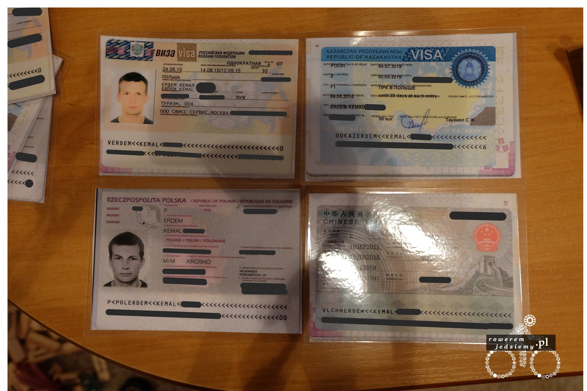
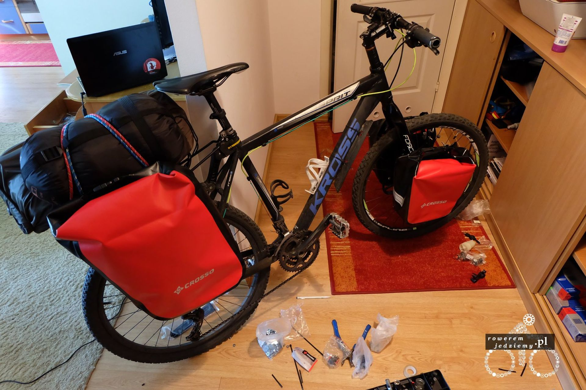
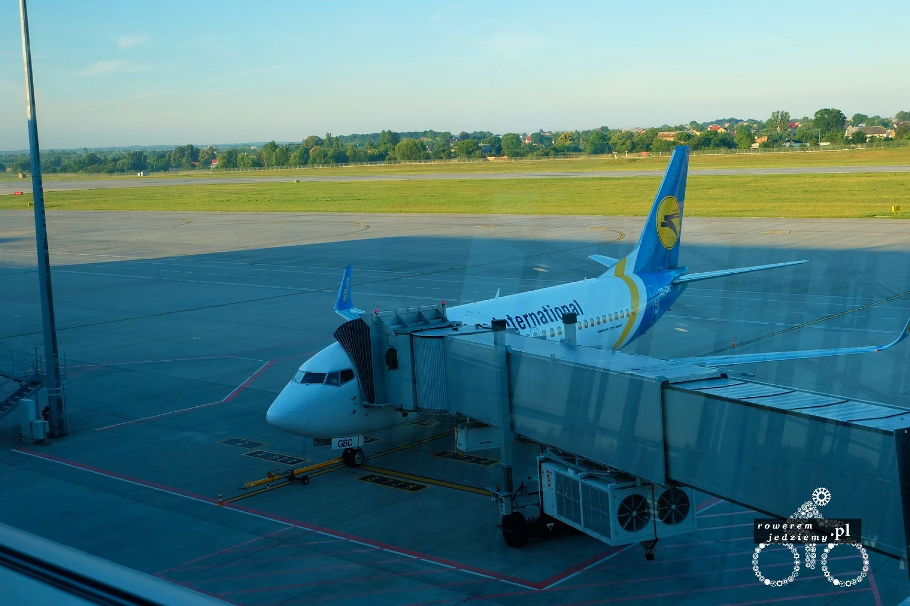
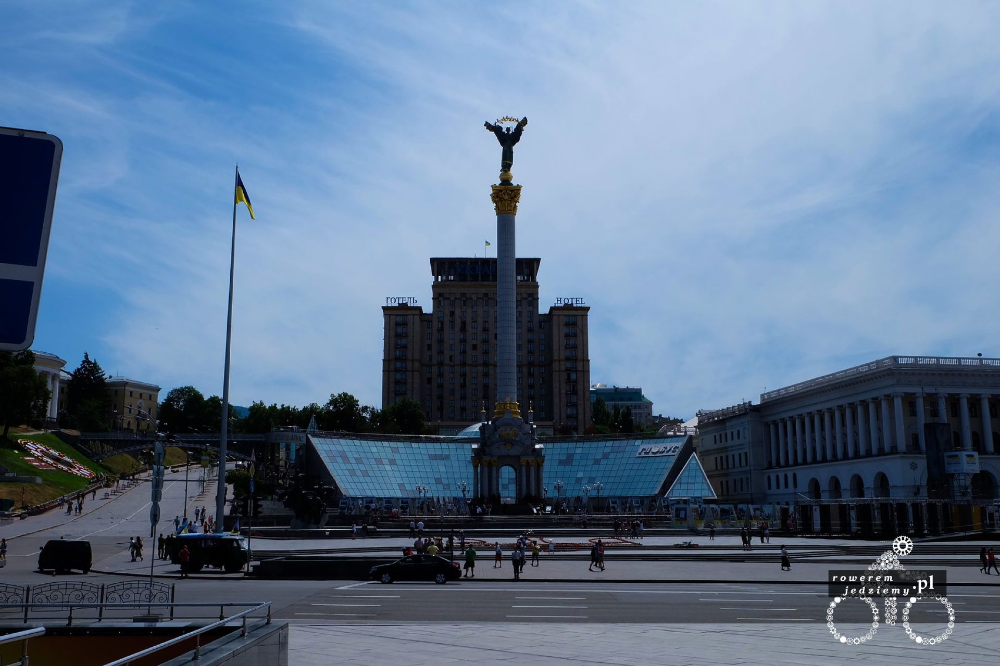
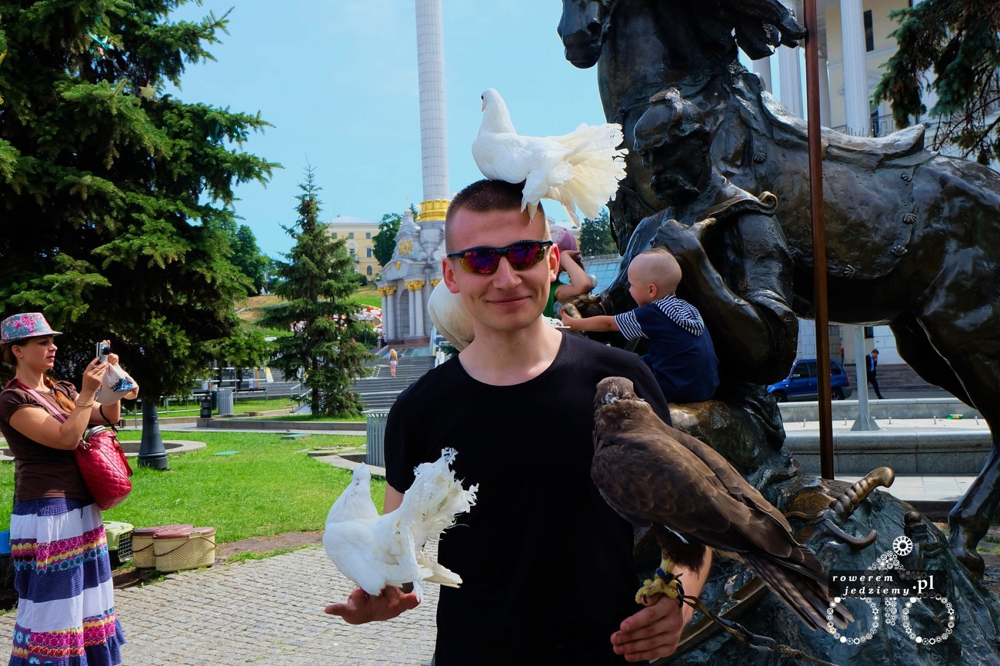
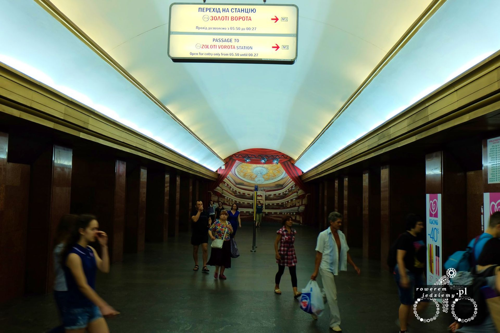
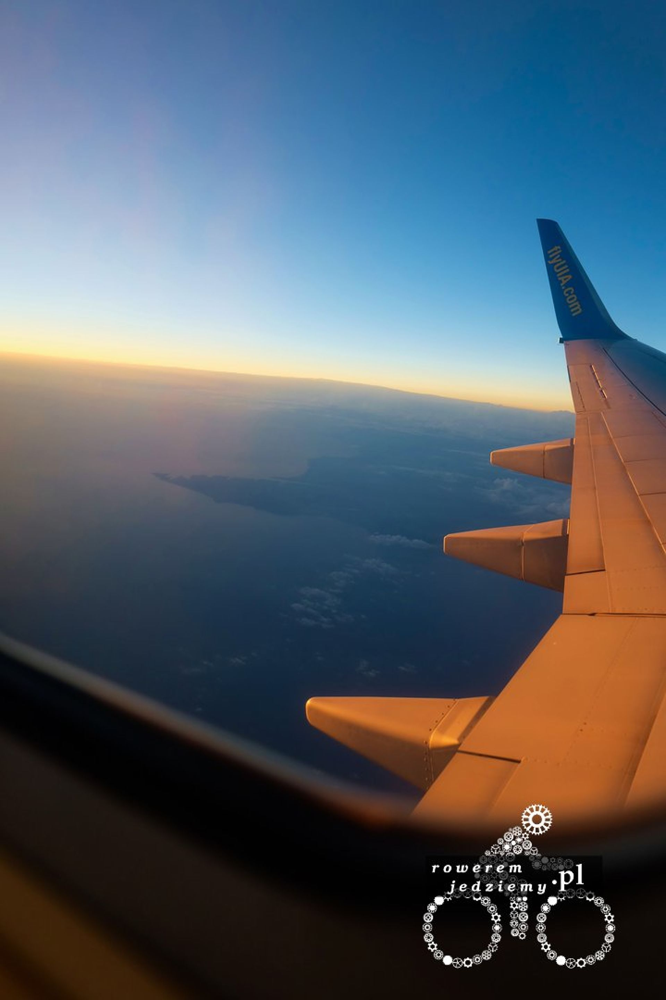
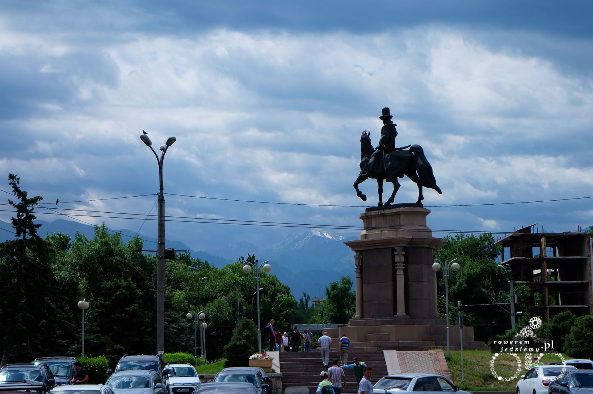

Jak zwykle początek wyjazdu nie mógł pójść gładko. Zacznijmy od początku... wizy. Jak pewnie część się orientuje, aby pojechać gdzieś poza UE, potrzebujemy wizę do danego kraju (z małymi wyjątkami). Zdobywanie takich wiz nie jest zazwyczaj problemem, jeżeli podróżujemy w normalny sposób w szczególności do krajów popularnych wśród turystów. Ale tak jak napisałem zazwyczaj. Oryginalnie moja wyprawa miała wyglądać trochę inaczej lecz po 2 miesiącach dyskusji z ambasadą i utwierdzeniu się w przekonaniu, że Tybet to tylko z przewodnikiem postanowiłem przejechać drugą najbardziej wyludnioną część Chin a dokładnie część północno-wschodnią. Jeżeli kiedyś będziecie się starać o wizę do Chin lub Kazachstanu niech nie będzie dla was zaskoczeniem prośba o ukazanie biletu powrotnego oraz potwierdzenie miejsca zamieszkania na cały okres wyjazdu. Jest to oczywiście do załatwienia, ale wiąże się z dodatkowymi kosztami. Ciężko wytłumaczyć, że będzie się jechać cały czas na rowerze i nie koniecznie zatrzymywać w hotelach. W moim przypadku skończyło się na skorzystaniu z pośrednika który miał już kontakty i hotele widmo na terenie Chin, Kazachstanu i Rosji :). No ale tydzień przed wyjazdem wrócił do mnie mój paszport i wszystkie wizy więc myślałem, że już więcej problemów nie będzie (tydzień dlatego że gdyby wyjazd się przedłużył, to wizy maksymalnie 3 miesiące w przód było można wyrobić i tak zrobiłem z Rosyjską i Kazachstańską).

Na zdjęciu kopie wiz oraz paszportu, aby oryginały trzymać w szczelnie zamkniętych wodoodpornych woreczkach. Te kopie są laminowane i służą głównie do legitymowania się policji itp.

Pakowanie tradycyjnie miało miejsce w noc przed wyjazdem i skończyło się jak zwykle (brakiem kilku rzeczy jak na przykład ładowarki słonecznej). 

O godzinie 11 miałem mieć autobus z Wrocławia, który miał dowieść mnie na lotnisko we Lwowie. Przed wyjazdem dzwoniłem do przewoźnika i informowałem go o rowerze, lecz po przyjściu na miejsce kierowca powiedział, że mnie nie weźmie, bo się rower nie zmieści (koniec roku akademickiego i dużo studentów na Ukrainę jechało). Szybko udało się go przekupić i po rozkręceniu roweru na części (koła, bagażnik, sakwy, rama, kierownica osobno) jednak się zmieścił. Chwała za to że są jeszcze ludzie, którzy dają się przekupić. Czy to koniec problemów? Oczywiście, że nie. Standardowo korek przed Opolem i już 4 godziny opóźnienia, myślałem sobie, że to w sumie jeszcze nic "samolot mam o 7 rano, autobus miał być tam o 1, więc spokojnie się wyrobimy". Kolejną rzeczą była kontrola graniczna i akurat na złość ktoś z naszego autobusu chciał coś przemycić. Nie wiem co to było, ale wyciągnęli nas na pobocze i wypakowali wszystko z bagażnika. Tylko patrzyłem czy wszystkie moje rzeczy włożą tak jak były. Duża dawka stresu została jeszcze zwiększona po przyjeździe do Lwowa, ponieważ kierowca zamiast skręcić na lotnisko pojechał na dworzec. Na moje pytanie "Co Pan robi?" odpowiedział całkiem poważnie: "Mamy duże opóźnienie nie mogę pozwolić na objazdy". Całkiem logiczne, lecz bardzo niefajne dla mnie. Wyleciałem z autobusu, nie składałem nawet roweru i biegałem po parkingu, szukając taksówki, która zabierze mnie na lotnisko w max 30 min. Zaskakująco łatwo poszło i już po kilku minutach jechałem pustą drogą na lotnisko pod sam terminal. Dałem kierowcy 10EUR, bo nie miałem żadnych hrywien, a złotówek nie chciał. Nie wiem nawet, czy to dużo, czy to mało jak stawna na lotnisko we Lwowie? Musiałem być ciekawą atrakcją dnia z całym tym złomem, który starałem się spiąć razem opaskami zaciskowymi, aby było można to nadać jako bagaż. 

No ale po chwili już leciałem. Nie daleko, bo tylko do Kijowa, ale leciałem. W stolicy, korzystając z chwili wolnego czasu, przejechałem się busem do centrum miasta, aby zobaczyć słynny Majdan, na którym rozpoczęła się rewolucja na Ukrainie. 

Wyglądał bardzo spokojnie, taka trochę większa wersja placu, na którym stoi Kolumna Zygmunta. Żadnych śladów walk czy też armii tam nie było. Kijów nie jest jakimś szczególnie pięknym miastem, bardziej przypomina zwyczajne komunistyczne blokowisko niż któreś z europejskich miast turystycznych. Wartymi obejrzenia się natomiast stacje metra. Nie jest to domena Kijowa, lecz bardziej krajów byłego bloku sowieckiego, ale stacje metra są naprawdę ładne. 

Szybko się zebrałem i już leciałem do Kazachstanu a dokładnie malowniczego miasteczka o nazwie Almaty. 

Dlaczego malowniczego? A to dla tego, że jestem fanem gór, a to miasteczko leży u podnóży bardzo ładnego pasma górskiego, które oddziela Kazachstan od Kirgistanu. 

Po wylądowaniu i konieczności wypełnienia formularza imigracyjnego po Kazachsku (tak jak się spodziewanie nie mam o nim pojęcia) przepuszczono mnie przez bramki i nowy kraj stał przede mną otworem. Czy coś mogło się jeszcze wydarzyć? Oczywiście, że tak. Po wejściu na rower i przejechaniu 20m coś strzeliło i odpadło od mojej korby. Były to dwa zęby, które należały do środkowej zębatki (wymieniona dopiero co przed wyjazdem nieużywana). Nie zebrałem tych zębów, ponieważ wróżki pewnie biorą tylko takie białe od dzieci więc nic mi z nich. Postanowiłem jechać więc tylko na dwóch przerzutkach 1 i 3 przez cały wyjazd. Jakby tego było jeszcze mało, rozpętała się ulewa. Ciekawy początek wyprawy nie ma co.