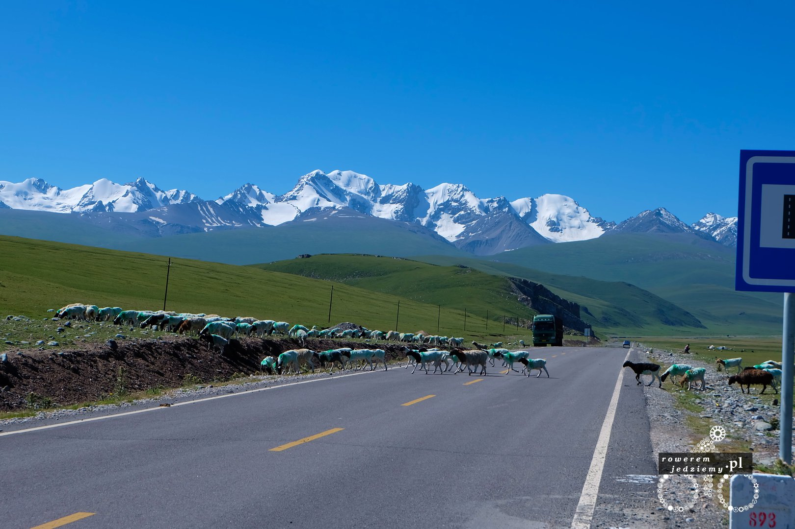
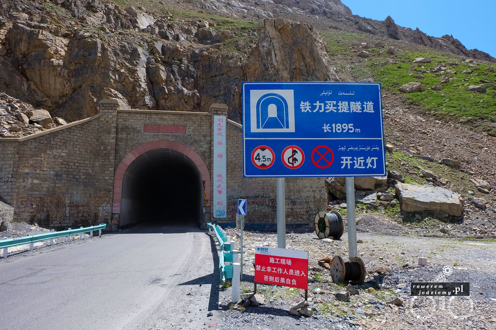
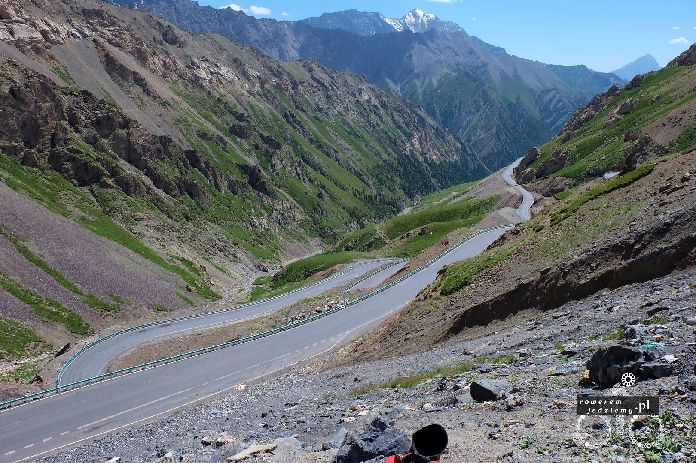
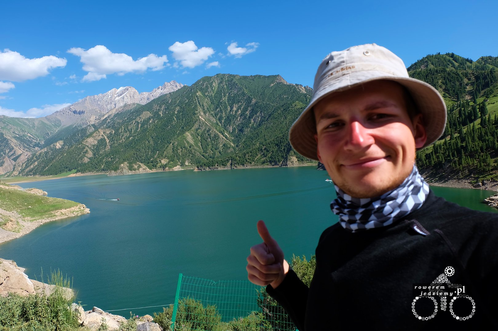

Ponieważ nie spodziewałem się braku źródła wody, moje zapasy wyschły. Oczywiście posiadam profesjonalny zestaw do filtrowania wody, lecz aby to zrobić trzeba pierwsze mieć jej źródło. Mimo że na wszystkich górach dookoła leży śnieg niestety droga jest zbudowana w taki sposób, że do strumyków nie można w żaden sposób podejść. Powiedziałem sobie, że jeżeli sytuacja będzie beznadziejna, mogę się wspinać, aby przefiltrować trochę wody. Jadąc w stronę gór, mogłem podziwiać stada przechodzące przez ulice i blokujące ruch tirów.

Kilka słów wyjaśnienia, o co chodzi z tymi kolorami. Polega to mniej więcej na tym, iż taka owca/koza pomalowana jest na kolor konkretnego plemienia (jeżeli mogę ich tak nazywać). Ponieważ nie ma tutaj żadnych granic i zwierzyna chodzi sobie jak chce, czasami zdarza się, że mieszanie stad. Gdy taki pasterz wieczorem zauważy, że jakieś owce są w innym kolorze, zaprowadza je do właściciela. Ponieważ wszyscy tu się znają (jest tylko kilka plemion) to wszyscy są uczciwi.

Gdy tylko wyjechałem z tego płaskowyżu, okazało się, że czeka mnie niezły podjazd pod górę (ponad 1000m różnicy), tym bardziej że nadal nie mam wody. Chwilowo moje rozważania na temat skąd tu wziąć wodę zostały przerwane przez Chińczyka, który zatrzymał mnie na środku drogi i nie pozwalał przejechać dalej, mówiąc coś po chińsku. Oczywiście nic nie zrozumiałem i gdy odszedł, to chciałem odjechać, ale gdy tylko to zauważył, podbiegł i zatrzymał mnie ponownie. Ostatecznie udało nam się dogadać, po tym jak wskazał na drogę i powiedział "Bum Bum!". Całość sytuacji wyjaśnił dokładnie głośny wybuch dochodzący ze wskazanego kierunku około minutę później. Pan zatrzymujący wszystko co zmierzało w tamtym kierunku, otrzymał informację po chińsku przez krótkofalówkę i pokazał, aby jechać. Podczas przejazdu widziałem ekipę rozbiórkową na zboczu jednej góry i to chyba było miejsce, gdzie coś wysadzali i chyba sprawdzali, czy poleci na drogę, czy nie :) Na szczęście nie zablokowali drogi, więc mogłem normalnie przejechać.

Wszystko zaczęło się układać całkiem dobrze, ponieważ droga na samą górę była już na tyle stroma, iż nie dało rady wybudować drogi odległej od strumyków. W ten sposób przefiltrowałem sobie 9 butelek wody (przez butelek mam na myśli takie 0.5l). Oczywiście jak zwykle karma musi być, więc skoro dostałem wodę, to musiało się coś przytrafić. Tym razem była to bardzo ciężka przeprawa przez tunel.

O co tutaj chodzi przecież to tylko tunel? No właśnie nie tylko chodzi o to, iż jak zapewne widzicie, tam nie ma światła i ma 1895m długości. Gdyby był jeszcze prosty to fajnie, ale niestety w środku znajdowały się zakręty. Zachęcony wjazdem i ciemnością, wyjąłem wszystko co świeci z sakw i zamontowałem na rowerze (w tym lampę służącą za światło w namiocie). Tak oświetlony ruszyłem do przodu, ledwo widząc co jest przede mną. W pewnym momencie za mną pojawiła się ciężarówka, która bardzo mi pomogła, tym bardziej że nie mogła mnie tam wyprzedzić. Oświetlenie ciężarówki pozwoliło mi zwiększyć prędkość, ponieważ widziałem gdzie jadę. Gdy tylko zobaczyłem światełko na końcu tunelu, wbrew powszechnemu przeświadczeniu bardzo się ucieszyłem. Chyba najdłuższe 1895m mojego życia. No ale teraz bardzo stromy zjazd :)

Miałem fajny filmik z tego zjazdu, ale niestety został uszkodzony i oprogramowanie GoPro, które ma wbudowany program do naprawy, całkowicie zniszczyło film. No ale co się wydarzyło dokładnie? Ponieważ podjazd z tej strony jest dużo bardziej stromy, jadąc z dużą prędkością, udało mi się wyprzedzać wszystkie samochody i inne pojazdy. Jadące z drugiej strony dostawczaki z racji swojego wieku czasami odmawiały posłuszeństwa (dwa stały z otwartą klapą, dymiąc radośnie). Z powodu nadmiernej prędkości zjazd zajął bardzo mało czasu (około 45min). Dojechałem do czegoś, co się nazywa "Smocze jeziora" (przynajmniej na tabliczce informacyjnej było tak napisane).

Podczas dalszego zjazdu skończył się fajny zielony krajobraz i rozpoczął czerwony industrialny. Pisząc industrialny, mam na myśli ilość kopalni i fabryk po drodze. Ponieważ góry te są bogate w surowce, trzeba to wykorzystać, więc po drodze można spotkać dużo takich budynków. Powoduje to niestety ogromną ilość pyłu w powietrzu. W pewnym momencie do tego stopnia, iż zrobiło się ciemno, przejeżdżając obok jednego z takich zakładów. No i zaczęło robić się ciepło, a nawet bardzo ciepło różnica temperatur w pomiędzy szczytem a podnóżem góry wynosiła ponad 25 stopni (na dole było 35 stopni na górze 9). Ilość fabryk i to, co tam wytwarzają, spowodowało jeszcze jeden problem. Na drodze znajdowało się dużo skrawków metali, przez co przebiłem kolejną dętkę. No ale pora spać...