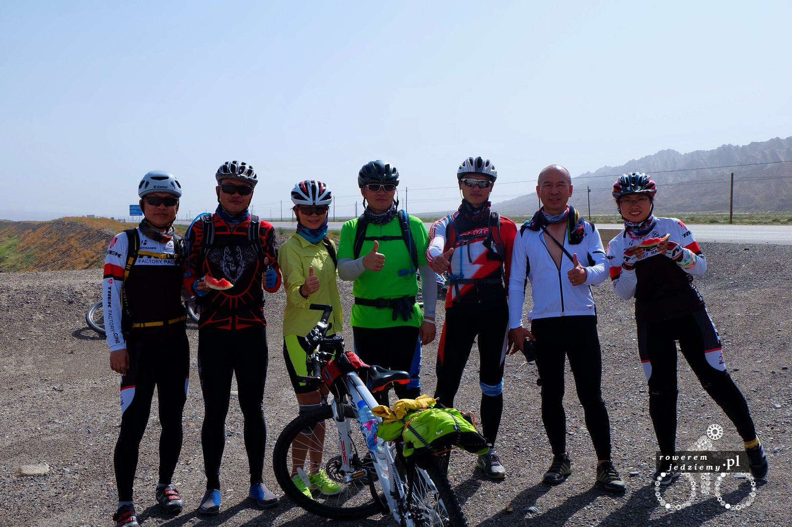

Kolejne kilometry i krajobraz z zielonego zamienia się w pustynny. Nie ma żadnych problemów z nawigacją, ponieważ jest tylko jedna droga (ogólnie to nie ma tutaj problemów z nawigacją poza miastami mimo nieznajomości znaków). Wrócił smog, który z racji wysokich gór był niedostępny w ich wyższych partiach (a już zacząłem za nim tęsknić). Tak sobie jadąc, fajna prostą drogą będąc mijany przez stada ciężarówek, które wywoziły lub przywoziły towar do pobliskich kopalń/fabryk zostałem zatrzymany przez grupę rowerzystów.

W sumie większym zdziwieniem mogło być spotkanie łódzkiego pogotowia, ale ich się tutaj nie spodziewałem. Okazało się, że jadą obecnie w stronę z której przyjechałem i mają zamiar pokonać ten płaskowyż. Byli chyba pod wrażeniem jak im powiedziałem, że to max 2 dni, bo oni standardowo tę trasę w 5 robią. Wyglądali na miarę sprawnych stąd moje zaskoczenie, tym bardziej że towarzyszył im samochód, który przewoził rzeczy. Prócz rzeczy samochód przewoził także arbuzy, którymi się delektowaliśmy. Pewnie wszyscy sądzą, że jazda na rowerze w chinach jest jakaś bardzo popularna. Takie mylne wrażenie można odnieść z powodu Pekinu i ogólnie dużych miast wschodniej części tego państwa. Chińczycy są bardzo praktycznym narodem i gdy w Pekinie ruch uliczny zrobił się bardzo spory, po prostu przerzucili się na rower, bo tak szybciej. Grupa tutaj posiada już lepsze rowery niż standardowy chińczyk (duża część znacznie lepsza od mojego, mimo że do mojego posiadam pewnego rodzaju sentyment). Wytłumaczyli mi, że oni należą do klubu rowerowego z siedzibą w Kuqa (jedno z większych miast w pobliżu). Byłem bardzo zdziwiony, że słyszeli o firmie Kross (producent mojego roweru), nie sądziłem że jest znana poza Polską a tym bardziej Europą. Nie spędziłem z nimi za dużo czasu, ale dowiedziałem się, że droga którą chciałem jechać docelowo, jest zamknięta i abym nie próbował się tam wybierać. No może zamknięta to za dużo powiedziane, ale wymieniają tam asfalt i jest ruch wahadłowy poprowadzony przez nasyp. Mój tyłek zdecydował za mnie, że nie jedziemy tą drogą. Żegnając się z nimi, otrzymałem jeszcze malutką butelkę z alkoholem ("Na zimne wieczory" jak gdyby było mi to potrzebne na pustyni). Oczywiście prezent zaakceptowałem, ponieważ podobno w ich kulturze się nie odmawia i pojechałem dalej.

Ciekawą rzeczą, na którą można się nadziać w Sinciang, są posterunki policji, które dzielnie sprawdzają wszystkich przejeżdżających. Na czym to mniej więcej polega? Co jakiś kawałek na drodze stoi sobie posterunek gdzie policja razem z wojskiem sprawdza przejeżdżające samochody. Już się przyzwyczaiłem, że wszyscy są zdziwieni widząc mnie tutaj na rowerze, ale panowie policjanci poprosili mnie o zejście z mojej maszyny i chwile rozmowy. Nigdy w życiu nie sądziłem, że człowiek z karabinem szturmowym będzie osobą, która poczęstuje mnie melonem :) Jeden z wojskowych troszkę znał angielski, więc tłumaczył, że ja z Polski i jadę z Kazachstanu przez góry Tian Shan. Oczywiście bez żadnych problemów pojechałem dalej i po przejechaniu kilometra złapałem kolejną gumę, ale nawet to nie popsuło mi humoru. Udało się to dopiero zrobić na następnym posterunku :( Dlaczego? Niestety, mimo że panowie poczęstowali mnie melonem, pogadali itd., zapomnieli wklepać mojego paszportu do systemu. A ponieważ system nie posiadał mojego paszportu na poprzednim stanowisku i nie było innej drogi, musiało się to wydawać dziwne podczas następnej kontroli. Tak oto spędziłem dobre kilka godzin, tłumacząc się jak tutaj przyjechałem i co robię. Ostatecznie, przeglądając zapiski z kamer poprzedniego posterunku, udało się znaleźć moment w którym przejechałem przez ten posterunek i sprawę wyjaśnić. Nie było to jakoś strasznie niemiłe czy też stresujące, ponieważ ewidentnie nie wyglądałem jak terrorysta (tak te posterunki są tutaj aby łapać terrorystów, z tego co mi wyjaśniono).

Jak szybko pustynia się zaczęła, tak szybko się skończyła, ponieważ wjechałem na mały kawałek sztucznie nawadnianego terenu obfitującego w gęstą roślinność a dokładnie w pola uprawne. Ponieważ długo zeszło mi na kontrolach, uznałem że rozbiję namiot obok miasta, aby nie szukać czegoś w środku. Na moje nieszczęście zainteresowały się tym chyba przejeżdżające samochody i ktoś zadzwonił po policję. Ta przyjechała już w nocy i łamanym angielskim kazali mi się zbierać. Nie chciałem się z nimi kłócić, tym bardziej że przyzwyczajony do polskich standardów myślałem, że skończę z mandatem. Pan dowodzący akcją wytłumaczył mi, że nie wolno rozkładać namiotu poza terenem miast. Musiałem przez chwilę przetworzyć informację, ponieważ myślałem że źle zrozumiałem. Jednak nie... okazało się, że wystarczy wjechać do miasta i można rozłożyć namiot gdzie mi się żywnie podoba, dopóki nie przeszkadzam nikomu. Nawet zaproponowano mi obstawę na drodze do miasta, ale z grzecznością odmówiłem. Mimo nieciekawej sytuacji przemili ludzie.

Kolejnym ciekawym punktem po drodze były różne miejscowości jak na przykład Baicheng. Miasto pomimo znajdowania się na pustyni jest zielone i posiada dużo oczek wodnych. Naturalnie chińczyk zbuduje wszystko, więc po prostu doprowadzają wodę z gór bezpośrednio do miasta. Daje to bardzo fajny efekt na obrzeżach miasta, ponieważ w pewnym momencie kończy się zieleń i zaczyna pustynia.

Pewnie widzicie tam po lewej stronie koniec miasta. Znajduje się obecnie w ostatnim parku w mieście, gdzie wymieniam kolejną dętkę, która została przebita (nadal na drogach jest sporo wszelkiego rodzaju świństwa.

Wydaje mi się, że wysyłając ludzi na Marsa, powinniśmy poważnie rozważyć wysłanie tam samych chińczyków. Biorąc pod uwagę fakt, jak dobrze adaptują nienadającą się do życia pustynię (jadąc drogą, można zobaczyć sztucznie nawadniane pola uprawne) to takie planety jak Mars nie powinny sprawić im żadnego problemu.