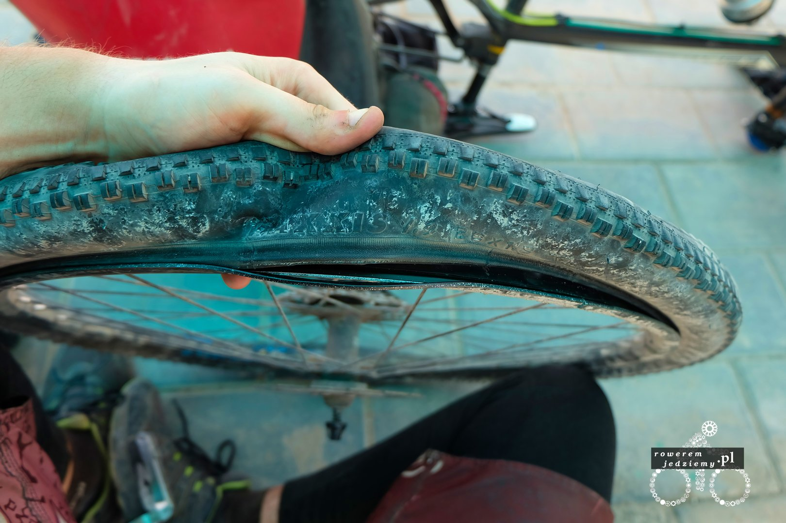
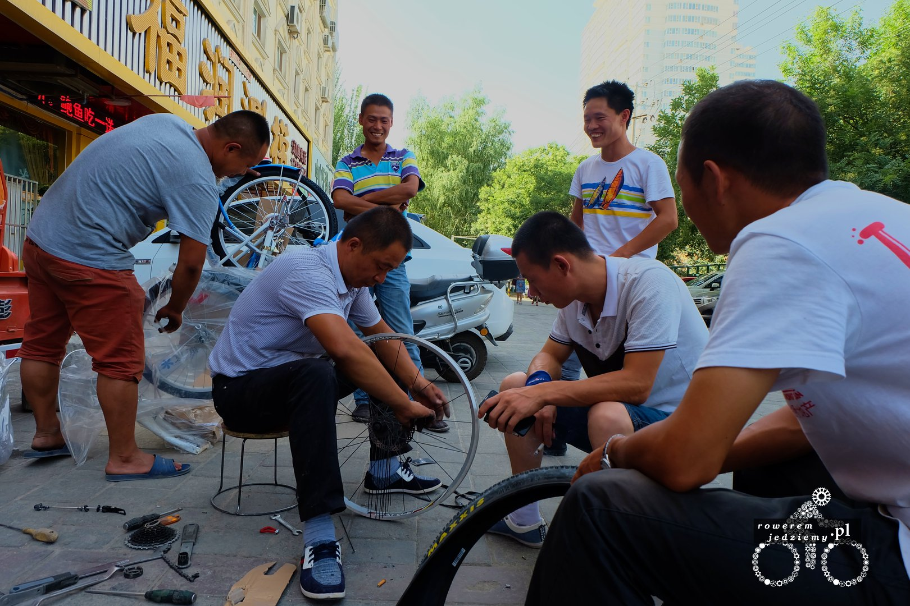
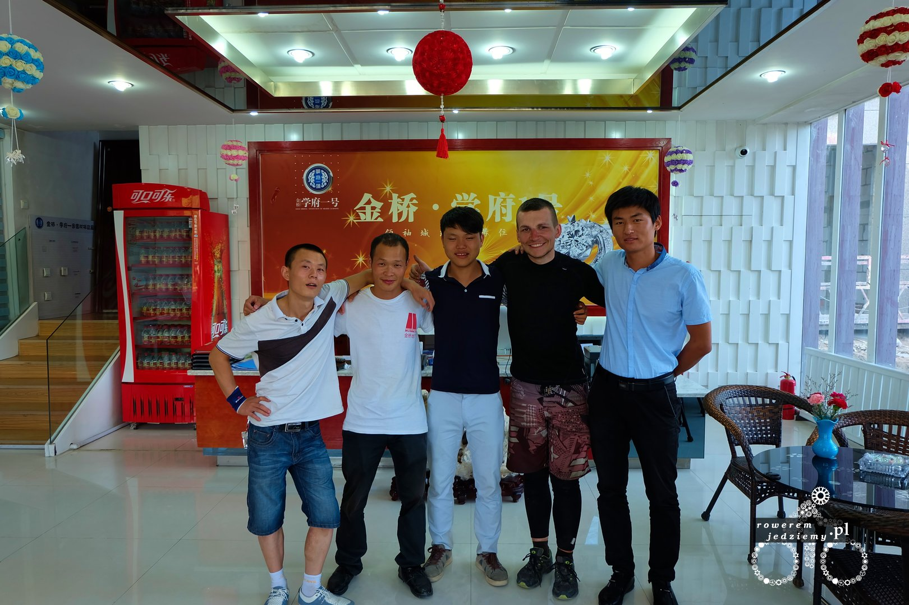
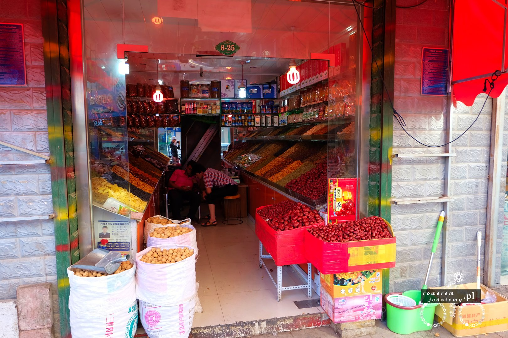
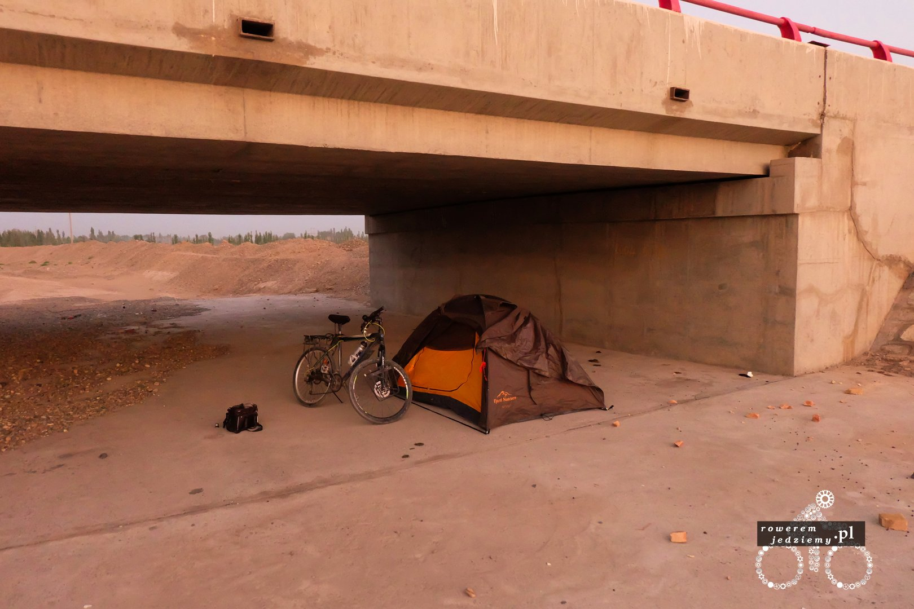

Jakie mogą być powody niemożliwości dojazdu do miasta? Brak drogi/roboty drogowe? Ukradli rower? Wypadek? Nie do końca, najbliższy prawdzie jest wypadek. Zdjęcie, które zobrazuje sytuacje:

Ta odstająca część to pęknięta obręcz rowerowa. Przez chwilę myślałem, że to po prostu kolejna dętka pękła. Nie pomyliłem się, bo dętka też pękła, lecz tym razem to tylne koło nie wytrzymało i postanowiło zakończyć swoją podróż (a w tym moją). Jedyną szczęśliwą rzeczą było to, że od miasta dzieliło mnie jedynie 2km więc dystans do przejścia na nogach. Po jakimś czasie znajdowałem się już w Aksu i rozpocząłem szukanie sklepu rowerowego w celu kupna nowego koła. Teraz nasuwa się pytanie, jak tu wyjaśnić, że chce kupić koło. Po jakimś czasie udało się znaleźć w rozmówkach chińskich, że kupić to "Mai" więc kupić koło to będzie "Mai koło" z ewentualnym wskazaniem na obiekt zakupu. No tylko, że teraz trzeba znaleźć sklep. Oczywiście w moich napach nie ma takiej opcji (punkty POI nie uwzględniły, tym bardziej w Chinach). 

Na szczęście idąc sobie wzdłuż głównej ulicy, zobaczyłem rower Gianta. Skoro jest rower, musiał być gdzieś kupiony, więc pewnie jest jakiś sklep, który sprzedaje normalne rowery (niechińskie z supermarketu). Iście perfekcyjna dedukcja Sherlocku. Ucieszony wszedłem do budynku, przy którym zostawiony był oto rower. Okazało się, że to jakieś biuro gdzie trochę dziwnie na mnie się patrzyli, szczególnie że osoba przy wejściu była obrana w koszule i spodnie od garnituru. Pierwsze co dało się zauważyć to powiew zimna. Magiczny efekt, gdy wchodzi się z temperatury 40 stopni do 20-stopniowego chłodu. Oczywiście Chińczycy przesiadujący w tym pomieszczeniu nie byli speszeni moją obecnością i zaczęli do mnie mówić. Specjalnie nie napisałem "rozmawiać" ponieważ dopiero co nauczyłem się, jak jest "kupić" po chińsku i moja umiejętność prowadzenia konwersacji w tym języku ogranicza się do zdania "cześć, kupić". Ponieważ są to ludzie inteligentni szybko przestali i przerzucili się na migowy. Tutaj już było trochę łatwiej, bo wyszliśmy na zewnątrz (znowu 40 stopni w twarz), gdzie wskazując na koło, cały czas powtarzałem "mai". Myślałem, że zorientowali się o co chodzi, gdy jeden z nich postanowił chyba zaprowadzić mnie na miejsce, ponieważ machał aby iść za nim.

Przeszczęśliwy podążałem za uśmiechniętym chińczykiem, który czasami coś tam próbował zagadać po chińsku, ale słabo się nam rozmawiało z bardzo oczywistego powodu. Nie zrażony zaprowadził mnie na jakiś tam bazar (wolałbym jednak do sklepu, ale nie protestowałem), aby ostatecznie dojść w pewien zaułek. Całkowicie nie spodziewałem się tego co zobaczyłem w zaułku, do tego stopnia, że nie zrobiłem nawet zdjęcia. Stała tam kobieta o muskulaturze i młotem Thora w ręce. 

źródło zdjęcia flexcomics.com

Mógłbym to uznać za coś zabawnego, gdyby nie cała sytuacja. Kang (imię oprowadzającego) podarował władcy młota moje koło i zaczął mówić w swoim języku. Kobieta dzielnie położyła koło na kowadle i już chciała chyba je prostować, gdy jej je odebrałem. Nie było sensu patrzeć jak wali swoim Mjolnirem w moje koło, ponieważ nawet gdyby jej się udało poprawnie wyprostować obręcz, pękłaby ona po przejechaniu kilkuset metrów. Wróciliśmy więc do naszej chłodnej bazy operacyjnej.

Udało się dogadać, używając translatora w komórce, że chcę znaleźć sklep, w którym będzie można kupić nowe koło. Zapakowali mnie wraz z dwójką pracowników do busa i w ten sposób pojechaliśmy dalej. Teraz pierwszy raz widziałem, jaką tutaj umiejętnością jest jazda samochodem. Hai (bo tak miał na imię kierowca) prowadził pojazd z precyzją kierowcy rajdowego z na wpół wciśniętym klaksonem. Rower zapakowany oczywiście do przestrzeni bagażowej był trzymany przez Kang'a, a ja na siedzeniu pasażera podziwiałem miasto. Dotarliśmy do sklepu rowerowego z masą rozłożonych rowerów przed nim. Po wyjściu z samochodu, którego zaparkowaliśmy po prostu przed sklepem na chodniku (nie ma zakazu parkowania, dopóki nie przeszkadzasz), podszedł do nas sprzedawca, a Kang wytłumaczył o co chodzi. Okazało się, że nie ma gotowych kół, ale może mi zapleść. Dla mnie to nie było problemem, ale to chwile zajmie więc zacząłem się obawiać o czas moich nowych kolegów. Zapewniając mnie, że to nie jest dla nich problem i że poczekają, dogadali się ze sprzedawcą, a ten kazał swojemu pracownikowi zapleść koło. 

Ponieważ zbliżała się pora obiadowa, wybrałem się ze znajomymi na obiad. Chciałem im chociaż zafundować obiad, ale ci nalegali, że to oni zapłacą. Dziwny naród... nie dość, że marnują pół swojego dnia, aby mi pomóc, to jeszcze stawiają mi obiad. Całe szczęście, że pozwolili mi zapłacić za nowe koło (swoją drogą koszt wynosił tylko tyle, co koszt części, ponieważ robocizna gratis więc całość zamknęła się w 150zł). Jeżeli sądzicie, że ludzie w Polsce są pomocni, polecam pojechać w te rejony. Dowiedziałem się przy okazji trochę nowych rzeczy o tej części chin oraz jej mieszkańcach. Ponieważ są oni wymieszani z muzułmanami oraz to, że ich kultury bardzo się różnią, dochodzi tu często do sporych spięć. Czasami policja musi pacyfikować mniejszości muzułmańskie. Dlatego też nie jest do końca bezpiecznie, będąc chińczykiem zapuszczać w rejony takie jak np. muzułmański bazar. Zdają sobie sprawę, że bardzo duża wina leży po ich stronie. Nie chodzi tu o to, jak oni się zachowują, lecz bardziej co robi ich rząd. Ponieważ jak wspomniałem we wcześniejszym artykule wszelkie stanowiska w państwowych firmach oraz urzędach mogą być zajmowane wyłącznie przez Chińczyków, mniejszości są traktowani jako obywatele drugiej kategorie (czy tam drugiego sortu jak to w Polsce się mówi).

Po zjedzeniu udaliśmy się ponownie do naszego serwisu, gdzie prace nad nowym kołem zostały zakończone. Przy okazji udało im się złamać szybkozłączkę antykradzieżową :) Może złamać to za dużo powiedziane. Udało im się wyłamać bolec, który zabezpieczał przed otwarciem, ponieważ sama szybkozłączka działa nadal. No ale mówi się trudno i jedzie się dalej. Zamiary mieli dobre, chcieli po prostu naciągnąć szprychy w przednim kole... Dostałem jeszcze gratis dętki zapasowe i klucz do szprych w razie, gdyby coś się działo. Jadąc z powrotem, chciałem jakoś podziękować moim chińskim przyjaciołom, ale nie chcieli oni żadnych pieniędzy czy tam alkoholu. Od Kang'a dowiedziałem się, że jak bardzo chcę, to mogę kierowcy kupić papierosy, bo on dużo pali. Po drodze wstąpiliśmy do sklepu i Kang pomógł mi wybrać odpowiednie papierosy. Zauważyłem, że w chinach jest dużo sklepów z papierosami. Fajną rzeczą jest to, że tam podobno najlepiej kupować wodę i soki z lodówki, a to dlatego, iż mało kto tam wchodzi specjalnie po wodę, więc zawsze jest zimna, a ceny w chinach tego samego produktu nie różnią się pomiędzy sklepami. Jedyna różnica to, że na pustyni woda kosztuje 3 juany a na północy była po 1 za 0.5l.

Gdy już dojechaliśmy na miejsce, miała miejsce cała sesja zdjęciowa, ponieważ każdy chciał sobie zrobić zdjęcie osobiście i grupowe.

Skoro można jechać dalej, to trzeba jeszcze zrobić zakupy. Pochodziłem więc sobie po części handlowej, gdzie miałem okazję dostać bardzo dobre bakalie (większość pewnie w polsce nie jest dostępna). Szczególnie ciekawą opcją są orzechy zawijane w morele i suszone w taki sposób. 

Kolację spożyłem na placu obok smoka i wybrałem się w dalszą podróż. Zastanawiacie się może jaka miejscówka jest najlepsza na spanie? Oczywiście, że pod mostem...

