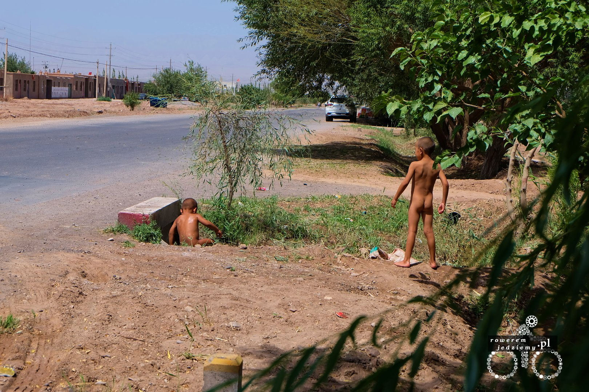
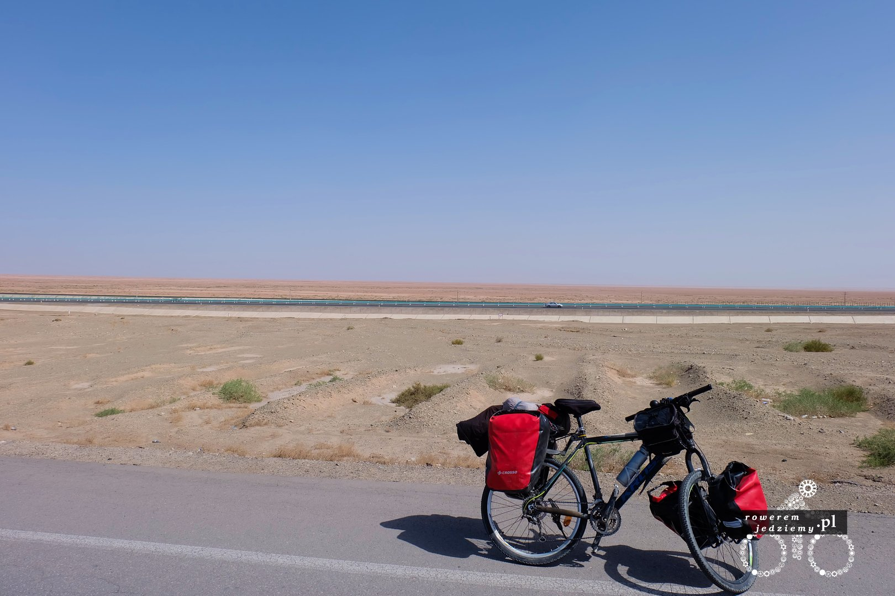
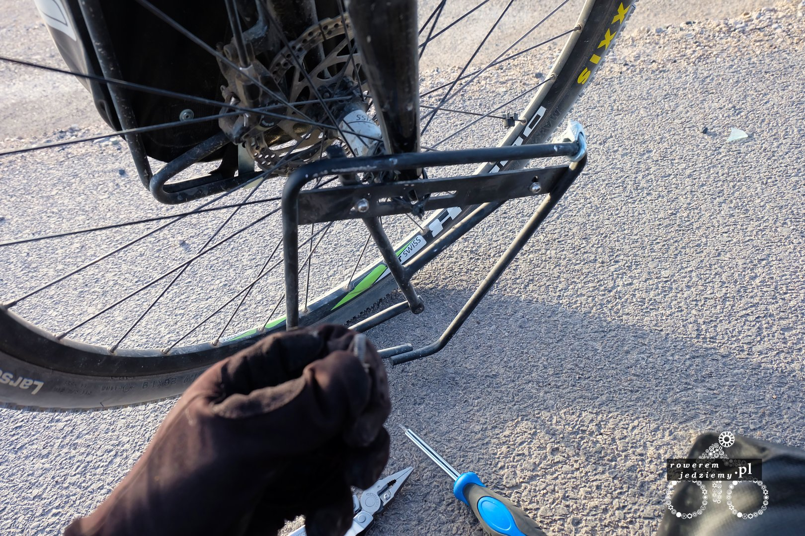

Dzień jak co dzień, wstaje o wschodzie słońca, jest w miarę chłodno (22 stopnie), szybka toaleta, śniadanie no i jedziemy. Do Kashgaru zostało ponad 400km więc pewnie około 3 dni jazdy (zakładam 150km dziennie). Jedziemy już po normalnej pustyni, ponieważ nikomu nie chciało się przekształcać tego terenu w pola uprawne. Obok nas jest autostrada a dalej tory kolejowe. Z powodu autostrady, po drodze której jadę, nie jeździ zupełnie nic. I przez nic, mam naprawdę na myśli nic. Jadę sobie lewym pasem, ponieważ jest lepszej jakości niż prawy, położony na kierownicy nawet nie patrząc przed siebie, a i tak jestem pewien, że nic mnie nie trzaśnie z naprzeciwka. Jedzie się bardzo dobrze i bardzo nudno. Cały czas lekko pod górkę i pod wiatr, ale przed południem udało się zrobić w ten sposób 90km więc niezłe tempo. Dlaczego piszę "cały czas"? A to dla tego, że tutaj wiatr wieje tylko w jedną stronę, a Kashgar jest około 400m wyżej (około 1400 n.p.m), niż Aksu co nie jest wartością bardzo zauważalną, ale skutkuje jazdą pod górkę. Przed południem zatrzymałem się w małej wiosce, ponieważ był tam kanał z czystą wodą i udało mi się zrobić pranie. Tak niestety czasami trzeba robić pranie, a teraz jest bardzo dobry okres, ponieważ przy praktycznie zerowej wilgotności i wysokiej temperaturze (prawie 50 stopni w słońcu) w przeciągu pół godziny wszystko jest suche. Gdy tak sobie siedziałem podeszły do mnie 3 dziewczyny, z których tylko jedna umiała kilka słów po angielsku. Ale udało się jakoś porozmawiać szczególnie ze względu, że zadzwoniło do koleżanki, która już angielski znała lepiej i była tłumaczką :) Dostałem bardzo ciekawy, bo kukurydziany chlebek Naan (swoją drogą to Naan brzmi prawie jak Not A Number, ach te naleciałości informatyczne), i oczywiście arbuza. Dziewczyny bardzo miłe i chciały się dowiedzieć, skąd jadę i dlaczego przez pustynię. Ciężko było im wytłumaczyć, że jestem z polski (standardowo nie wiedziały, gdzie jest polska), ale jadę z Kazachstanu (to wiedziały gdzie jest, bo z nim graniczą). Bardzo dużym zaskoczeniem było zobaczenie nagich dzieciaków, które korzystały z wody w celach chłodzących.

Wioski są fajne, ponieważ zazwyczaj posiadają kilka drzew, gdzie można się schować i przeczekać największe słońce (około godziny 15), w którym jazda prócz tego, że jest ciężka, jest już chyba niebezpieczna. Obecnie całe moje ciało jest osłonięte i mimo tego nie jest gorąco, jadąc w jakiś 45 stopniach. Kiedyś się dziwiłem, że na pustyni chodzą tak osłonięci, a teraz się zorientowałem, że właśnie z powodu małej wilgotności taki ubiór powoduje, że jest chłodniej, a nie cieplej.

Pewnie się zastanawiacie, o co chodzi z tym błędem w oszacowaniu trasy. No to już wyjaśniam. Gdy wyjechałem z tego miasteczka, kupiłem tylko kilka butelek wody (pamiętajcie, że tutaj butelki mają 0.5l). To z tego powodu, że nie chcę wozić zbędnych kilogramów. Przecież można kupić w następnej wiosce kolejne itd. Nie zobaczyłem dokładnie na mapę (ponieważ jest tutaj tylko jedna droga i nie ma konieczności sprawdzania trasy), gdybym to zrobił, pewnie zauważyłbym, że nie ma przede mną żadnej wioski przez najbliższe 100km. Pewnie nawet udałoby się to przejechać do końca dnia, gdyby nie złamanie śruby od bagażnika, kolejna przebita opona i odwodnienie, ponieważ woda tym tempem skończyła się po 40km (2 godziny).

Co się robi, gdy złamie się wam śruba, a nie macie zapasowej? Improwizuje oczywiście. A w jaki sposób inżynier improwizuje? A taki, że bierze mocowanie od gopro i wkręca w miejsce śruby. Pasuje idealnie, trochę wystaje, ale daje radę z tym jechać. Niestety godzina stracona (głównie na próbach wykręcenie złamanej śruby z mocowania). Przy okazji nabawiłem się zatrucia pokarmowego chyba po wczorajszym jedzeniu w Aksu i mój organizm na problem z przyjmowaniem pokarmu więc jeszcze bardziej się odwadnia. Jadąc dalej na południe, spotkałem ekipę budowlaną, która wymieniała część drogi (po co remontować drogę, po której i tak nikt nie jeździ?). Na początku myślałem, że to ktoś zostawił sprzęt, ale później zobaczyłem ich schowanych w cieniu. Chcieli mi dać wodę, ale miałem duże wątpliwości co do jej zdatności do picia (strasznie śmierdziała), może dla nich nie jest ona niebezpieczna, ale ja wolę być odwodniony niż dodatkowo podtruty. Kolejna rzecz mnie zdziwiła, a mianowicie jeden członek ekipy oglądał sobie przy wszystkich porno na komórce. Jakoś specjalnie się z tym nie krył. Może to normalne tutaj, ale w europie chyba nie do pomyślenia.

Pojechałem dalej i ostatecznie zatrzymałem się na środku drogi, gdzie położyłem się na ziemi (dokładnie to na asfalcie) i tak sobie leżałem, ponieważ byłem już zmęczony i znacząco odwodniony. Nie było sensu już dalej jechać, ponieważ zbliżała się 23. Może was zdziwić godzina, ale Chiny mają źle ustawione strefy czasowe, a dokładnie strefę czasową. Cały kraj posiada jedną strefę czasową, która pasuje do południka, na którym leży Pekin. Powoduje to, że zachodnia część kraju żyje w bardzo dziwnych godzinach. Słońce wstaje około 7-8 rano a zachodzi około północy. Wiem, że komunizm równość itd., ale aby wszystkim narzucać tę samą strefę czasową :)