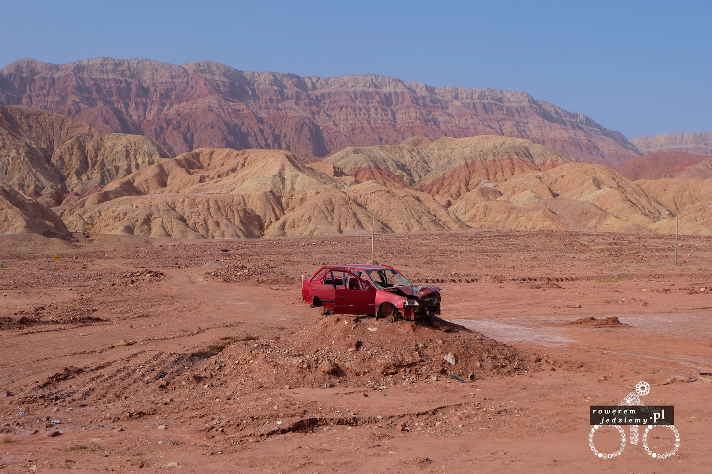
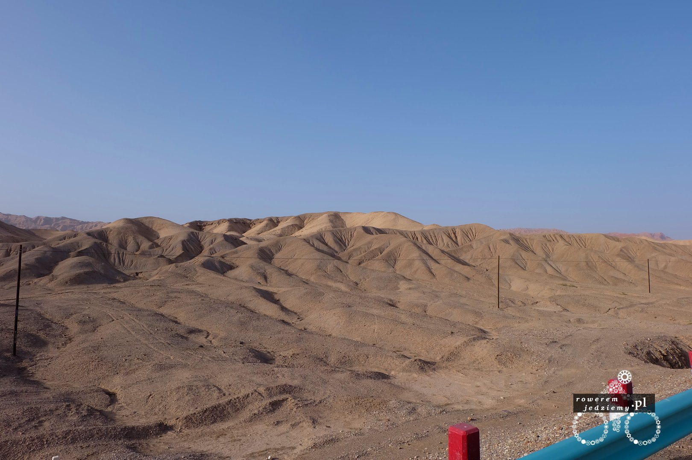
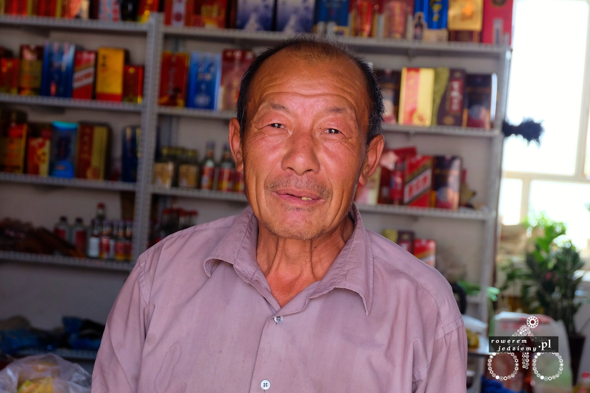
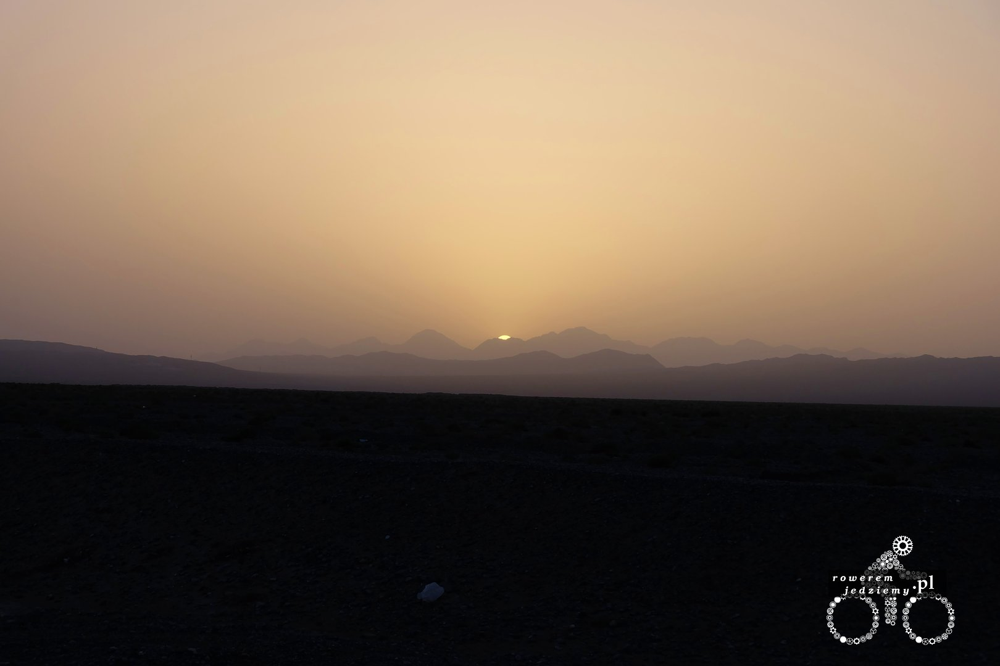

Odwodniony obudziłem się rano, trochę niewyspany, a to dlatego, że w nocy nie dały mi spać pająki. Nie, żeby coś mi do namiotu wlazło... po prostu są tutaj takie bardzo irytujące pajączki, które w nocy wchodzą pod namiot i sobie tak pod nim chodzą. Ponieważ nie mam karimaty, czasami któryś z nich chodził pode mną, co nie należało do najprzyjemniejszych odczuć. Rano, gdy się już obudziłem, wszystkie uciekły przy ruszeniu namiotu. Bardzo dobrze maskowały się na pustyni, ponieważ aparat nie odróżnia ich od piasku. Dotarłem jakoś tam do miasta, może "miasta" to za dużo powiedziane, ponieważ prócz stacji benzynowej i dwóch sklepów nic tu nie było. No i może jeszcze psy. Psy są tutaj bardzo irytujące, ponieważ standardowo nie lubią rowerzystów i listonoszy. Listonosza jeszcze tu nie spotkałem, ale cały czas żałuję, że nie wziąłem gwizdka na psy. Godzina 8 rano przed sklepem ubrany w piżamę właściciel wyleguje się na łóżku i patrzy na mnie wzrokiem "naprawdę musisz tu teraz coś kupować marny człowieku, mam ważniejsze sprawy na głowie" no ale sprzedał mi zapas wody.

Jadąc przez tą pustynię, czasami można zobaczyć bardzo ciekawe rzeczy jak na przykład wraki samochodów.

Trochę ten wrak kojarzy się z ciałami piratów wiszącymi przy portach z napisem "Piratom wstęp wzbroniony" (może trochę za dużo Piratów z Karaibów). Cały dzień wyglądał tak jak każdy inny, droga pustynia i nic więcej. Pierwszy raz zdarzyła mi się nieprzyjemna sytuacja związana z religią, a mianowicie nie zostałem wpuszczony do sklepu, bo jak to sprzedawca powiedział "no muslim". Nie chciałem się z nim sprzeczać, bo to mogły być jedyne dwa słowa, które znał, poza tym jestem na jego terenie. Korzystając z dobrodziejstw rynku, wybrałem drugi sklep, tym razem należący do Chińczyka. Przemiły starszy pan z wnuczkiem bardzo miło mnie przywitali i dali mi gratis melona. Uznałem, że go pokroję i się podzielę, bo i tak jest za gorąco, aby jechać.

Po zjedzeniu dostałem drugiego. Chyba bardzo mu zależało, abym wziął sobie na drogę. Wnuczek miał bardzo fajny kalkulator, który wymawiał cyfry po angielsku, dobry sposób na naukę dla dziecka. Chińskie sklepy mają trochę inne zaopatrzenie niż muzułmańskie. Nie ma tutaj chlebków Naan, ale za to są bardzo dobre chińskie bułeczki i cała masa innych chińskich dobrych rzeczy. Jeżeli kogoś to obchodzi, to tutaj drożdżówki robi się z tego samego ciasta co u nas rogaliki 7days.

Na koniec wrzucę zdjęcie, ukazujące jak bardzo zanieczyszczone jest powietrze, a widać to najlepiej podczas zachodu słońca. Dzięki temu zanieczyszczeniu różnice temperatur na tej pustyni pomiędzy dniem i nocą zmalały do około 20 stopni (z danych historyczny było kiedyś 40).

