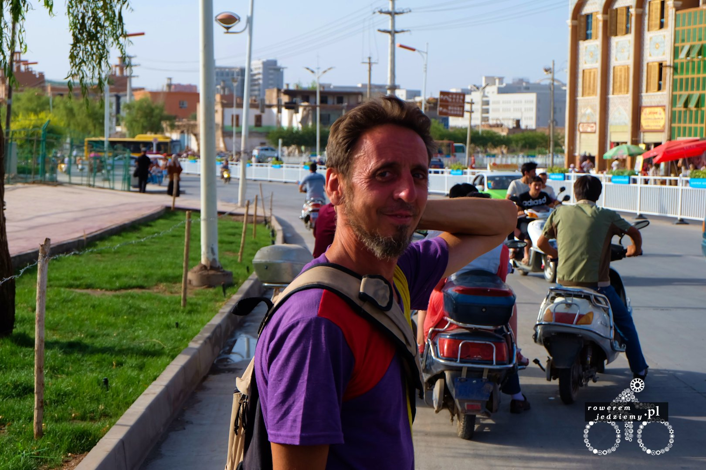
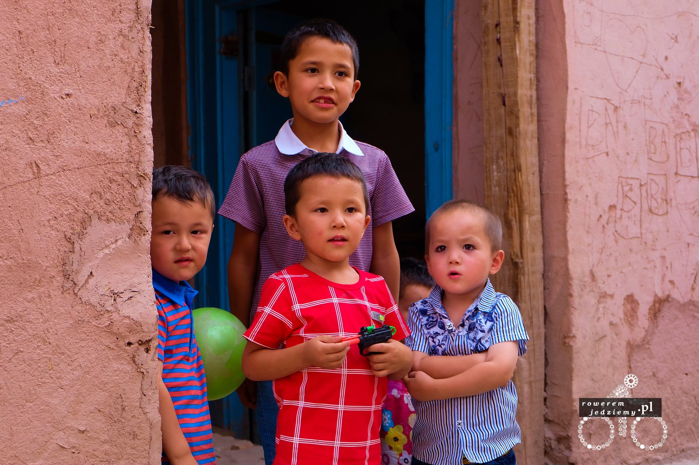

Dopiero co poznałem dwójkę polaków, Ewę oraz Marcina "Yeti", a już dałem się namówić na wyjazd pod Łuk Shimptona. Jeżeli nazwa wam nic nie mówi to dobrze, bo mi też. Jak się okazało, jest to największy naturalny łuk skalny na świecie. Odkryty w 1947 roku przez Erica Shimptona a dokładniej zbadany dopiero w 2000 przez National Geographic. Wysokość tego łuku od podłoża wynosi około 370m. Dla porównania najwyższy budynek w polsce (wysokość do dachu) ma 206 metrów i znajduje się we Wrocławiu (Sky tower). Podejście od strony zachodniej jest jednak niemożliwe dla zwykłych śmiertelników, ponieważ wymaga doświadczenia i sprzętu wspinaczkowego.

Tak więc udało nam się załatwić taksówkę, która podwiozła nas do podnóża góry, na której jest ten łuk. Kierowca standardowo słuchał disco (bardzo popularne zamiennie z arabską muzyką). Po dojeździe na miejsce musieliśmy kupić bilet. Całkowicie nie wiem po co, skoro nikt go nie sprawdzał, ale kierowca zaprowadził nas do budynku, gdzie takowe sprzedawali. Oczywiście Chińczycy są wstanie skomercjalizować wszystko, nawet łuk skalny. Podobno pobierają opłaty za zbliżenie się do środka Azji (punkt wypada gdzieś tam w Chinach), tak naprawdę nic tam nie ma szczególnego, ale to środek Azji więc ludzie zapłacą, aby dotknąć słupka. Na szczęście z powodu znikomej znajomości tej atrakcji turystycznej bilety na łuk są stosunkowo tanie.

Podróż na górę nie jest specjalnie ciężka, chociaż biorąc pod uwagę, że Chińczycy tam idą z zapasem jedzenia na dwa dni, zaczyna w pewnym momencie zastanawiać czy aby na pewno bułka i butelka wody to wystarczający prowiant. No ale Chińczycy zawsze biorą pełno jedzenia i nigdy po sobie nie sprzątają.

Na zdjęciu Marcin "Yeti" i droga na szczyt (dokładnie zdjęcie przedstawia zejście z góry).

Sam koniec trasy został już wybetonowany i ozdobiony w drewniane schody (nadal obok znajduje się wydeptana ścieżka, która kiedyś była używana).

Na szczycie spotkaliśmy jedną grupkę z Chin, z której to grupy pewna dziewczynka postanowiła zabawić się w rzucanie śmieci z podestu. Oczywiście dostała opieprz od Ewy za śmiecenie w tym miejscu, a następnie od swoich rodziców (którzy nie mieli nic przeciwko temu jeszcze kilka minut wcześniej). Na tym zdjęciu widać sam szczyt łuku a tak naprawdę idzie on jeszcze sporo w dół, lecz aby zrobić lepsze zdjęcie należy podejść od strony zachodniej, co jest, jak już napisałem, dużym wyzwaniem. Aby wyobrazić sobie wysokość, łuku można zobaczyć w oddali pustynię i określić jak bardzo "w dół" ona jest. Nie bez powodu ta dziewczynka rzucała śmieci w przepaść, aby określić jak długo będą spadać.

Jak przystało na każde miasto, posiada ono lepsze i gorsze dzielnice. Zostałem o tym poinformowany przez Chińczyka, którego poznałem już w Kashgarze. Te gorsze dzielnice to tzw. "Stare miasto". Stare miasto jest to oryginalny Kashgar, który swoją drogą wygląda jak Slamsy i w sumie jest slamsami. Składa się głównie z rozpadających się budynków, pijanych ludzi, nagich biegających dzieciaków i innych patologii. Wybrałem się tam tylko z powodu właśnie nowo poznanych Chińczyków oraz Jose (Hiszpan).

Przepraszam, że trochę odejdę od tematu, ale wypada powiedzieć kilka słów o Jose.

Jest to osoba, która dzielnie wykorzystuje Hiszpański system socjalny. Nie pochwalam takiego zachowania, ale też nie potępiam. Podróżuje on po świecie, otrzymując zasiłek dla bezrobotnych, w wysokości około 1000 EUR na miesiąc co wystarcza aż nadto. Jest wielkim zwolennikiem UE i twierdzi, że Hiszpania i jej system socjalny jest świetny. Próbowałem mu wytłumaczyć, że to, co robi to okradanie obywateli jego kraju, ale ciężko do niego dotrzeć (no bo przecież to państwo daje mu pieniądze).

No ale wracajmy do innych patologii :)

Tak wyglądają slamsy z zewnątrz. W oddali widać zabudowania nowego miasta. Z tego co się dowiedziałem, władze planują zniszczenie tej części, w przeciągu najbliższych kilku lat, więc jak ktoś chce to zobaczyć, to radzę się pośpieszyć. Co jest tam takiego wyjątkowego? Można zobaczyć budownictwo z bardzo odległego okresu. Z powodu nikłych opadów deszczu, zerowej wilgotności budownictwo nie jest wymagające. Niestety to co kiedyś było zapewne normalna częścią mieszkalną, trochę podupadło i zamieniło się w to co mamy teraz.

W tym miejscu ludzie niechętnie dają się fotografować, całkowite przeciwieństwo do sąsiednich "dzielnic". Nie ma tutaj turystów, ponieważ nie ma tego nigdzie w informatorach czy nawet na znakach.

Celem tego zdjęcia nie była kura, lecz nie mogłem tego zrobić aż tak bezczelnie, ponieważ z głębi "mieszkania" obserwowała mnie kobieta.

Nie są to najprzyjemniejsze widoki pod słońcem. Zakładam, że gdyby odrestaurować tę dzielnicę, byłaby to świetna okazja do pokazania jak kiedyś żyli tutaj ludzie, ale nie jest to chyba w planach władz miasta. Po wyjściu z osiedla mamy przed sobą most, który prowadzi do lokalnego bazaru. Chińczycy z którymi byłem na tej wycieczce, powiedzieli mi, że wejście na bazar jest niebezpieczne dla turystów. Oczywiście całkowicie im nie wierzyłem. To z tego powodu, iż istnieje mała woja pomiędzy Chińczykami i lokalną ludnością więc może dla Chińczyków jest to niebezpieczne, ale inni turyści są witani z otwartymi ramionami. Nie chciałem ich jednak zostawiać i zdecydowałem się wybrać tam jutro. Na koniec jeszcze zdjęcia kilku dzieciaków (dzieci lubią jak im się zdjęcia robi)

Tak ten ostatni specjalnie wdrapał się na ten słup, abyśmy mu zdjęcie zrobili :)
