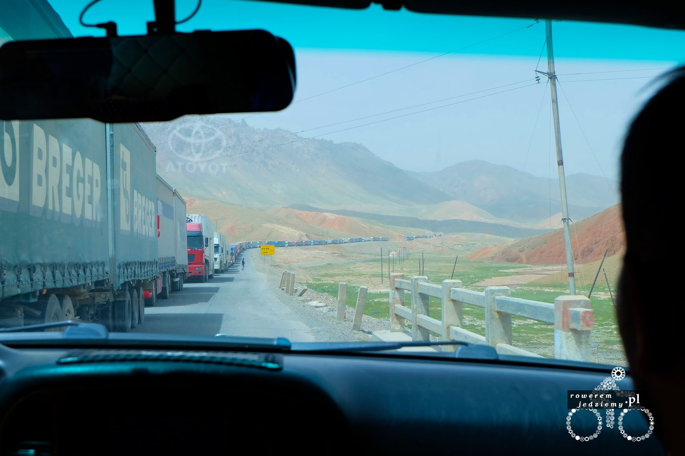
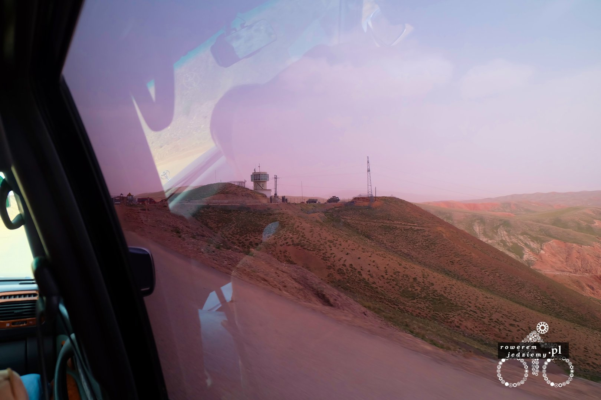
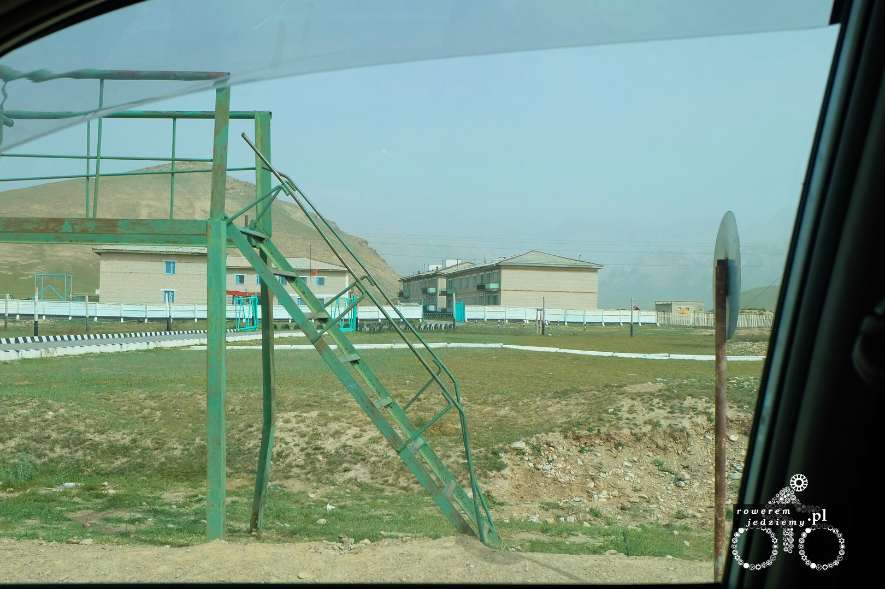
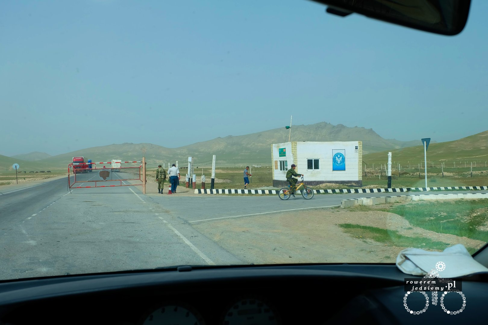
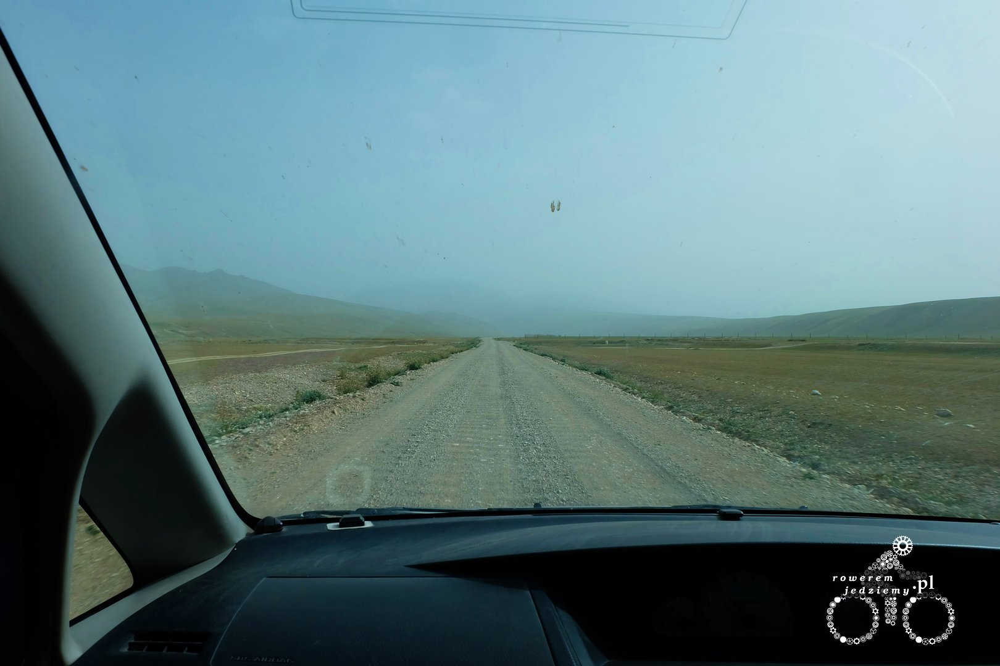
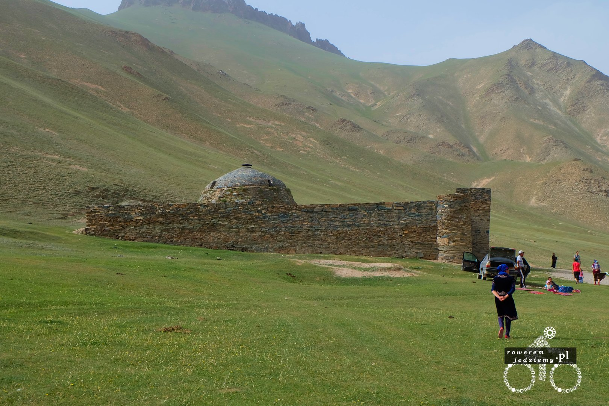
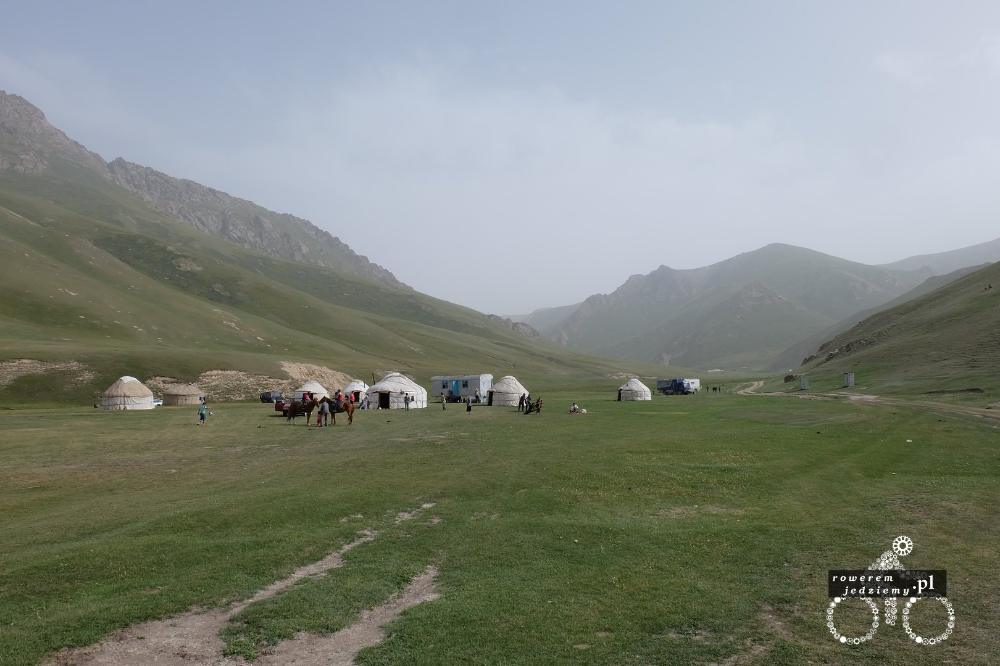

Zacznijmy od przejścia granicznego. A dokładnie od informacji, że nie mogę przejść w miejscu, w którym planowałem. Przejście nazywa się Torugart, trochę mi się kojarzy z Tortugą (Piraci z Karaibów). Dlaczego nie mogę tam przejść? A no dla tego, że to przejście jest tylko i wyłącznie dla Chińczyków. "No ale jak Pan chce, to jest pewien sposób..." i takim rozpoczęciem rozmowy wyjaśniono mi jak ominąć Chińskie przepisy. Jak więc to zrobić? Jedziemy do granicy Chińskim samochodem z Chińskim kierowcą, na granicy przesiadamy się w Kirgiski samochód z Kirgiskim kierowcą. Oczywiście nie za darmo, bo będzie to kosztować 400 USD. Na całe szczęście udało mi się znaleźć kompana, który podzieli ze mną koszty. Okazało się, że w moim hostelu stacjonuje pewien Japończyk, który jedzie z Japonii i już przejechał Chiny (trochę długo to zajęło, bo 9 miesięcy) i właśnie chce przekroczyć to przejście. Tak więc tylko 200 USD. Możecie zapytać, dlaczego nie przejadę drugim przejściem?

Mój rower się rozleci... Chodzi o to, iż koło zakupione w Aksu już ma lekką centrę a w Kirgistanie podobno dużo gorsze drogi. Mam zatartą piastę tylną (tak, tak piaskiem) no nie mam drugiego biegu (jakoś dało rady jechać). Wymiana tego w chinach nie jest nawet opcją, ponieważ nie są w stanie odkręcić mojej korby nawet. Jedyną opcją jest zamówienie części i czekać aż przyjdą. To nauczy mnie na przyszłość, że nawet wymiana napędu przed wyjazdem nie zwalnia z konieczności wzięcia zapasowych części i kluczy. Postanowiłem więc jakoś dojechać do Almat, bo tam jest lotnisko, z którego łatwo dolecieć do Lwowa. Na szybko udało się nawet dostać bilet, na za 10 dni więc spokojnie powinienem się wyrobić. Szkoda, że trzeba skrócić trasę, ale sam wyjazd ma być przyjemnością, a walka z rowerem po drodze przez pustynię w Kazachstanie trochę różni się od definicji przyjemności.

Ale, wracając do stanu obecnego... obecnie temperatura mojego ciała wynosi 39.5 stopnia i na szczęście już nie rośnie. Muszę wyrazić swoją wdzięczność dla Jonasa oraz Burcha (Cyryla) dwójki szwajcarów, którzy z nami spędzali czas, a teraz sprawdzają, czy jeszcze żyję. A dokładnie udało im się skołować termometr, przynoszą mi wodę i ogólnie pomagają. Właścicielka hostelu powiedziała mi, że szpital nie jest najlepszą opcją, bo są tam dużo gorsze warunki sanitarne niż w hostelu. Ponieważ zna ona miasto i to jak tutaj wygląda służba zdrowia, zaryzykuje i jej posłucham. Burch załatwił sporą dawkę paracetamolu, więc udało się trochę zbić gorączkę i przeniosłem swoje miejsce pobytu pod zimny prysznic. Ogólnie to nie polecam. Na całe szczęście udało się wyzdrowieć w dniu wyjazdu na granicę. 

https://www.google.co.uk/maps/place/Torugart+Port/@40.5544016,75.3871701,15z/data=!4m2!3m1!1s0x0000000000000000:0xb42f8ae837e915dc

Jeżeli ktoś chce kiedyś przekraczać granice w tym miejscu, radzę uzbroić się w cierpliwość. Po pierwsze będziemy stać w dość sporym korku, po drugie kilka kontroli granicznych.

Podobno jest to bardzo strzeżony teren z powodu obecności tam jakiejś bazy wojskowej. Fajnie było się dogadać z ludźmi po polsku (Kirgistan naturalnie zna Rosyjski). No i jak mi zapowiadano, skończył się asfalt...

Ugadaliśmy się z kierowcą, aby zawiózł nas do "Tash rabat" a my sobie dalej już poradzimy. Teraz co to jest "Tash rabat"? Jest to "karawanseraj" czyli zajazd dla karawan (tak musiałem skopiować tę nazwę, bo sam jej nie pamiętałem). Ten szczególny pochodzi z okolic XV wieku i znajduje się na wysokości 3200 m.n.p.m. Można tam zostać na noc lub przejechać się na koniu. Kolega z Japonii postanowił skorzystać z oferty, ale ja uznałem, że szkoda dnia a tak naprawdę prócz kilku zdjęć nic tam nie ma. Warto zauważyć, że lipiec ± 2 tyg to jedyny czas, gdy nie ma tam śniegu. Tak więc razem z moim rozklekotanym rowerem ruszyłem w dalszą podróż przez drogi Kirgistanu.

