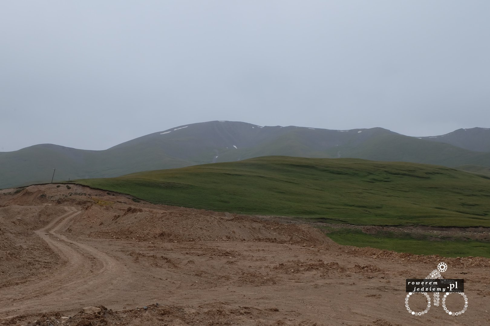

Pierwsze wrażenie po przyjeździe do Kirgistanu? Gdzie podziała się cywilizacja? Prócz tego, że drogi są w stanie, powiedzmy przedindustrialnym to ciężko tutaj o oznaki luksusu. Nawet po dojechaniu do pierwszego większego miasta (Naryn) ciężko było ze znalezieniem miejsca, aby rozmienić pieniądze. Ostatecznie zorientowałem się, że mając dolary, możemy dostać dużo lepszy kurs w "szarej" strefie niż w jakimkolwiek banku (kurs międzybankowy USD/KGS wynosił około 61 somy za dolara, a ja sprzedawałem dolary po 85 sonów). Jeżeli chcecie zobaczyć, jak wygląda "przedindustrialna" droga to zdjęcie wam da dobry przykład.

Czasami jednak zamieniała się w tradycyjny szuter, co było jeszcze gorszą opcją z powodu "tarki" która się na niej robiła.

Co można powiedzieć o tym kraju? Górzysty, mały, krowy!!!

Im dalej na północ tym droga robi się lepsza, pojawił się pewnie kilkunastoletni asfalt pamiętający czasy panowania Jelcyna w Rosji (Kirgistan uzyskał niepodległość kilka miesięcy wcześniej). Strasznie zaskoczyła mnie mała przejrzystość powietrza. Jak się okazało, jest to spowodowane przez Chińskie fabryki, które większość swoich zanieczyszczeń wysyłają właśnie tutaj (nie specjalnie, ale po prostu tak prądy powietrzne działają w tym regionie). Najlepiej obrazuje to porównanie sobie zdjęć z okolic Issyk Kulu (największe jezioro w Kirgistanie) sprzed 5 lat i obecnych.

Tak to wyglądało około 5-6 lat temu

A taka jest widoczność teraz. Nie ma to jak wybrać się nad jezioro, aby pooddychać świeżym powietrzem prawda? Tak sobie pomyślałem, że Kazachstan to ma szczęście, że odgradza go od Kirgistanu pasmo górskie, które ponownie zatrzymuje ten smog.

Nie jest tak, że specjalnie w tym momencie chciałem robić gorsze zdjęcia, po prostu widoczność jest naprawdę słaba. Jazda przez ten kraj nie należy do najciekawszych. Szczególnie z powodu niskiego zagęszczenia miast i co za tym idzie ludności. Większość ludzi skupia się głównie w dwóch ośrodkach, którymi są Bishkek oraz Osh. Cała reszta kraju to tak naprawdę małe mieścinki gdzie nie ma zbytnio pracy, a ludzie żyją z rolnictwa. Bishkek jest stolicą i ma około 900 tyś mieszkańców natomiast Osh jest drugim co do wielkości miastem z liczbą ludności około 250 tyś. Dla porównania 3 największe miasto nie ma nawet 100 tyś mieszkańców. Kraj jest jednym z biedniejszych, w jakich byłem. PKB na mieszkańca to tylko 1000 USD (w Polsce na 2015 to 12 500 USD). Przekłada się to na ceny częściowo, ponieważ wszystko prócz wody butelkowanej jest około 3-4 razy tańsze. Oczywiście nie rekompensuje to niskich zarobków, ponieważ nawet przy tak niskich cenach mieszkańcy mogą pozwolić sobie na zdecydowanie mnie niż my. Większość ludzi to Muzułmanie więc nie ma co się dziwić że architektura (jeżeli jest) także jest muzułmańska. Oczywiście standardowym elementem Kirgistanu są Yurty i dziwne pomniki?

Takich zwierzęcych pomników jest tutaj zdecydowanie za dużo, aby przejść obok tego obojętnie biorąc pod uwagę, że czasami znajdują się bardzo daleko od jakiejkolwiek wioski. Jadąc da radę jeszcze zauważyć typowe muzułmańskie cmentarze.

Wygląda to trochę jak miniaturowe domki, ale tak naprawdę to są groby. 

Czasami zastanawiam się, co tak naprawdę oznaczają niektóre budowle w dziwnych miejscach...

Czy napisałem już, że im bardziej na północ, tym lepsza droga? Oczywiście jak każda zasada od tej także może być wyjątek...

Na dodatek jeszcze czasami leje, ale to w górach normalne. 

Gdyby ktoś kiedyś był w tym kraju, proszę się nie zdziwić, jeżeli nowo poznana osoba zapyta was "A ty to ile zarabiasz?". W naszej kulturze nie rozmawia się o zarobkach, a tutaj nie jest to niczym dziwnym. Gdy tego jeszcze nie wiedziałem, to pierwszą osobę okłamałem, ponieważ myślałem, że jak się dowie ile zarabiam i porówna to sobie z zarobkami w jego wiosce to jeszcze weźmie mnie na okup :) Nie to było jednak jego intencją. Ludzie tutaj są bardzo zainteresowani, tym jak u nas się żyje. Gdy opowiadałem im, jak tam wygląda Polska, gdzie to właściwie jest i że też u nas się wódkę pije (swoją drogą zadziwiająco duża ilość muzułmanów pije wódkę :) ), z uwagą słuchali i nawet zadawali pytania. Większość osób zna rosyjski, więc można się jakoś tam dogadać. Ludzie są mili, ale kierowcy już nie koniecznie. Przyzwyczajony z chin, że klakson jest tylko dla informacji, że ktoś mija cię z danej strony, zostałem przetarty przez samochód i jeszcze kierowca wyskoczył do mnie z wyrzutami, jak to ja jeżdżę... No i na dodatek przez te drogi mój Kindle nie wytrzymał i postanowił pęknąć.

