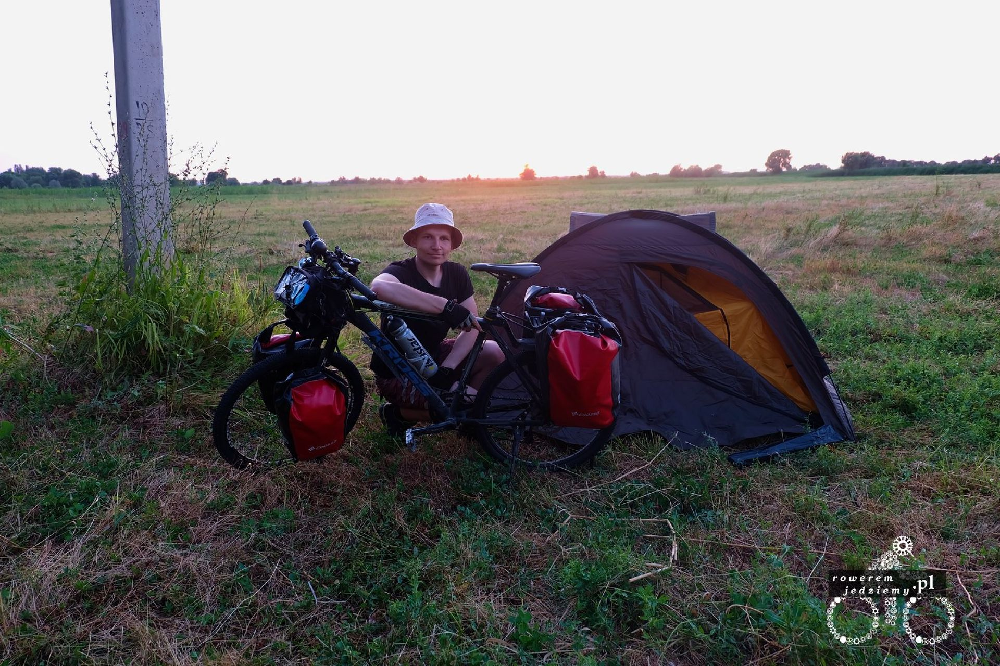

Jak już wspomniałem w poprzednim wpisie, wylądowałem w Kazachstanie. Dla tych, co nie wiedzą wypada przedstawić ogólny obraz sytuacji. Kazachstan to państwo powstałe w wyniki rozpadu Związku Radzieckiego. Jest to państwo Islamskie (nie mylić z obecnie popularnym ISIS), a dokładnie to ponad 70% obywateli to wyznawcy islamu. Dzień w którym przyleciałem, wypada dokładnie na środek Ramadanu (islamskie święto podobne do chrześcijańskiego "Wielkiego Postu"). W czasie tego święta (trwa miesiąc), muzułmanin nie powinien spożywać pokarmu za dnia. Z tego wynika reguła pozwalająca obżerać się przed i po zachodzie słońca i dzielnie to wszyscy wykorzystują. Oczywiście religia religią, ale ludzie wiedzą swoje (w końcu byli kiedyś częścią ZSRR). Zasady religijne nie są tutaj aż tak przestrzegane, jak w krajach arabskich, lecz gdy zrobiłem zakupy w pierwszym napotkanym supermarkecie i rozłożyłem się na parkingu, aby spożyć musli, ludzie patrzyli na mnie trochę ze złością (a może to była ciekawość?). Postanowiłem znaleźć dworzec i podładować sobie trochę powerbanki oraz komórkę. Dzięki mapom, które wcześniej zainstalowałem na telefonie, nie zajęło to dużo czasu i nawet udało mi się natrafić na kontakt znajdujący się na zewnątrz budynku dworca kolejowego.

Przed dworcem było bardzo dużo taksówkarzy i z racji tego, iż spędziłem tam dobrą godzinę, wdałem się w rozmowę. Ja, nie znając Rosyjskiego (jak również Kazachskiego) oni, nie znając Angielskiego. O dziwo rozmowa przebiegała całkiem gładko. Udało nam się nawiązać komunikację ruchowo werbalną z wykorzystaniem rosyjsko-pochodnego języka. W ten sposób nauczyłem się kilku słów takich jak:

- "Normalnie" - dobrze
- "Karta" - mapa
- "Kitaj" - chiny

Dla osób trzecich ta rozmowa musiała wyglądać zabawnie, ale wzbudzałem spore zainteresowanie. Otrzymałem od nich nową mapę papierową Kazachstanu, na której była nowa droga. Droga ta (bazując na mapie) bardzo ułatwiała mój przejazd do granicy chińskiego, więc za namową nowo poznanych postanowiłem z niej skorzystać.

Na ten wyjazd nie wziąłem kasku, więc potrzebowałem nakrycia głowy. Pierwszym pomysłem było kupno fajnego kapelusza i tak oto wybrałem się na lokalny bazar, gdzie dodałem kapelusz marki "Adidas" oczywiście pani na bazarze zapewniała, że "oryginalny" itp. Ale cena 10zł mówiła sama za siebie.

No i teraz drogi. Te o dziwo w Kazachstanie są bardzo dobrej jakości. Ogólnie to jest to kraj rozwinięty podobnie jak Polska z troszkę wyższymi cenami. Większość osób sądzi, że nie ma tu cywilizacji, lecz muszę was rozczarować, jest i to całkiem nieźle rozwinięta. Muszę przyznać, że sam tak sądziłem jeszcze przed przylotem :). Niestety pierwszego dnia pogoda nie dopisywała i przechodziły krótkie 20min burze (takie małe oberwania chmury). Wiązało się to z koniecznością zatrzymywania raz na jakiś czas, aby nie jechać w aż takim deszczu. Jeden z tych postojów skończył się zaproszeniem na kawę i ciastka przez właściciela sklepu/serwisu samochodowego. Przemiły facet nawet dodałem go na FB. Zaoferował mi nocleg, ale była dopiero godzina 15 a ja chciałem jeszcze dzisiaj trochę kilometrów zrobić. W takim razie zaoferował mi drugi nocleg tym razem u jego brata który, który mieszka w Żarkent. Dostałem numer telefonu do brata i informacje, że wszystko jest załatwione, abym tylko się odezwał, jak będę w Żarkent.

Jadąc dalej, im robiło się ciemniej, tym więcej ludzi było na ulicach małych wiosek i miasteczek. To właśnie z powodu ramadanu, ponieważ po zachodzie słońca zaczynała się impreza. Ostatecznie zatrzymałem się na jakimś polu i pogoda się znacznie poprawiła. To pewnie dlatego, iż wyjechałem z górskiego rejonu Almat na bardziej płaski i suchy.

