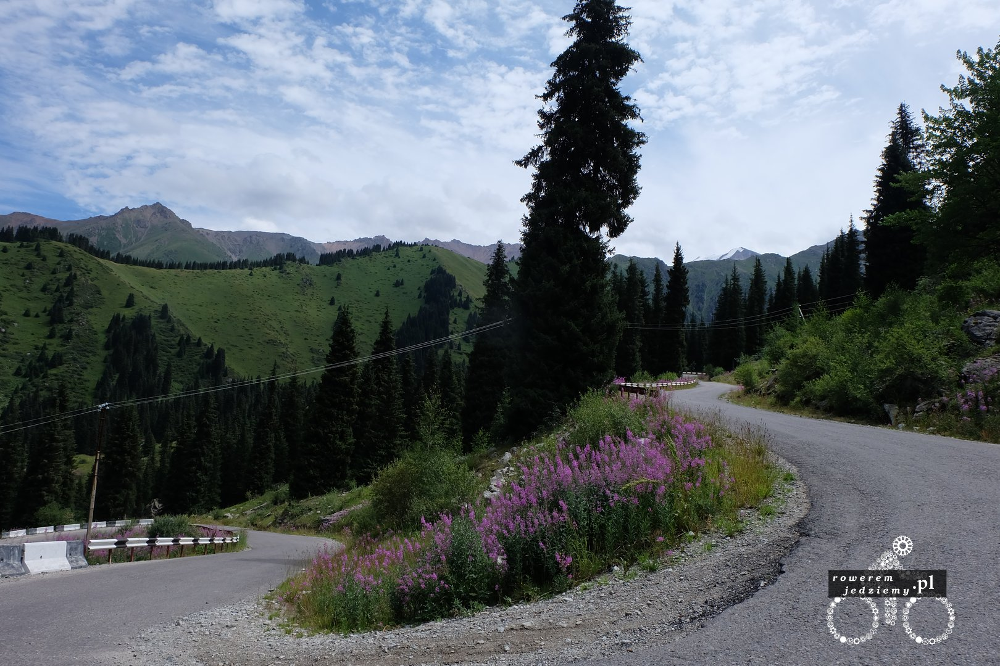

Almaty największe miasto, była stolica i centrum kulturowe Kazachstanu, miasto olimpijskie, ośrodek naukowy i długo by tu jeszcze wymieniać. Wielką ciekawostką jest umiejscowienie tego miasta. Różnica pomiędzy najniższym punktem a najwyższym wynosi ponad 1000m (1140m aby być dokładnym). Ciekawe zjawiska mają tutaj miejsce jesienią, gdzie w niżej położonych częściach miasta jest ciepło natomiast w jego górnych partiach leży śnieg. Miasto posiada wiele zabytków i kompleks olimpijski, ale zacznijmy znowu od początku. Po przybyciu do miasta zawitałem w KFC, aby dobrać się do internetu i znaleźć miejsce do spania. Niestety w KFC nie było internetu, więc musiałem szukać dalej i tak właśnie trafiłem na uniwersytet. Z powodu wakacji na uczelni znajdowało się tylko kilka osób, ale udało mi się spotkać profesora z instytutu fizyki. Ponieważ zawsze dobrze dogadywałem się z fizykami, tym razem także dobrze mi poszło. Po pierwsze znał angielki i pomógł mi skorzystać ze studenckiej kafejki internetowej, a następnie pokazał mi swój wydział i laboratorium.

Tam maszyna w tle służy do nakładania jednoatomowych warstw metali na dowolne powierzchnie. Jego katedra zajmuje się badaniem wykorzystania właśnie takich jednoatomowych warstw w przemyśle. Pokazał mi kilka przykładów tych warstw pod mikroskopem. Bardzo miło z jego strony, że postanowił poświęcić swój czas na pomoc i oprowadzenie po uczelni. Zaraz po zakończeniu zwiedzania wybrałem się do właśnie znalezionego hostelu. Po dotarciu przywitało mnie miękkie łóżko, ale nie czas teraz z niego korzystać. Nie spać... zwiedzać!!!

 A jest dużo do zwiedzania. Istnieje tutaj wiele zabytków pozostałych po byciu stolica państwa. Pałac prezydencki, budynek parlamentu itd.

Almaty posiadają także największe centrum handlowe w całym Kazachstanie. Oczywiście w centrum nie zabrakło nawet akwarium z rekinkami :)

Jak na każde duże miasto przystało, królują tutaj parki, gdzie można odpocząć i poczytać książkę.

Książki są dostępne dla każdego. Największy park nazywa się park Prezydenta. Został wybudowany na cześć pierwszego i jak do teraz jedynego prezydenta Kazachstanu. Dobrze rozumiecie, od momentu upadku ZSRR w Kazachstanie rządzi jedna i ta sama osoba. To głównie dzięki niemu ten kraj jako jedyny z całej grupy "stanów" rozwinął się tak dobrze. Park prezydenta jest ogromny i dostępny dla każdego.

Kolejna ciekawą rzeczą w Almatach jest ich źródło wody pitnej. Ponieważ Almaty nie leżą nad żadną rzeką, nie posiadają żadnego centrum uzdatniania wody. Woda pitna pochodzi z jeziora położonego w górach. Z jeziora poprowadzona jest rura, która dostarcza wodę pitną. Jezioro to jest bardzo dobrze strzeżone i nie można podejść zbyt blisko bez "permitu" czyli papierka wydawanego chyba przez jakiegoś urzędnika. Oczywiście nie odpuściłbym sobie, gdybym tam nie podjechał, więc mimo stanu mojego roweru postanowiłem wjechać na tą górkę (2511m). Nazwa tego jeziora nie jest jakoś szczególnie wyszukana "Almaty Big Lake". Tak więc z samego rana rozpocząłem podjazd na szczyt.

To jest właśnie wspomniana rura.

Z powodu bardzo drogiej wody i taniej benzyny ludzie wolą jechać w góry, aby zaopatrzyć się w czystą wodę źródlaną.

Ci ludzie nie byli do końca trzeźwi. Ciekawe co na to wojskowi, którzy mają siedzibę na szczycie :)

Ponieważ nie można podejść pod samo jezioro (jest ono obserwowane przez strażników) postanowiłem udawać głupka, który nie umie przeczytać znaków i przynajmniej spróbować.

Prawie się udało, ale w pewnym momencie zatrzymał mnie strażnik z jednej wierzy. Wziął sobie mój paszport i po chwili proszenia udało mi się uzyskać chwilowy wstęp nad jezioro (oczywiście cały czas byłem obserwowany), aby zrobić zdjęcia.

Na koniec kilka dodatkowych ciekawych zdjęć

Tak to jest mój rower w drodze powrotnej.

On tak przez cały lot (prawie 7 godzin)...

No i jeszcze zapis trasy z profilem wysokościowym

<iframe name="plotaroute_map_100039" src="https://www.plotaroute.com/embedmap/100039?units=km&hills=show" style="position:absolute;top:0;left:0;bottom:0;right:0;width:100%; height:100%;" frameborder="0" scrolling="no" allowfullscreen webkitallowfullscreen mozallowfullscreen oallowfullscreen msallowfullscreen></iframe>

Route map for <a href="https://www.plotaroute.com/route/100039?units=km" target="_blank" title="View this route map on plotaroute.com">China-Kyrgyzstan-Kazakhstan 2015</a> by <a href="https://www.plotaroute.com/userprofile/30172" target="_blank" title="View this person's profile on plotaroute.com">kemal piro</a> on <a href="https://www.plotaroute.com" target="_blank" title="plotaroute.com - free route planner for walking, running, cycling and more">plotaroute.com</a>

