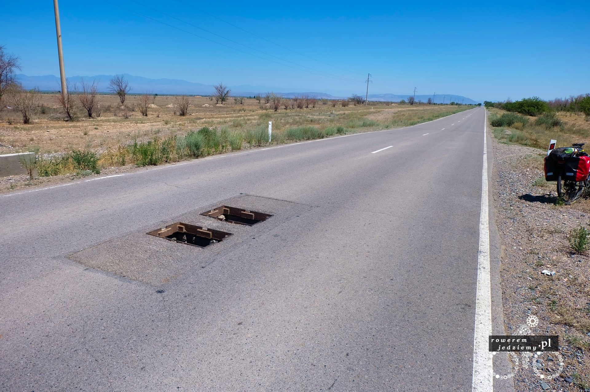
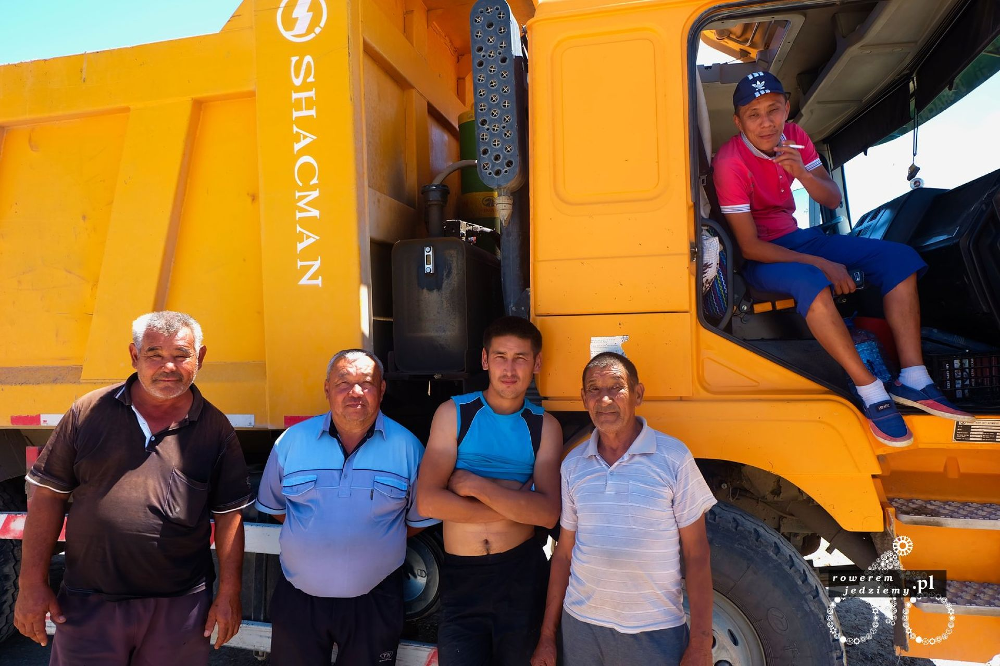
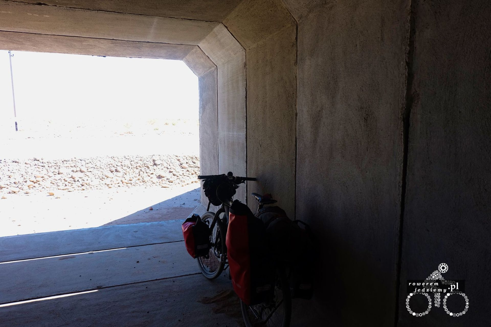
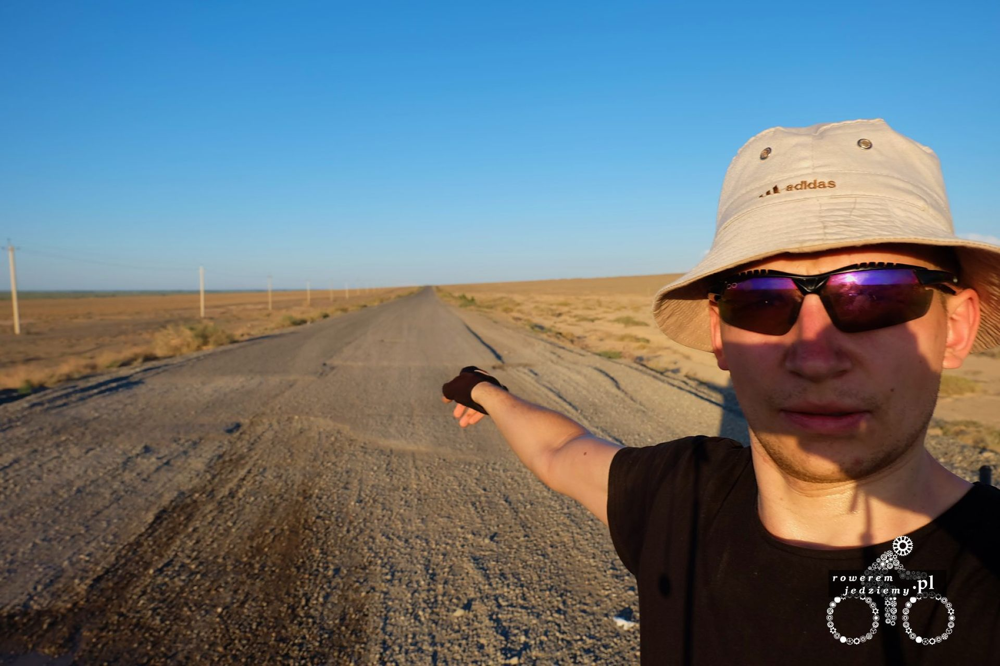
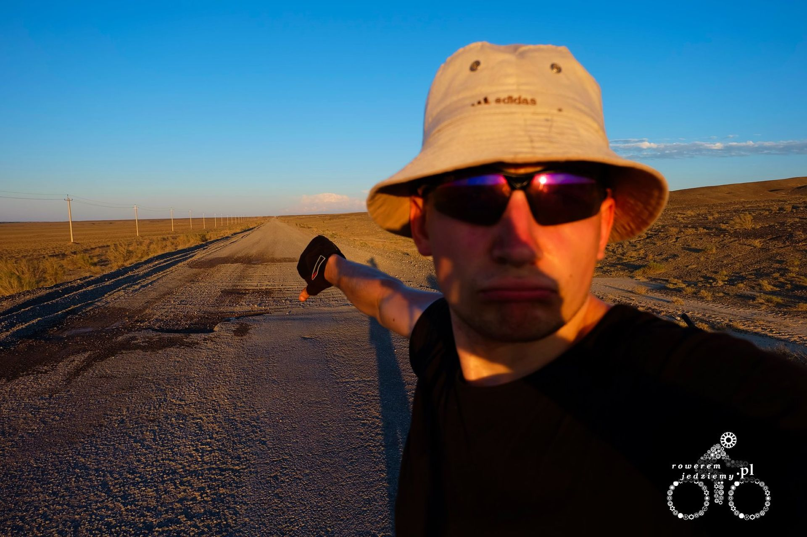
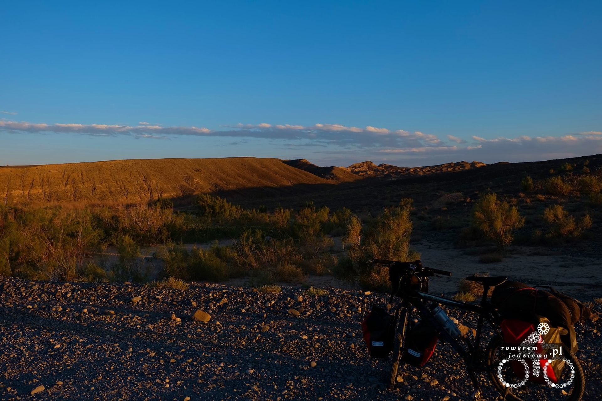

Pewnie zastanawiacie się, jak jedzie się przez Kazachstan? Aby ująć to krótko, stwierdzę tylko, że każdy chaos ma swój porządek :) Rozwijając myśl, jest to trochę tak, że zasad ruchu drogowego poza miastem nie przestrzega nikt. Trochę przypomina mi to Ukrainę, gdzie panuje zasada "Większy ma pierwszeństwo". Mimo to kierowcy są tutaj mili i nie wymuszają pierwszeństwa na rowerach. Może to też z tego powodu, iż rzadko widzą rowerzystę na krajówce daleko od miasta. Co mnie irytowało na początku to trąbienie. Po chwili zrozumiałem, że to po prostu sposób, aby wyrazić swoje emocje. Większość tych klaksonów oznacza "Cześć co tam". Przynajmniej tak mi się wydaje, bo czasami prócz klaksonów kierowcy zwalniają, aby mi pomachać, kilkoro z nich się nawet zatrzymało, aby sobie zrobić zdjęcie. Obecnie mój kolor skóry bardzo się różni od miejscowego, więc dodatkowo się wyróżniam. Co do samej drogi to okazało się, że przygotowali oni pułapki dla wyprzedzających kierowców takie jak te:

Wygląda to dość niebezpiecznie i nie mam pojęcia po co zostawić takie otwarte włazy na drodze, tym bardziej iż nie jest to pierwszy taki przypadek i można je spotkać co kilka km. Zastanawia mnie częstotliwość wpadania w takie pułapki? Jak pewnie widać po zdjęciu pogoda znacząco się poprawiła. Nawet bardzo, ponieważ temperatura sięga nawet 35 stopni. Ostatecznie dojechałem do drogi, którą mi zaproponowali taksówkarze. Na samym początku jechało się dobrze, chociaż zastanawiał mnie całkowity brak samochodów. Brak samochodów został wyjaśniony po przejechaniu jakiś 20km a to dlatego, iż skończył się asfalt i zaczęło coś w rodzaju szutru. No ale nic, może to tylko kawałek - pomyślał sobie nieświadomy rowerzysta i pojechał dalej. Po kilku kilometrach zorientowałem się, iż był to bardzo zły wybór, ponieważ prędkość spadła drastycznie i w związku z pozbyciem się amortyzatora przed wyjazdem na rzecz sztywnego widelca zacząłem odczuwać hopki, po których jechałem. Jakie hopki? A no takie, które powstają po przejechaniu dostawczaków po miękkim podłożu. Ponieważ ich opony mają sporą kostkę, formują równoległe pasy, które są jedyną utwardzoną częścią drogi, więc koniecznie po nich trzeba jechać. Gdy znajdę czas, wrzucę film z jazdy po czymś takim.

Po jakimś czasie udało się spotkać pierwszych ludzi. W związku z tym iż zbliżała się pora obiadowa, dostałem ciepły obiad (jakiś ryż z mięsem na ostro). Robota oczywiście jak to typowa robota "może poczekać" i robotnicy się tego trzymają niezależnie od szerokości geograficznej. Swoją drogą przemili panowie, którzy chyba nie koniecznie przestrzegali ramadanu (chociaż jest tam chyba zapis, że w wypadku pracy fizycznej można spożywać pożywienie czy jakoś tak). Dostałem nawet jedzenie na wynos i trochę wody, ponieważ moje zapasy były na wykończeniu (nie spodziewałem się, iż nie będzie tutaj sklepów czy wiosek po drodze).

Jedynym sposobem, aby schować się przed słońcem, były tunele pod droga, które były z jakiegoś powodu wystarczająco duże, aby zmieścić cały samochód a nawet dostawczaka. Otrzymując informację, że ta droga jeszcze ciągnie się przez 80km i wygląda podobnie jak teraz. Tak więc zostawili mnie z dwiema opcjami wracać 25 kilometrów i objechać ten kawałek robiąc około 160km lub przejechać 80km szutrem. 80km wydawało się ciekawszą opcją. W pewnym momencie (jakieś 50km później) pojawił się asfalt, którego się nie spodziewałem.

Na moje nieszczęście, skończył się równie szybko, jak się zaczął :(

Widać tutaj właśnie jak wyglądają fałdy stworzone przez samochody dostawcze. Jadąc tą drogą, z tempem gorszym niż normalnie nie udało się wyjechać z tej drogi do końca dnia więc w tym stepowo-pustynnym klimacie rozbiłem namiot i zostałem na noc.

