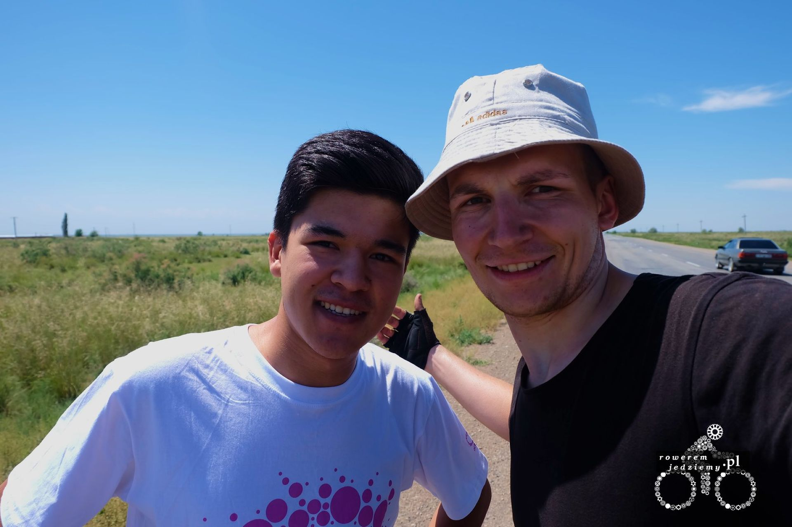
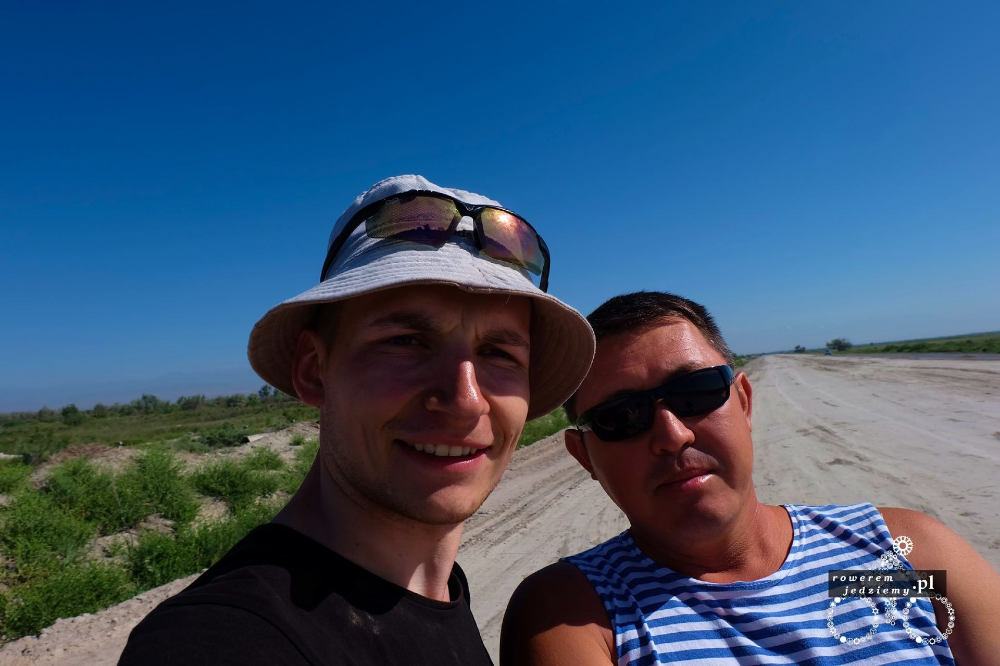

Mimo że jestem rannym ptaszkiem, nawet ranny ptaszek nie lubi być budzony zbyt wcześnie. Tak się stało, gdy około godziny 5 rano obudził mnie kierowca zagubionej ciężarówki. Niestety nie byłem mu w stanie pomóc, ponieważ sam nie do końca ogarniałem okolicy (w sumie ja tu pierwszy raz). Chyba uznał, że nic ze mnie nie wyciągnie, więc wrócił do swojej maszyny i odjechał. Ponieważ słońce już wschodziło nie było już sensu kłaść się spać (obecnie osoby lubiące spać pewnie zastanawiają się nad sensem wypowiedzi "nie było sensu kłaść się spać"). Zostało mi dokładnie 0.25l wody i z powodu braku informacji o tym jak daleko jest najbliższa wioska (mapa wskazywała dość spory kawałek) postanowiłem wypić ją gdy naprawdę zacznę się odwadniać. Na całe szczęście skończyła się już droga szutrowa (w sumie to bardziej była budowa niż droga, ale nie wchodźmy w szczegóły). Po przejechaniu jakiś 20km okazało się, że jest na mojej drodze małe miasteczko a w nim o dziwo jeden sklepik :) . Jak mogłem się spodziewać, nie było tam zbyt dużego wyboru, lecz biorąc pod uwagę brak jedzenia, udało mi się dostać najlepszą wodę pod słońcem. Tak dobrą, że kupiłem aż 4 butelki więc zapas na dość spory kawałek trasy. Prócz tego lokalny chlebek (niestety musli nie było), wysokoprocentowe mleko (mają tutaj 6% i 10%) no i jakiś ser. Można uznać, że śniadanie gotowe. Już nauczyłem się witać z ludźmi, używając "Salam alejkum" i odpowiadać na takie powitanie "As salam". Czasami spotykam się z trochę dłuższą odmianą odpowiedzi, lecz ja staram się używać tej właśnie, ponieważ mniejsza jest szansa, iż coś przekręcę i przez przypadek obrażę ich matkę czy coś w tym stylu. Temperatura zaczęła szybko rosnąć i w pewnym momencie podczas postoju osiągnęła 41 stopni. Co można zauważyć po drodze to dużą ilość meczetów, każda mała wioska ma własny meczet, który wygląda dość okazale. Możecie sobie wyobrazić wioskę z rozpadającymi się domami pojedynczymi sklepami gdzie na środku stoi przepiękny meczet. To coś jak z naszymi kościołami, które także buduje się bardziej na pokaz niż aby było po prostu użyteczne.

No ale dojechałem do Żarkent, gdzie miałem okazję spotkać się z bratem poznanego niedaleko Almat Алик Арупов (nie wiem czy to się odmienia). Ale w związku z tym iż znowu było południe, a ja nie chciałem marnować czasu, pojechałem dalej, aby dojechać przynajmniej do granicy Chińskiej. Po drodze spotkałem kilku ciekawych ludzi, a może lepiej powiedzieć, że to oni spotkali mnie, ponieważ zatrzymali się na drodze lub też poboczu, aby zrobić sobie zdjęcie lub po prostu porozmawiać.

Z tym drugim człowiekiem nawet udało się napić czaj z odrobiną wódki (a sądziłem, że muzułmanie nie piją alkoholu, ale jak widać w post sowieckich republikach ta zasada nie może być prawdziwa). Można powiedzieć, że był to czaj z prądem. Odpowiednia mieszanka mocnej herbaty z być może lokalnym wyrobem rozgrzewa, mimo że nie jest to potrzebne. To na tym zdjęciu to kolejna droga w budowie i Pan ten tam pracuje. Tym razem obok jest stara droga, która jest cały czas w użytku, więc nie myślcie sobie, że musiałem jechać po tym piasku. Droga do Chin nie była już aż tak obfitująca w wydarzenia i udało się spokojnie dotrzeć do granicy pod wieczór, lecz musiałem zawrócić i odjechać kawałek, ponieważ granica w tym miejscu nie jest czynna 24h tylko od 9 do 16, co zmusiło mnie do rozbicia namiotu w pobliżu i czekania do samego rana.