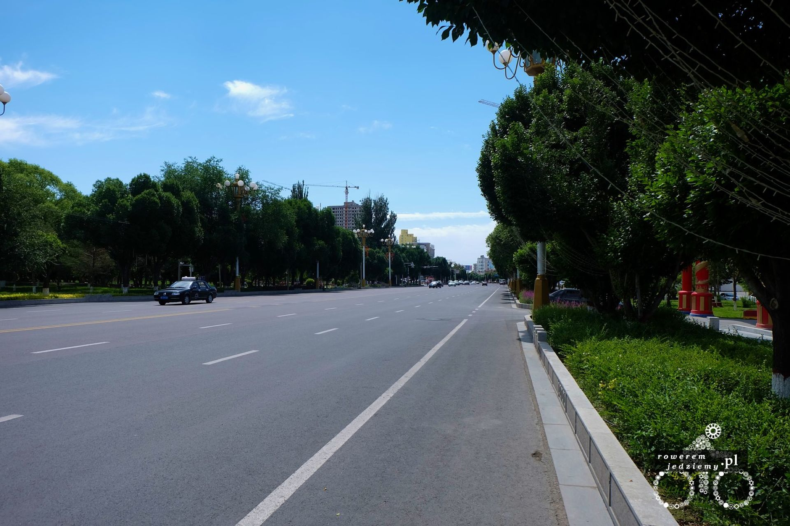
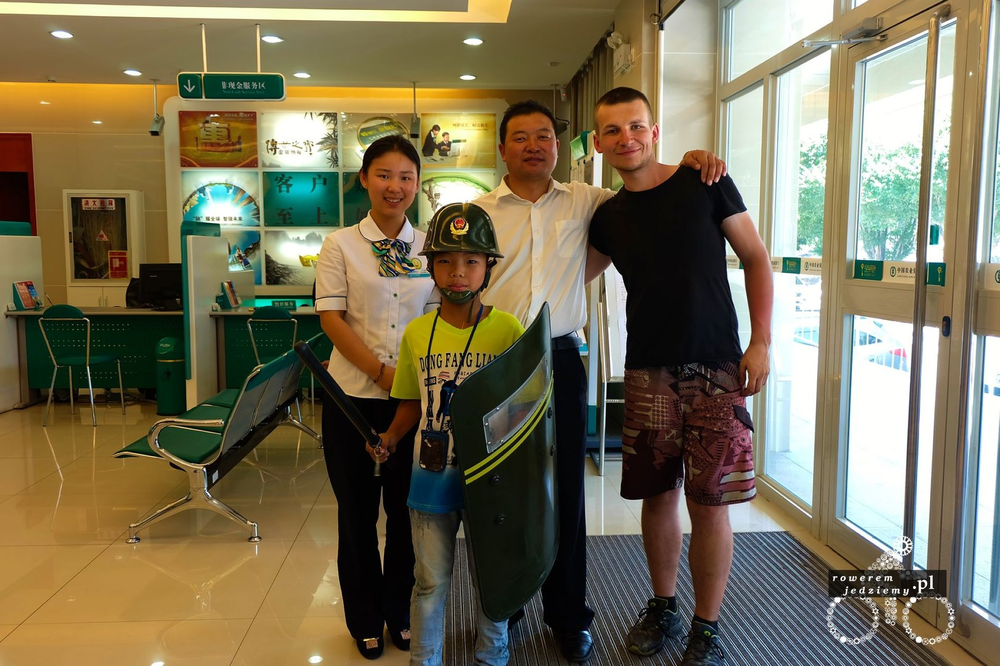
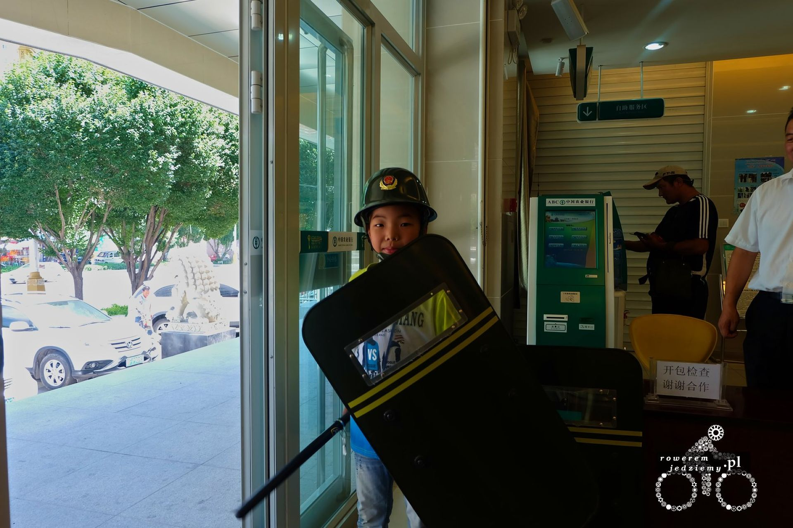
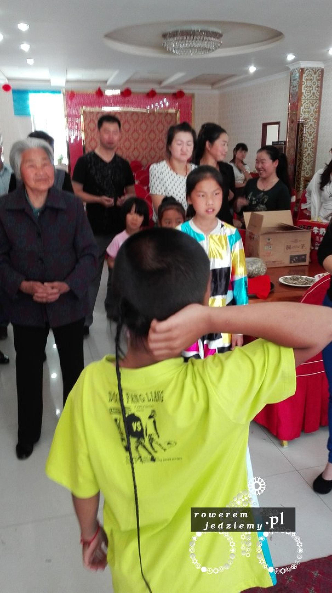

No to dzisiaj upragnione Chiny. No ale jak zwykle trzeba swoje odstać przed dostaniem się do środka. Jak to mniej więcej wygląda? Granica Kazachsko-Chińska (czy tam Kazachstańsko-Chińska) składa się z kilku bram. Pierwsza brama otwiera się o godzinie 8 czasu lokalnego. Już przed tą godziną ustawiła się tam spora kolejka osób, które tak jak ja chciały przedostać się do Chin. Jak zwykle wzbudzam zainteresowanie swoją osobą na szczęście również wśród wojska (czy może to są celnicy?). Dzięki swojej nienaturalnej sytuacji (chciałbym wierzyć, że to o urok osobisty chodziło) zostałem wpuszczony jakieś 5 min przed wszystkimi. Do pokonania miałem jakieś 1000m do drugiej bramy i tak się musiało złożyć, że na tym odcinku pękła mi dętka. Tak więc do drugiej bramy nie dotarłem już pierwszy, a nawet nie dotarłem tam jadąc na rowerze. Na drugiej bramie postanowiłem wymienić dętkę jeszcze przed kontrolą. Ciekawie to musiało wyglądać, ponieważ jak gdyby nigdy nic zdjąłem sakwy i zacząłem zdejmować oponę. Po kilku minutach wszystko było naprawione i mogłem iść dalej. Druga kontrola przebiegała bez problemów. Wzięli sobie mój paszport, wizę sprawdzili, czy to ja i puścili dalej. Kolejna bramka, kolejna kontrola tym razem ze skanerem, który na szczęście pomieścił cały rower, lecz musiałem zdjąć sakwy. Myślałem, że już tyle, ale po przejściu tunelem rodem z filmów o obcych (taka plastikowa tuba, półprzezroczysta) dotarłem do kolejnego stanowiska kontroli paszportów (to się chyba nie znudzi lub po prostu mnie tak kontrolują). 

Około godziny 9 udało mi się opuścić budynek i teraz dopiero natrafiłem na ciekawy problem. Jeżeli jesteś mrówką, to wsiadasz w małego busika, który to przewozi cię przez "strefę niczyją" strzeżoną przez uzbrojonych żołnierzy umiejscowionych na wieżach co kilkaset metrów. Niestety busik nie był w stanie zmieścić mojego roweru, więc musiałem być traktowany jako zmotoryzowany. Strefa to około 7km i otrzymałem informacje, że nie mogę na tym odcinku zatrzymać lub też wykonywać żadnych nieprzewidzianych ruchów (jak na przykład wyrzucenie butelki). Dlaczego? A to dla tego, że mogę zostać zinterpretowany jako zagrożenie (domyśliłem się, co jest tego konsekwencją). Przejechałem więc, przez cały odcinek tak jak powiedzieli i dotarłem do ostatniego punktu kontroli. Już trochę podirytowany tym, że wszyscy pytają się czy nie przewożę czegoś niebezpiecznego "zażartowałem" i powiedziałem, że w rowerze mam bombę. Niestety tutaj nie znają się na żartach, pewnie nawet nie znają pojęcia żart. Panowie wzięli mnie na bok, dodatkowo przyszło dwoje żołnierzy i zaczęli wypakowywać mi rzeczy z sakw. Po tym jak przyszedł ktoś kto zna angielski, zostałem poinformowany, że mój rower zostanie przecięty w celu sprawdzenia, czy nie ma tam materiałów wybuchowych. Oczywiście pierwszą reakcją była panika. Co ja zrobię bez roweru? Szybko starałem się wytłumaczyć, że nie ma tam żadnych materiałów i że to tylko żart. Skończyło się na tym, że zabrano mi tylko jabłka (na teren CHRL nie wolno wwozić warzyw i owoców).

Gdy sytuacja się uspokoiła, zrobiłem sobie zdjęcie z żołnierzem, który mówił po angielsku (to on zaproponował). Poprosił mnie, abym nie wrzucał tego zdjęcia do internetu, ponieważ może mieć przez to problemy, więc zgodnie z przyrzeczeniem tego nie zrobię. Zaraz po wyjściu z budynku straży granicznej moim oczom ukazało się pierwsze miasto w Chinach.

Jest to spory szok, biorąc pod uwagę, że właśnie przyjechałem z Kazachstanu, gdzie przejście graniczne wieje głębokim PRL i składa się z kilku rozpadających budynków. Chiny mimo małego miasteczka od razu zaprezentowały 3 pasmową drogę i wysokie budynki. Oczywiście zaraz przy przejściu stało dużo cinkciarzy, którzy wyglądali na zapętlonych, powtarzając w kółko "dolars, dolars". Ja postanowiłem skorzystać z bankomatu, ponieważ nie wiedziałem, jaki jest faktyczny kurs wymiany waluty. Znaleźć bank nie jest trudno, udało mi się trafić do jakiegoś dużego oddziału, gdzie spotkałem bardzo przyjaznych ludzi. Pomogli mi obsłużyć bankomat i pozwolili podładować telefon. Zostałem przez nich zaproszony nawet na obiad i mogłem skorzystać z prysznica znajdującego się na terenie banku. Co do obiadu to spodziewałem się typowego jedzenia chińskiego znanego z polski. Byłem trochę zaskoczony, otrzymując coś bardziej arabskiego niż chińskiego. Mimo to było to bardzo dobre, jak się okazało to mięso z czegoś na wzór bizona, czyli wołowinka. Do tego bardzo słabe piwo. Na tyle słabe, iż młody, który z nami tam był pił je razem z nami. Po prostu poziom obsługi na najwyższym poziomie.

Dzieciak na zdjęciu powyżej nauczył mnie składać małe chińskie samolociki z papieru. Kobieta (która bardzo dobrze mówiła po angielsku) wyjaśniła mi kilka rzeczy. Dowiedziałem się że praca w banku to prestiż i że pracować może tam tylko Chińczyk. Dlaczego jest takie ograniczenie i dlaczego o nim wspominam? W regionie, w którym obecnie przebywam, Chińczycy stanowią jedynie około 50% populacji, reszta to rdzenni mieszkańcy. Tak jest, skośnoocy przyjaciele nie są rdzennymi mieszkańcami tej części Chin. Rdzenni nazywają się Huie (tak, wiem jak to brzmi, ale wcale tutaj nic nie przekręciłem więcej o nich na Wikipedii https://en.wikipedia.org/wiki/Hui_people). Po drugiej wojnie światowej Chińskie władze zaczęły przesiedlać obywateli ze wschodu tutaj, aby mieć większa władzę nad tymi terenami i obecnie stanowiska w państwowych spółkach mogą zajmować wyłącznie Chińczycy. Nie tylko o spółki tutaj chodzi także o służby takie jak policja itp. Prowadzi to do spięć pomiędzy nacjami, która czasami kończą się małą rozróbą. Na co dzień żyją jednak obok siebie i sobie nie wadzą. Zebrałem się z miasta i wyjechałem na autostradę. Autostrada bardzo ładna, ale nie jechałem nią zbyt długo, ponieważ równolegle do niej pojawiły się dwie drogi (przypuszczam, że to po prostu stare drogi, obok których wybudowano autostradę). Ciekawe rozwiązanie swoją drogą. Co da się zauważyć w Chinach, możesz jechać rowerem po autostradzie, jeżeli jesteś w stanie utrzymać prędkość 40km/h. To był właśnie powód, dlaczego zjechałem z tej autostrady. Utrzymanie takiej prędkości, po tym jak skończył się spadek (około 4 km), było już cięższe. Przez pewien czas nawet obok mnie jechał radiowóz i chyba sprawdzał czy przekraczam to 40km/h. Widocznie nie miał żadnych zastrzeżeń, bo w końcu przyśpieszyli i pojechali dalej. Znowu wjechałem w dolinę i zmieniła się roślinność. Sinciang jest to Kazachska prefektura autonomiczna w Chinach ze stolicą w Yining. Ogólnie to przepiękna dolina otoczona dwoma pasmami górskimi, z których najbardziej znane jest Tian Shan. No ale na więcej zdjęć będzie trzeba poczekać.

Na koniec jeszcze jedno zdjęcie z "imprezy" wchodzenia w dorosłość dzieciaka ukazanego powyżej.

Na czym polega taka impreza? Jak pewnie widzicie, z tyłu jego głowy jest taki warkoczyk. Ten oto warkoczyk jest zapuszczany od urodzenia i w momencie wejścia w dorosłość (nie ma to nic wspólnego z pełnoletnością) jest on ucinany. Oczywiście musi być impreza, aby to wszystko opić i tak dalej. Mnie udało się na takową załapać :) To z tego powodu zrobiłem dzisiaj tylko 40km.