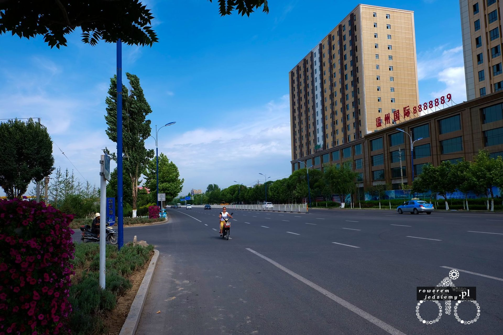
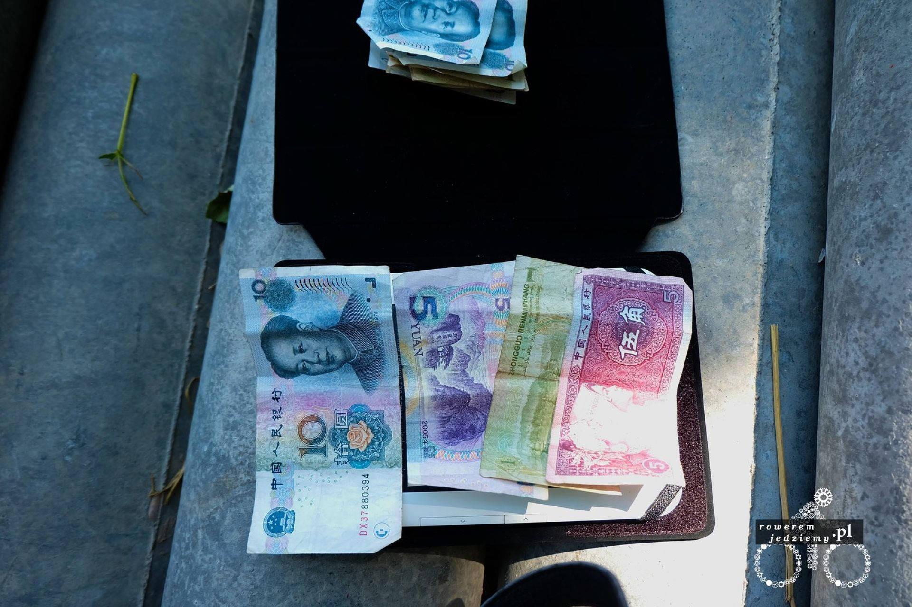
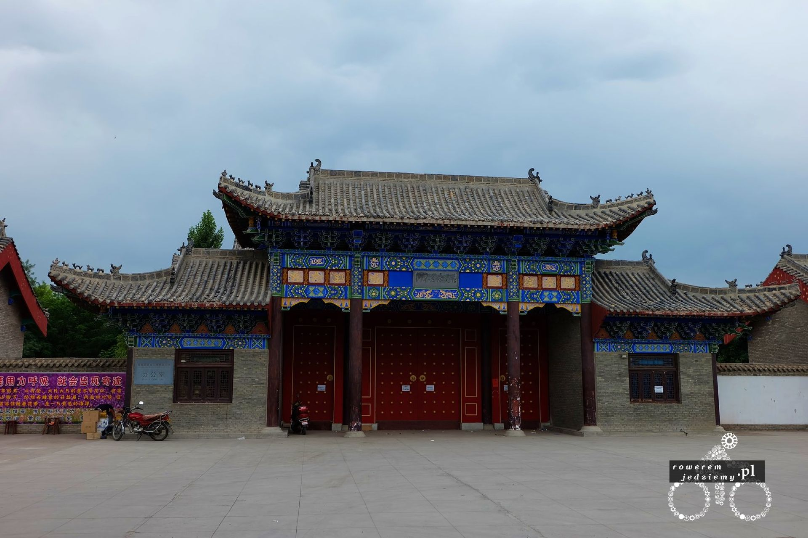
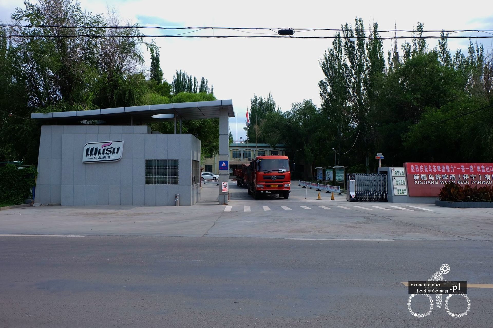

Pierwszą rzeczą, która należy przyznać jest to, ze Chińczycy mają bardzo dobre drogi. Powodem może być to że większość z nich powstała w ciągu kilku ostatnich lat. Czasami drogi budowane się z dużym wyprzedzeniem (tak samo jak miasta). Skutkuje to obrazami tego typu:

 

Taka ilość miejsca pozostaje niezagospodarowana :) Ale przynajmniej nie ma korków. Wszystkie drogi wyglądają mniej więcej w taki sposób. I nie to nie jest autostrada :)

#### Teraz do rzeczy... jak jeździ się w chinach.

Po pierwsze to jazda tutaj jest bardzo chaotyczna. Nie powoduje to problemów, ponieważ ludzie są na tyle inteligentni, aby nie powodować korków. Nie wiem, czy coś takiego przeszłoby w europie, ponieważ z powodu braków przepisów i wysokich kar za spowodowanie wypadku ludzie nauczyli się przepuszczać innych, nie zwalniając przy tym ruchu. Co można zauważyć to praktycznie brak świateł czy nawet ronda na dużych skrzyżowaniach. Kolejną rzecz, jaką nie sposób nie zauważyć, jest używanie klaksonu. Ale nie jest to polskie używanie klaksonu typu "Gdzie jedziesz baranie" czy też włoskie w podobnej formie językowej. Tutaj klaksonu używa się mijając/wyprzedzając innych uczestników ruchu. Robiąc to, osoba przed tobą nie wykonuje głupich manewrów, typu zmiana pasa na twój, ponieważ wie, czy będziesz go wyprzedzał z lewej, czy z prawej strony (ciekawe co robią osoby głuche na jedno ucho?). Sam zacząłem się dostosowywać do nowego sposobu jazdy przez używanie trąbki, którą mam na kierownicy.

Udało mi się dojechać do miasta zwanego Huocheng a dokładnie do jego nowej części. Miasto dzieli się na dwie części, starą i nową. Stara jest to część mieszkalno/zabytkowa a nowa mieszkalno/przemysłowa. Tak więc czekała mnie pierwsza wizyta w sklepach chińskich. Jak na europejczyka przystało, zacząłem szukać jakiegoś supermarketu, ale po spędzeniu około pół godziny jeżdżąc po mieście, dowiedziałem się że supermarket się w chinach niepopularne. Skorzystałem więc z oferty bazaru, gdzie udało mi się dostać chlebki Naan i świeże mleko nalane do przyniesionej przeze mnie butelki. Zastanawiałem się przez chwilę nad świeżością tego mleka i tym czy nadaje się do spożycia, ale skoro lokalni je kupowali, to znaczy że nie jest trujące. Prócz rzeczy typowo spożywczych kupiłem też maskę przeciwpyłową, ponieważ tutejsze samochody dymią niczym niemieckie czołgi z pierwszej wojny światowej. Poza tym są one tutaj popularne, więc trzeba podążać za modą.

Problem był z kupnem wody w większych butelkach niż 0.45-0.65l. Po długim szukaniu zacząłem pytać się ludzi. Oczywiście zrezygnowałem już z używania języka angielskiego, ponieważ i tak nikt go tutaj nie rozumie i próbowałem używać polsko-rosyjskiej hybrydy. Łatwiej się chyba dogadać na migi. W pewnym momencie zatrzymałem parę która wychodziła z bazaru i tańcząc coś w rodzaju makareny, chyba wytłumaczyłem, że chcę kupić duże butelki wody. Swoją makareną wytłumaczyli mi, abym jechał za nimi :) Tak więc jadąc sobie za nową Toyotą Corollą, dojechałem na obrzeża miasta, gdzie nie było już sklepów. Okazało się, że zaprowadzili mnie do swojego domu, gdzie dostałem 10l baniak z wodą :) Chyba trochę się nie dogadaliśmy, ale nie będę się z nimi sprzeczał. Nie chcieli żadnych pieniędzy, tylko zrobić sobie zdjęcie.

W tym miejscu dobrze by było opisać, jak wygląda prywatne życie takiego Chińczyka. A mianowicie takie trochę życie na pokaz. W Polsce mamy dziwny fetysz, aby posiadać odstawiony dom, do którego możemy zaprosić znajomych i to właśnie dom (coraz częściej też samochód) definiuje status osoby. W Chinach z racji tego, iż nie zaprasza się zbyt często kogoś do ciebie (jak już zapraszać to w jakimś konkretnym celu, a nie aby sobie posiedzieć), domu mają bardzo niski standard. Co rozumiem przez niski? Mieszkałem w akademiku przez 3.5 roku moich studiów i powiem, że standard polskiego akademika we wrocławiu jest lekko wyższy niż ich mieszkań. Bardzo często podłoga jest betonowa nawet bez dywanów innego rodzaju wykładziny. Meble raczej proste i skromne, tak samo, jak łazienka. Co do łazienki to jeszcze wypada dodać, iż bardzo często nawet w nowych domach spotyka się dziurę w ziemi zamiast toalety :) Prócz domu wszystko wygląda fajnie. Jak już wspomniałem para, którą spotkałem, jeździ sobie nową Toyotą Corollą, posiadają dobrej jakości smartphony (ci posiadali samsunga s6 edge i to nie jego podróbki chińskie), ubrania zazwyczaj też dobrze wyglądające (nie znam się na tkaninach, tym bardziej z wyglądu więc nie jestem wstanie określić dokładnie jakości). No i tak wygląda przeciętny Chińczyk. Później się jeszcze dowiedziałem, że z samochodami to jest tak, że jaki masz samochód, określa zazwyczaj w jakiej klasie społecznej jesteś. Niższe klasy mają samochody produkowane w Chinach, klasa średnia samochody Japońskie lub Koreańskie, klasa wyższa Europejskie lub Amerykańskie. Dlaczego taki podział? To w wyniku ceł na towary. Cło na samochody z Japonii i Korei nie jest aż tak wysokie, lecz cło na samochody europejskie czy amerykańskie to 100%, czyli kupując skodę fabię, zapłacisz więcej niż za nową Toyotę...

