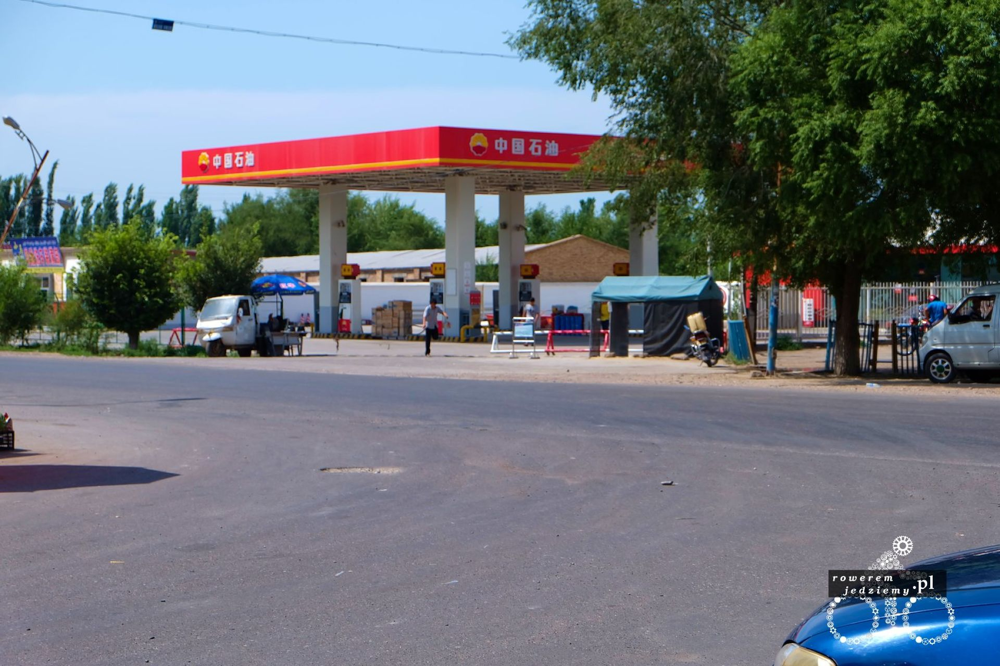
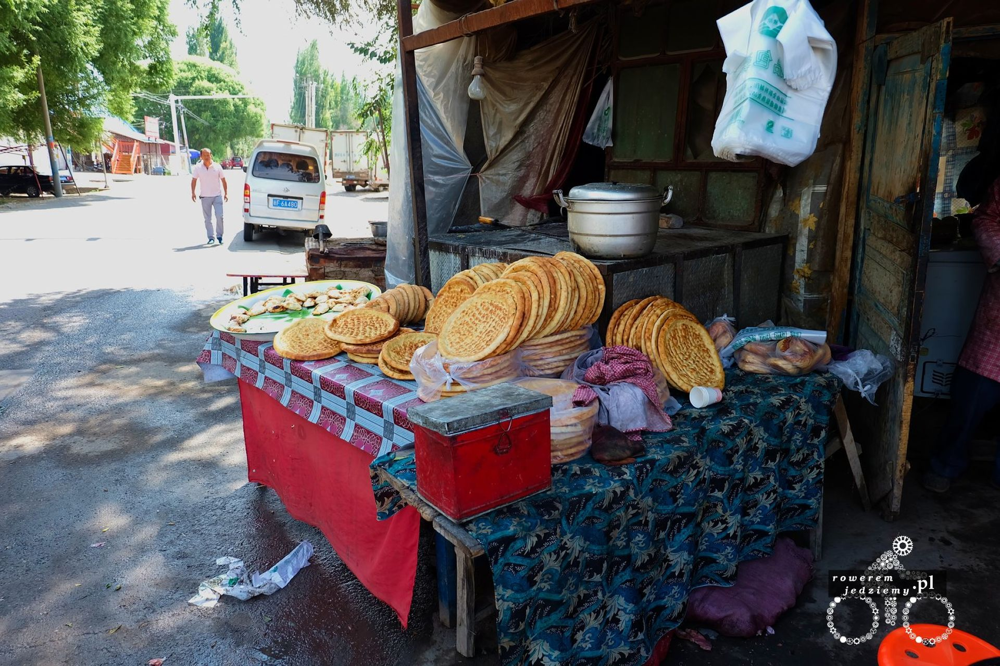
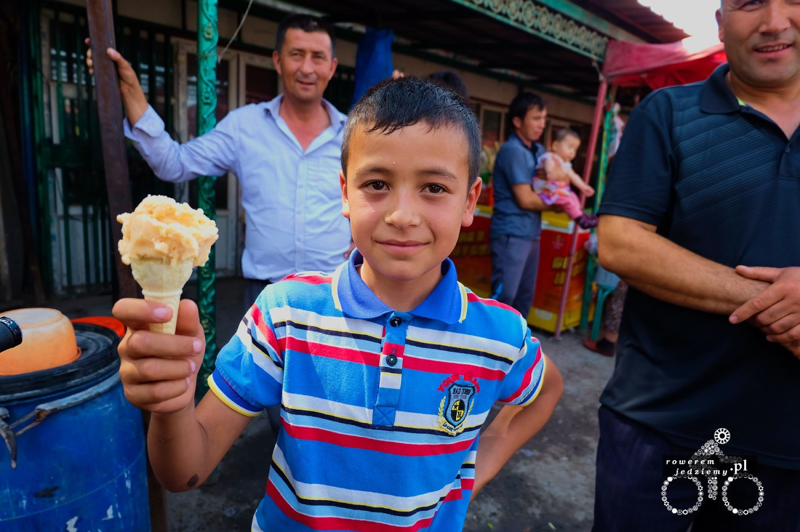
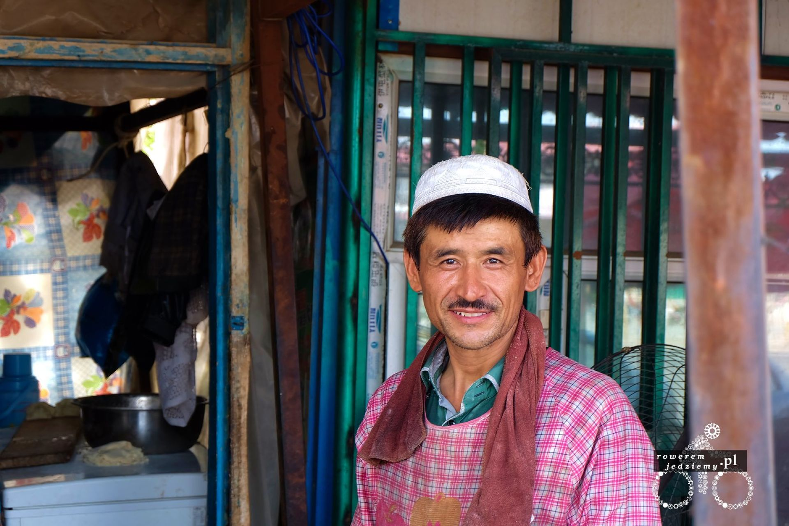
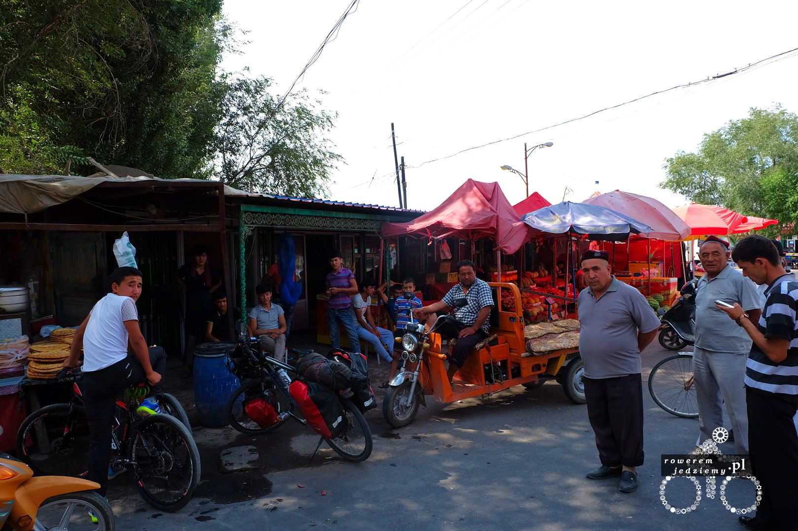
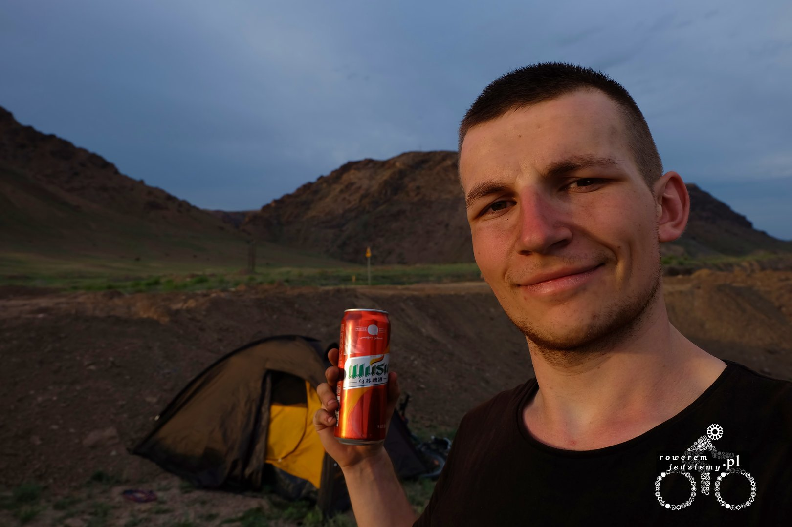
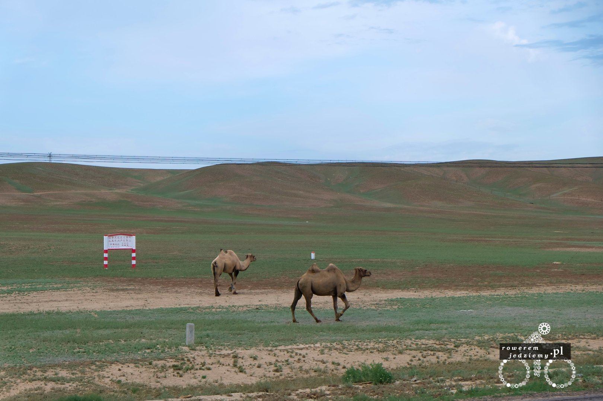
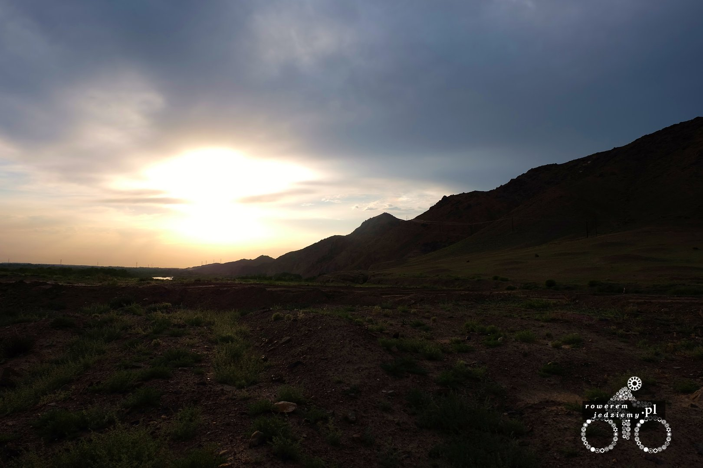
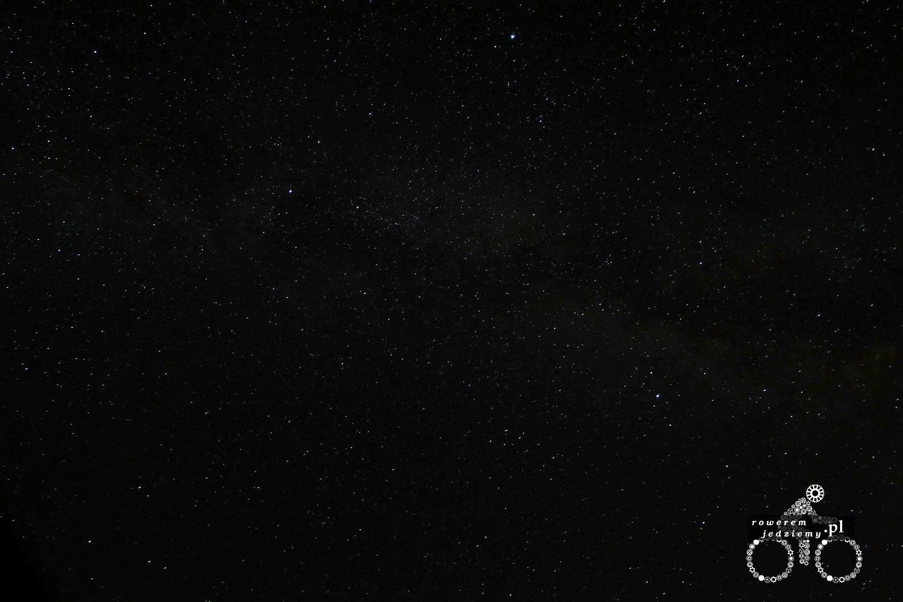
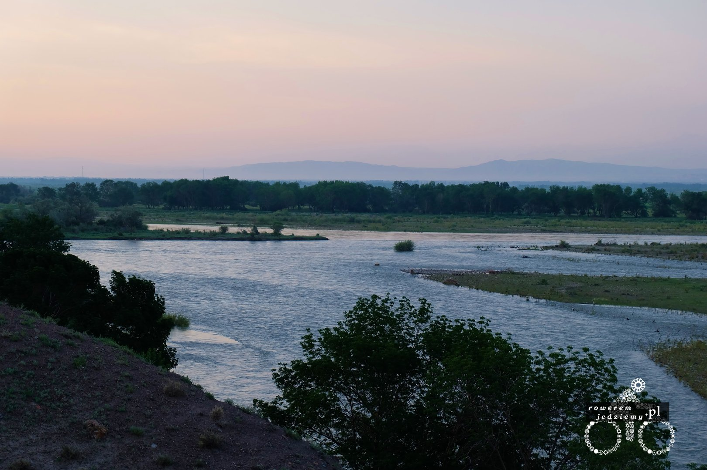

Jak już wspomniałem w poprzednim wpisie, rejon Sinciang zamieszkują Chińczycy oraz Chińscy muzułmanie. Ci drudzy stanową bardzo sporą grupę ludności i bardzo trudno ich przeoczyć, szczególnie że większość jedzenia sprzedawane go ulicy jest robiona przez nich. Całkowicie zaakceptowałem brak musli w mojej diecie (nie sposób tutaj dostać tego przysmaku) więc przerzuciłem się na lokalne jedzenie. Pewnego razu zatrzymałem się, aby zrobić zdjęcie stacji benzynowej. 

Zapytacie, po co robić zdjęcie stacji benzynowej? A to dlatego, że w tej części Chin stacje benzynowe są ogrodzone i nie wpuszczają samochodów do środka. Tankowanie odbywa się w prosty sposób. Podchodzisz z kanistrem, nalewasz, idziesz do samochodu i tankujesz. Proste prawda? No ale zacząłem o jedzeniu i ludności, a tu stacja benzynowa się wplątała... Podczas robienia tego zdjęcia zostałem zaczepiony przez jednego z tych muzułmanów. Chciał on, abym sobie z nim zrobił zdjęcie. Całkowicie przyzwyczajony do tego, że to ja jestem tu atrakcją turystyczną, a nie oni oczywiście ustawiłem się z owym człowiekiem do zdjęcia i automatycznie zebrała się cała gromadka. Ponieważ było tam kilka stoisk z jedzeniem/warzywniak/lodami po krótkiej rozmowie z tubylcami (znowu pseudorosyjski język) skończyłem z sakwą pełną chlebków Naan, owoców, wody i bakaliów :)

Od kiedy wjechałem do tego kraju, przekonałem się, że gościnność nie jest tylko domena krajów słowiańskich. Warto tutaj wspomnieć, że nie robi im to problemu, że nie jestem muzułmaninem. Nie było trzeba długo czekać, aby trafić na następną okazję do skorzystania z uprzejmości lokalnej ludności. Gdy tylko przyjechałem do małego sklepiku gdzieś w jakiejś tam wiosce po kupnie wody i zrobieniu sobie zdjęcia otrzymałem 2 piwa w prezencie. Czasami mi się wydaje, że oni te prezenty traktują jako rodzaj zapłaty za zdjęcie :)

Ciekawe rzeczy można spotkać po drodze. Jak na przykład wielbłądy w ich nienaturalnym środowisku (nie ta strona gór chłopaki, pustynia jest po drugiej stronie).

Na zdjęciu z piwem widzicie, w jakich ciekawych miejscach można rozbić namiot, ale jeszcze lepsze są widoki wieczorem i w nocy (niestety nie byłem w stanie zrobić aż tak dobrego zdjęcia gwiazd, z powodu braku samowyzwalacza gdzie nie ma maksymalnego czasu naświetlania, mój aparat może ustawić sobie czas wyświetlania na 8s, a trzymanie spustu migawki kończy się poruszeniem aparatu).

