Jakość chińskich dróg dobrze obrazuje to zdjęcie.

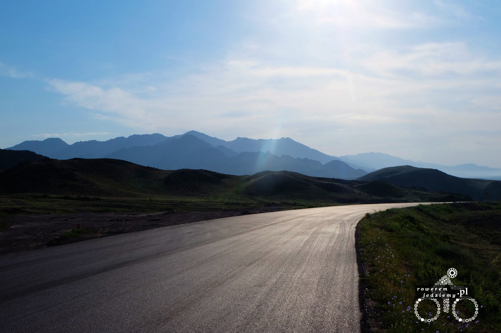

Gładko i bez żadnego ruchu. Wiem, że nie jest to pewnie popularna trasa i mało zaludniony rejon chin, ale tutaj naprawdę jest znikomy ruch uliczny. Możesz jechać środkiem drogi i nawet czytać książkę, ponieważ szansa na spotkanie samochodu jest bliska 0. Poza tym oni i tak trąbią, więc szybko się zorientujesz. Oczywiście można też podziwiać widoki, zamiast czytać książkę i korzystać ze słonecznej pogody. Jeszcze się nie dowiedziałem, co oznaczają częste napisy na wzgórzach, ale pewnie jakieś populistyczne hasła typu "pracuj a będzie ci dane" czy coś w tym stylu.

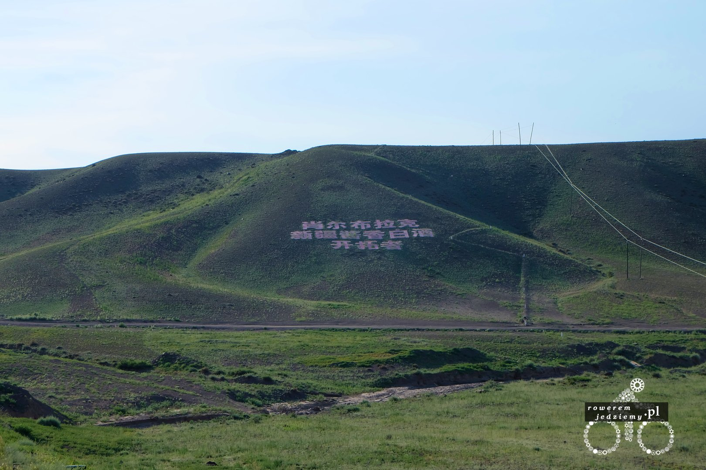

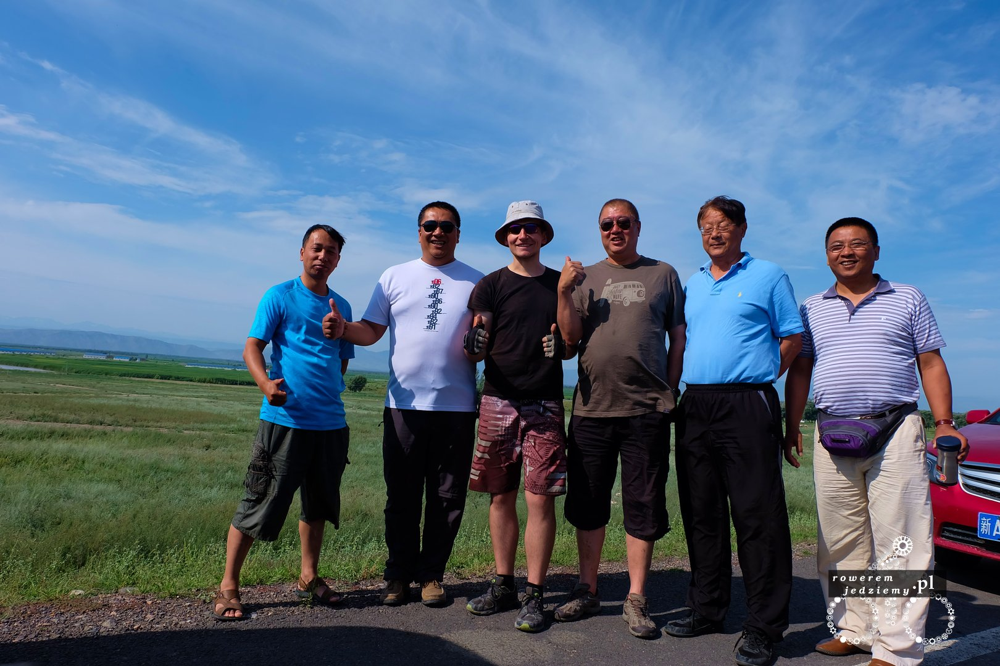

Ponieważ jesteśmy w górach, pogoda może bardzo szybko się zmieniać. Oczywiście, jeżeli może to tak też będzie czynić. Ponieważ już od kilku dni nie padało, to fajnie by było sprowadzić małą ulewę tak dla zabawy. To był czas, gdy zobaczyłem, jak słabo Chińczycy zabezpieczają teren budowy. W jaki sposób się o tym przekonałem? A no udało mi się wjechać rowerem w świeżo rozlany beton i zostawić na nim piękny ślad przedniego koła. Na szczęście tylne koło pozostało na asfalcie (kto normalny betonuje asfalt?) więc przerzutka pozostała nietknięta. Nikogo nie było na miejscu zdarzenia, więc jak przystało na polaka, pojechałem dalej. W sumie to nie było tak daleko, bo już odpowiednia godzina do rozkładania namiotu itd.

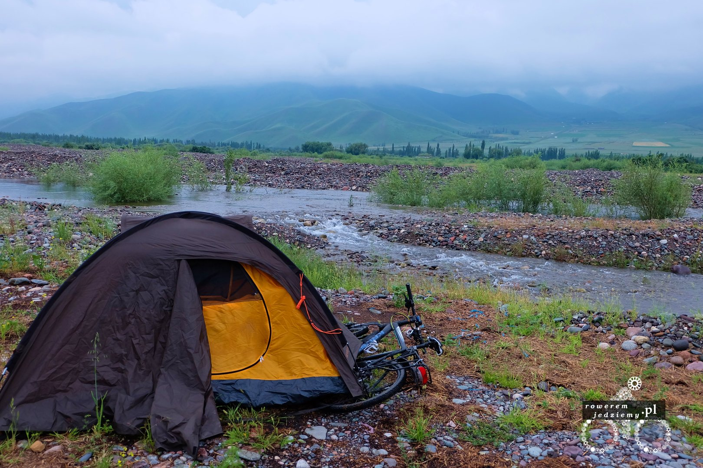

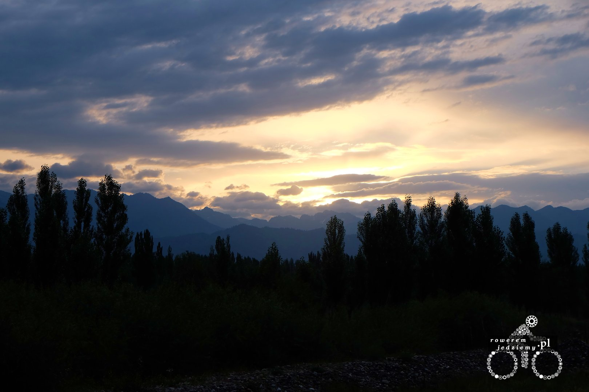

Myślałem, że jestem przyzwyczajony do dziwnych rzeczy, ale o poranku zobaczyłem ciekawe rozwiązanie do trzymania kabli.

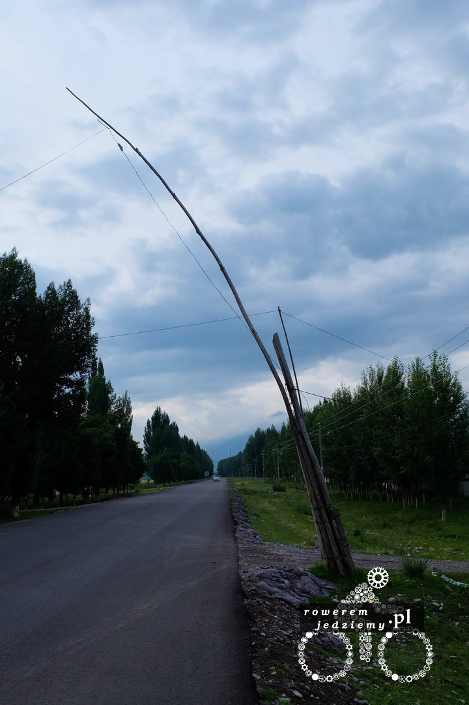

Warto też pokazać coś, co bardzo fajnie pokazuje, do jakiego miasta właśnie jedziemy.

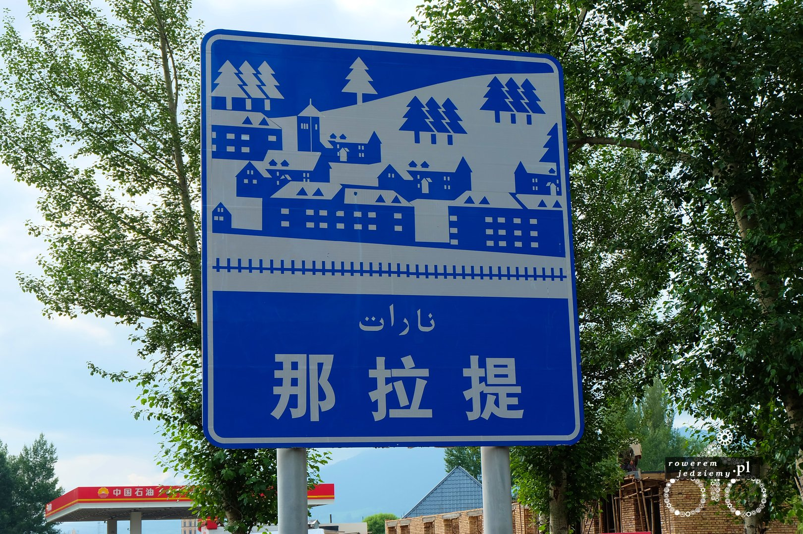

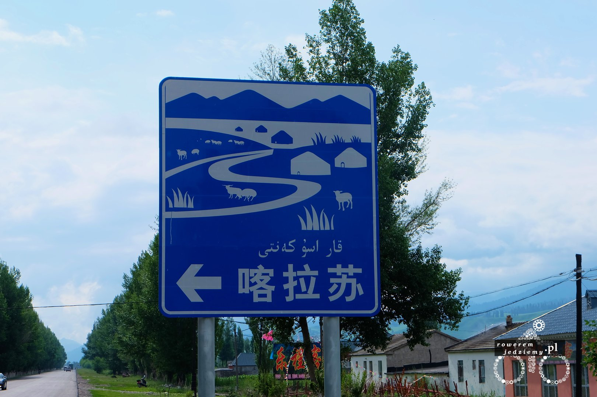

Wielkość miasta zobrazowana na znaku drogowym, proste, ale genialne :) Im wyżej w górę, tym więcej możemy zobaczyć małych domków czasami podchodzących trochę pod nory Hobbitów.

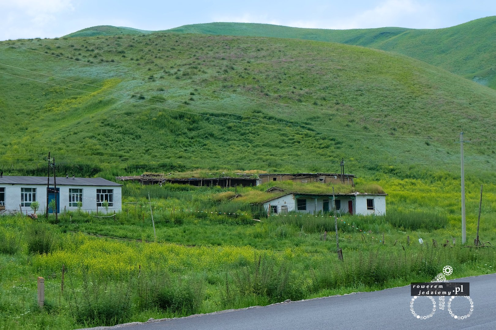

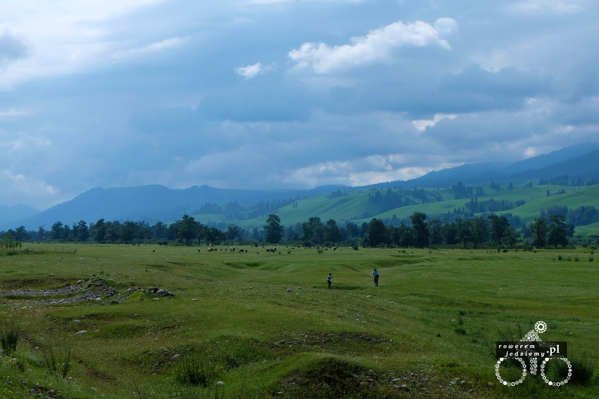

No i można spotkać pierwsze Yurty. Yurta to taki namiot, w którym mieszkają nomadzi kazachscy. Jest tam podobno ciepło nawet w zimie. Oczywiście jak z każdymi mniejszościami jest część na pokaz i cześć rzeczywista. Część na pokaz możliwe jest do zobaczenia w niższych partiach gór, gdzie zbudowane jest specjalne miasteczko Yurt, do którego przyjeżdżają busy z chińczykami, aby zrobi zrobić zdjęcia, usiąść na koniu i kupić miód. Niektórzy z nich nawet nie raczyli się wysiadać z samochodu, lecz wystawiali 3 komórki przez okna i robili zdjęcia. To zachowanie trochę mi japończyków przypomina. Oryginalne Yurty można zobaczyć trochę wyżej, gdzie autobusy mają problem z dojechaniem. No ale to pokażę w następnym wpisie.

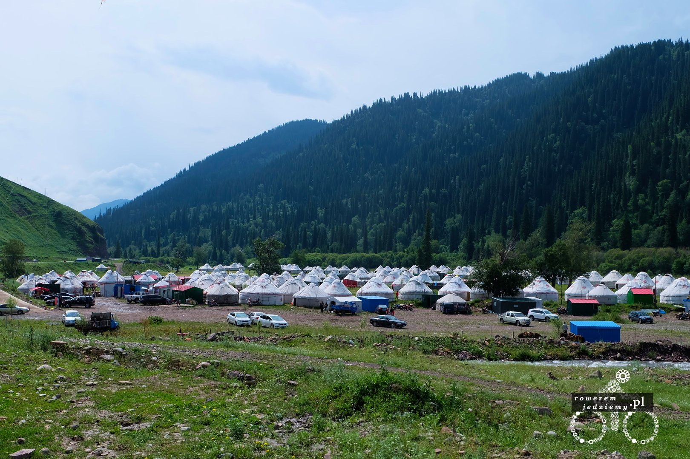

No i na koniec jeszcze zdjęcie nakazu trąbienia w związku z górzystym rejonem i masą zakrętów.

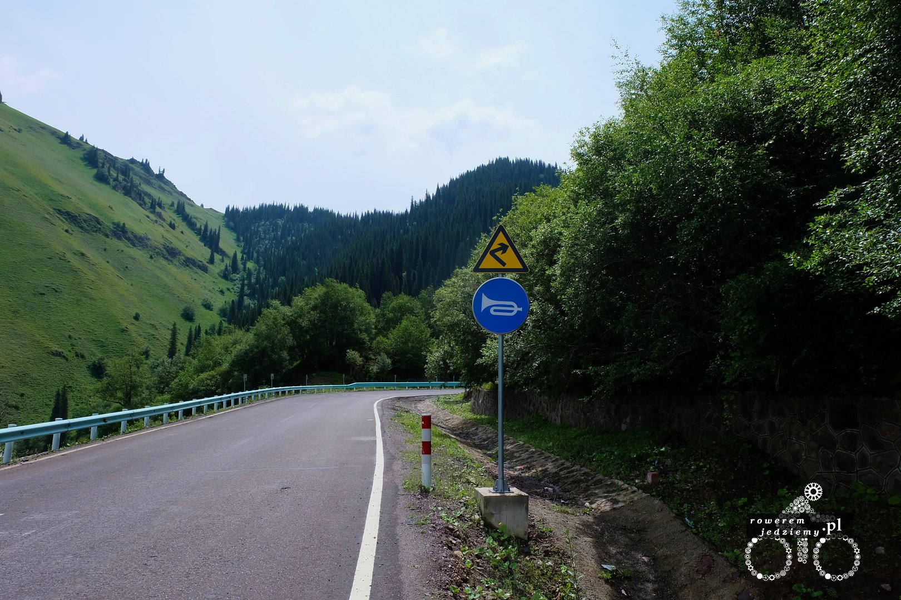