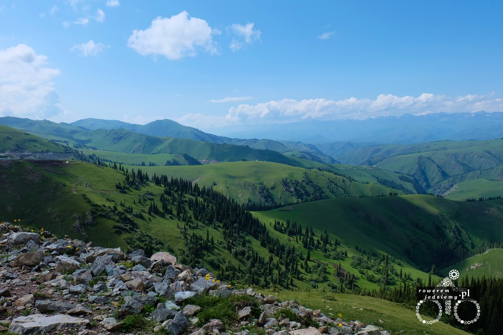
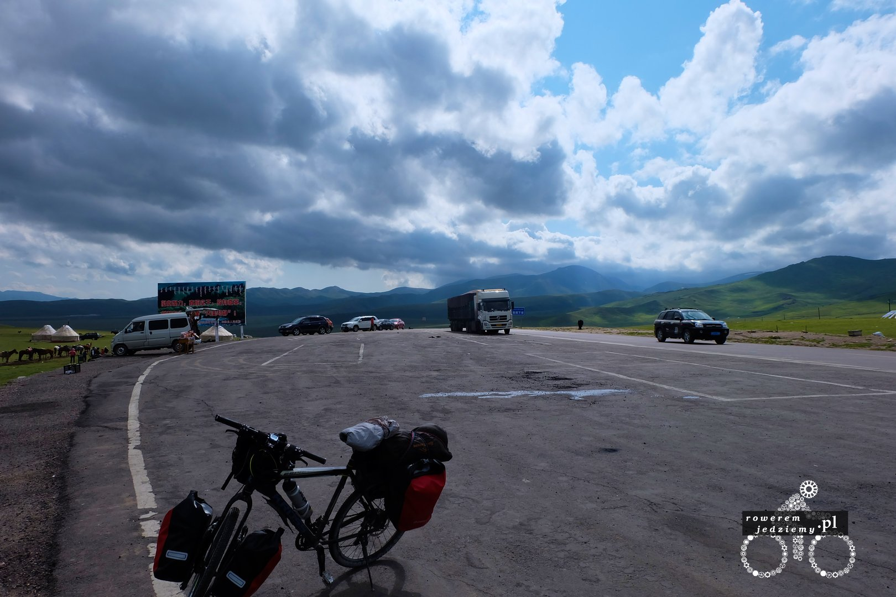
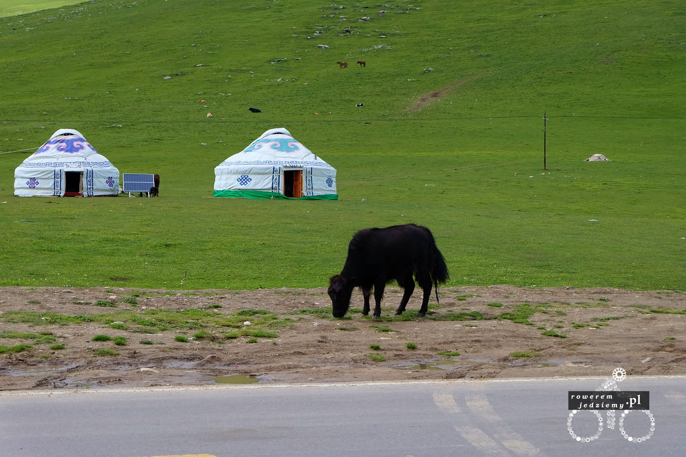
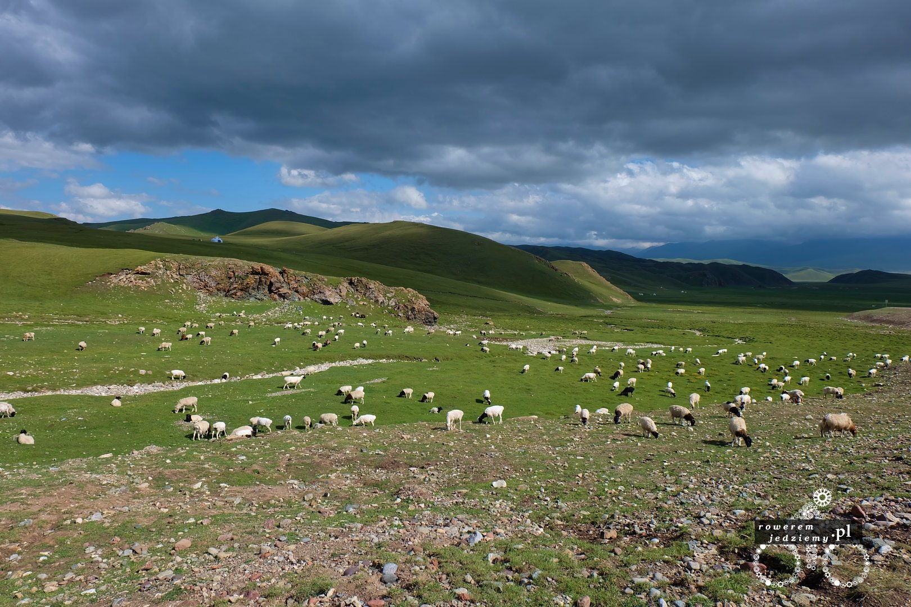
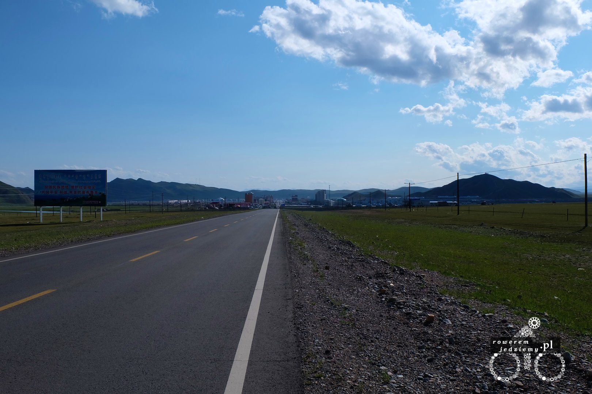
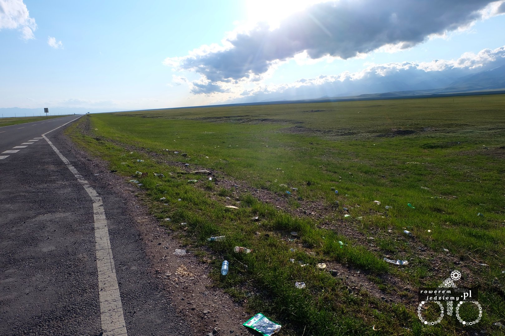
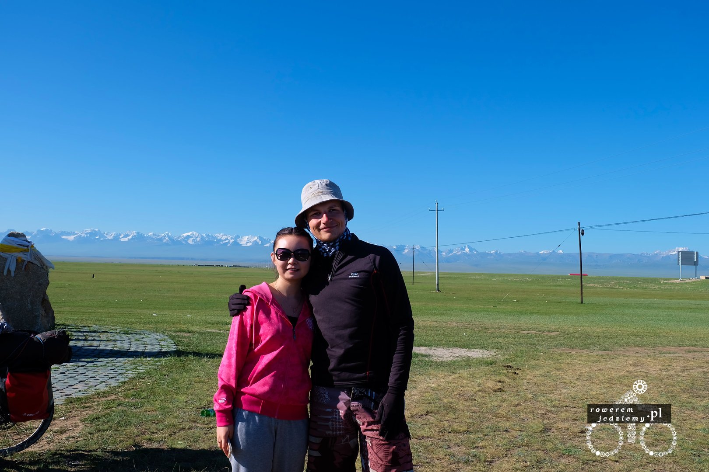
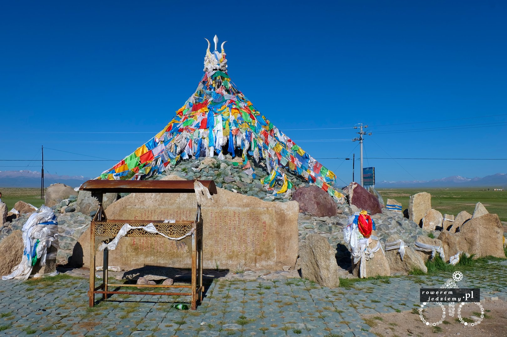

Nadszedł czas, aby rozpocząć podjazd pod Tian Shan. Jest to pasmo górskie oddzielające region Yining od pustyni Taklamakan. Wygląda to mniej więcej tak, że z na samej górze jest płaskowyż otoczony przez wysokie góry z wiecznym śniegiem. Zapowiada się bardzo interesująco szczególnie z powodu dużej różnicy temperatur. Po drodze było można zobaczyć prawdziwe Yurty (oczywiście nieróżniące się niczym od tych dla turystów, ale te faktycznie są używane do mieszkania). Sam podjazd był przerywany kilkuminutowymi ulewami. Podczas jednej z nich udało mi się schować do takiej Yurty. Nie wszedłem tam sam, ale zaprosiła mnie dziewczyna, która widziała, jak osłonięty płachtą przeciwdeszczową stoję na poboczu. W środku była cała rodzinka i o dziwo agregat prądotwórczy. Cywilizacja nawet tutaj dotarła, więc zakładam, że każdy ma smartfona :) . Zostałem poczęstowany figą suszoną (tak mi się przynajmniej wydaje) i po tym, jak deszcz ustał, pożegnałem się ze wszystkimi i pojechałem dalej. Widoki oczywiście przepiękne

Podjazd zajął dobre kilka godzin, co nie jest zbyt długim czasem, biorąc pod uwagę, iż wjeżdża się z poziomu około 900 m.n.p.m na poziom 3100 m.n.p.m. Później jest mały zjazd na płaskowyż usytuowany na 2500 m.n.p.m i kolejny wjazd na szczyt o wysokości 3650 m. No ale po tym, jak temperatura spadła na szczycie do 12 stopni w południe jechało się już znacznie lepiej. Jeszcze przed wjazdem na szczyt miałem 3 próby, aby podjechać pod jedną górkę. Czy była ona tak stroma czy tam trudna? Wcale nie ale problemem okazały się 3 psy, które stały sobie obok drogi i nie pozwalały mi przejechać. Tz. nie próbowałem aż tak się do nich zbliżyć, ponieważ gdy tylko się zbliżałem, zaczynały szczekać i biec w moim kierunku. Podczas 3 podejścia właściciel chyba się zorientował i zostały przywołane do porządku. To uświadomiło mi jedną rzecz "Zapamiętać... na wyprawy brać gwizdek na psy!".

Tak to jest Jak :) Dużo tu takich... z czegoś trzeba mieć mleko, bo kozie nie jest specjalnie smaczne (przynajmniej w moim odczuciu). 

Warto tutaj zaznaczyć, że pogoda jest tutaj trochę zdradliwa, ponieważ wartość promieniowania UV jest dużo wyższa z powodu rozrzedzenia powietrza i łatwo dostać oparzeń słonecznych mimo niskiej temperatury. Ciekawie wygląda droga na samym szczycie. Ponieważ jak widzicie, jest tam w miarę płasko. Chińczycy uznali, że po co robić zakręty skoro nie trzeba lepiej wybudować prostą drogę. Możecie zobaczyć, jak to wygląda z góry [https://www.google.co.uk/maps/@42.8467159,83.8548714,11.5z](https://www.google.co.uk/maps/@42.8467159,83.8548714,11.5z) . Po prostu marzenie dla Seby, aby ścigać się swoim golfem na prostej. No ale pośrodku tego płaskowyżu ktoś wpadł na pomysł, aby wybudować sobie miasto. Dlaczego mówię ktoś? A to dlatego, iż nikt tam nie mieszka, więc nie była to spontaniczna decyzja miejscowych (którzy nadal mieszkają w Yurtach), lecz pewnie władz Chińskich. Wygląda to przezabawnie, gdy dookoła ludzie poruszają się na koniach i wypasają zwierzynę.

Wypada tutaj powiedzieć o rzeczy, która mi się w Chinach strasznie nie podoba a dokładnie śmiecenie tam, gdzie się stoi. Już zrozumie nawet to plucie i charczenie, ale nie widzę powodu, aby wszędzie wyrzucać śmieci, ponieważ bardzo brzydko to wygląda szczególnie w takim otoczeniu. Oczywiście jadąc sobie drogą, wszędzie można zobaczyć znaki informujące, aby nie spać za kierownicą nie wyrzucać śmieci przez okno itd. Jak przystało na chiny oczywiście znaki obrazkowe.

Ponieważ nie chciałem zostać w wyższych górach na noc, postanowiłem rozbić namiot przy drodze (nie było sensu się chować, ponieważ nie ma gdzie). Powiem, że to była najcięższa noc w moim życiu, ponieważ temperatura spadła poniżej zera. Na szczęście mój śpiwór był do -5, ale to była minimalna temperatura, w której człowiek przetrwa, używając tego sprzętu. Na szczęście pomimo ciągłego budzenia się w nocy udało się przetrwać. Poranek był przepiękny i nadzieja zjazdu z tej góry dawała mi siłę do jazdy. A siły to ja potrzebowałem, ponieważ moje zasoby wody były na wykończeniu. A to było spowodowane tym iż spodziewałem się tutaj potoków i zamieszkałego miasta (tak jest ono na mapie). Chciałem odwiedzić jezioro łabędzie, ale jak się okazało, w okresie lipca wysycha więc ani jeziora, ani łabędzi :( . W zamian udało mi się zobaczyć miejsce kultu lokalnej ludności i poznać a dokładnie ponownie spotkać Chinkę, która już spotkałem w Yining, kupując kartki na poczcie. Wytłumaczyła mi, że tutaj się modli i przygotowuje ceremonialne potrawy. Tak to była osoba, która mówiła po angielsku, za co byłem jej bardzo wdzięczny. Dostałem nawet jej adres w Aksu, ponieważ usłyszała, że tam zmierzam a ona tam mieszka, więc gdybym miał chwilę to żebym wpadł. Po tym jak odjechała, zacząłem się zastanawiać jak ja ten adres znajdę skoro mimo że jest on zapisany na kartce, nie jestem go w stanie przepisać do komórki, a Aksu to duże miasto jest z populacją około pół miliona. Oczywiście w związku z tym, że jesteśmy w Chinach, można uznać to za wioskę, ale na warunki polskie to nadal spore miasto.

