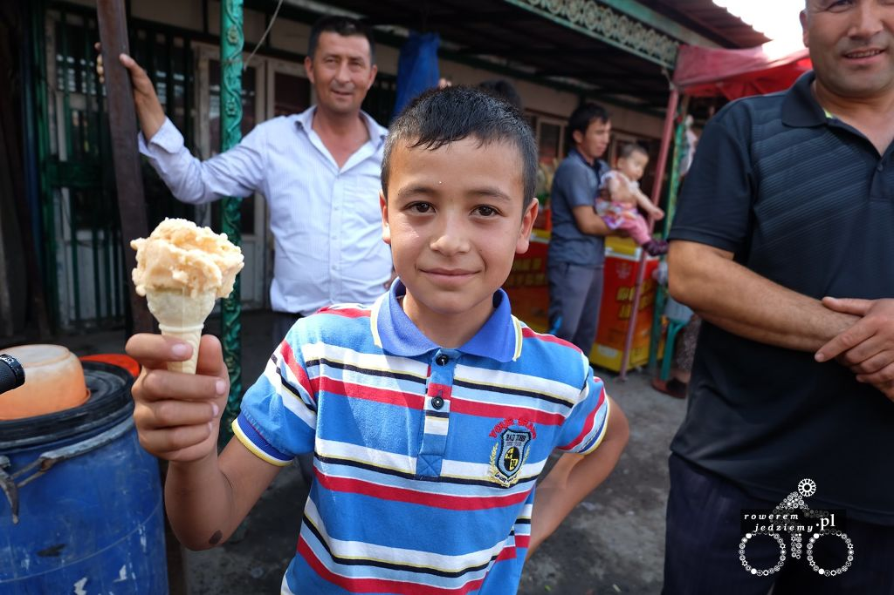

Wiele pytań odnośnie do wypraw rowerowych skierowane jest właśnie na jedzenie. "Co jadłeś?", "Czy się nie zatrułeś?" ogólnie większość z nich zawiera się praktycznie tylko w tych dwóch prostych pytaniach. Tak więc wypada odpowiedzieć jak i co jeść w trakcie podróży.

### Co i ile jeść?

Odpowiedź na to pytanie ucieszy chyba wszystkich, którzy lubią jeść. Wszystko! Ogólnie to nie ma jakiś szczegółowych wytycznych dotyczących tego, jakie pożywienie powinno się spożywać, ponieważ każdy ma inny gust i przebywamy w różnych miejscach na świecie, gdzie nie koniecznie dostaniesz schabowego w barze. Jeżeli masz ochotę na ten super niezdrowy i tuczący kawałek ciasta w sklepie, proszę bardzo, zjedz go sobie (oczywiście pierwsze go kup). Twój organizm nie odczuje tego zbyt mocno, ponieważ będzie obecnie w stanie przetworzyć każdą ilość kalorii, jaką mu dostarczysz. To jest wielki plus takich wypraw, ponieważ nie wiadomo ile byś nie jadł, nie jesteś w stanie na nich przytyć. Chciałbym zobaczyć ludzi, którzy mówią że oni tycie mają w genach mówiących to po przejechaniu 2000km. 

Zakładając bardzo spokojne tempo, jazda na rowerze spala około 500 kalorii w ciągu godziny. 
Biorąc pod uwagę, że gdy jest nudno i jest się na kompletnym odludziu, można jechać nawet 10-12 godzin w ciągu dnia widać ile trzeba by było dostarczyć kalorii, aby wyjść na "zero". Teoretycznie jest to możliwe, jedna tabliczka czekolady to około 500 kcal, więc gdyby ktoś był w stanie zjeść 14-16 dziennie :) . Oczywiście, jeżeli wcześniej nie zwymiotowałby z ilości szczęścia. 

No ale skoro już ustaliliśmy, że możemy jeść wszystko, teraz trzeba ustalić ile tego jeść? Nie jest to takie oczywiste. Standardowe 3 posiłki dziennie nie są takim najlepszym pomysłem szczególnie, gdy chcemy sobie zjeść jakiś pokaźny obiad. Nasz organizm nie jest przystosowany do wysiłku po spożyciu dużej ilości pokarmu. Gdy już tak się stanie, będzie miał dwa wyjścia:

- Zwróci to co właśnie zjadł
- Bólem zmusi cię abyś przestał/ła się ruszać

Żadne z powyższych rozwiązań nie jest fajne, więc jak to powinno wyglądać? Fajnie jest jeść dość często, powiedzmy 6 posiłków dziennie, ale odpowiednio mniejszych. W takim przypadku będziemy w stanie jechać i nie umrzemy z głodu. Oczywiście należy do tego dodać picie wody/soków w trakcie, ale to można robić praktycznie przez cały czas. Co do samego rodzaju pożywienia warto mieć na uwadze kilka bardzo podstawowych rzeczy jak na przykład to aby jeść całkiem sporo węglowodanów (ja upatrzyłem sobie musli, ale wybieraj co tam chcesz). Prócz tego fajnym wyborem jest dostarczenie organizmowi innych składników takich jak tłuszcze i białka. Tutaj przewalone mają wegetarianie... Nie dość, że dieta wegetariańska jest ogólnie uboga, jeżeli chodzi o ilość kalorii w pożywieniu (no może prócz orzechów) to jeszcze słabo tutaj z białkiem (tofu nie zawsze jest dostępne). Jeżeli nie jesteś wegetarianinem (ja mam to szczęście nie być) wtedy jedzenie kanapek z mięsem lub odwiedzenie raz na jakiś czas lokalnego baru gdzie serwują mięso, powinno wystarczyć.

### Dobra a teraz gdzie jeść?

To już w zależności od budżetu i upodobań. Może zacznijmy od tańszych rozwiązań.

##### U kogoś :)

Najtańsza opcja i o dziwo wcale nie taka niespotykana. Ponieważ zwiedzanie świata na rowerze nie jest zbyt popularną rzeczą, bardzo często spotkacie ludzi, którzy zaoferują wam darmowe jedzenie. Czasami jest to herbata i kanapki a czasami 2-daniowy obiad. Niestety na tym rozwiązaniu nie można do końca polegać, ponieważ czasami można po prostu nikogo nie spotkać lub spotkana osoba nie będzie zbytnio chętna na podzielenie się swoim jedzeniem. Tutaj po raz kolejny im bardziej na wschód tym ludzie bardziej gościnni.

##### Chomikowanie jedzenia w sakwach

.jpg)

Najpopularniejsza forma i najczęściej stosowana przez moją osobę. Polega głównie na tym żeby robić zakupy z wyprzedzeniem (zazwyczaj rano można zrobić zakupy na cały dzień i trzymać jedzenie w sakwach. Minusem takiego rozwiązania jest brak możliwości dłuższego przechowywania rzeczy które szybko się psują. Nikt chyba nie chce rano otworzyć sakw i poczuć zapachu zepsutego sera i/lub szynki. W ten sposób można przewozić pieczywo, konserwy, musli, owoce i warzywa też dają radę i o dziwo mleko (wcale tak szybko się nie psuje szczególnie UHT). Jeżeli wiesz że w przeciągu najbliższych dwóch dni nie uświadczysz sklepu i żywych ludzi warto rozważyć zrobienie większych zakupów. Kolejnym minusem jest zwiększanie wagi swojego bagażu.

##### Jedzenie uliczne

.jpg)

.jpg)

.jpg)

Fajny sposób na poznanie lokalnej gastronomii miejsc do których się udajemy. Jedzenie uliczne nie jest drogie a zazwyczaj bardzo smaczne. Czy zdrowe? To zależy kiedy i gdzie. Z moich obserwacji nie warto stołować się rano ponieważ bardzo często sprzedaje się wtedy resztki z dnia poprzedniego. No chyba że widzisz już tłum tubylców którzy tam jedzą wtedy jest mała szansa że dostaniesz coś z dnia drugiej świeżości. Niestety boleśnie się przekonałem że stołowanie się w czasie szczytu (jeżeli tak można nazwać noc po zakończeniu Ramadanu) tez nie jest najlepszym rozwiązaniem. Mimo że jedzenie było bardzo dobre okazało się później że było również trochę za surowe co skończyło się bardzo wysoką gorączką która prawie dorównywała temperaturze otoczenia. Więc jeżeli nie masz pewności co do jedzenie może lepiej spróbować coś innego?

##### Restauracje

.jpg)

To już trochę droższe ale nadal w dostępnych cenach (wypada sprawdzić cennik przed wejściem do środka). Czasami można się nawet bardzo dziwić ponieważ z pozoru dobra restauracja możne mieć naprawdę niskie ceny. Jedzenie w restauracjach jest zazwyczaj dobre i są małe szanse że się nim zatrujesz. 