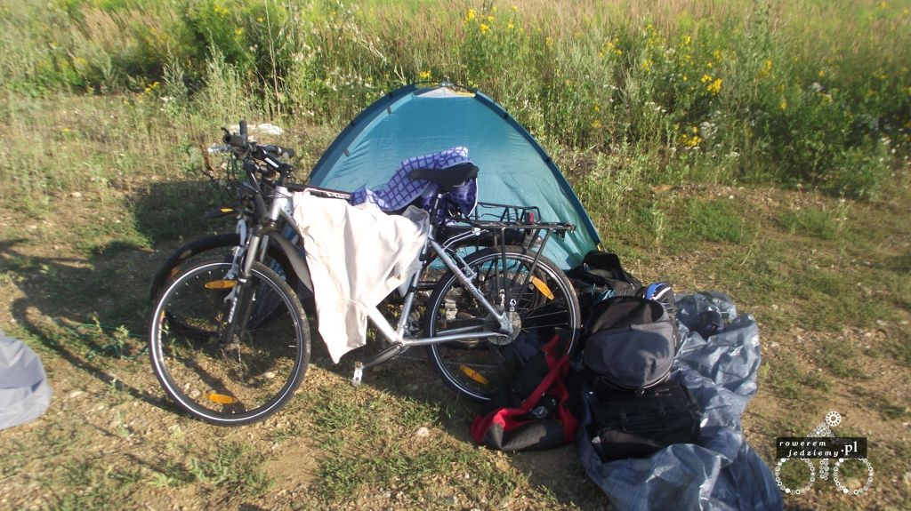

Dawno, dawno temu... w odległej galaktyce. Wszystko zaczęło się od słów piosenki Amy McDonald "This Is The Life".

<iframe width="560" height="315" src="https://www.youtube.com/embed/iRYvuS9OxdA" frameborder="0" allow="accelerometer; autoplay; encrypted-media; gyroscope; picture-in-picture" allowfullscreen></iframe>

Oczywiście każdego wieczoru trzeba sobie odpowiedzieć na takie samo pytanie "Gdzie ja dzisiaj się prześpię?". Czasami odpowiedź może zaskoczyć, lecz w większości przypadków wiązało się to z rozłożeniem namiotu. W moich wyjazdach naprawdę rzadko spałem w miejscach innych niż namiot. Oczywiście zdarzały się takie sytuacje, ale dzisiaj ma być o spaniu pod namiotem i przy tym zostańmy. Zakładam, że na początku może to być dla ciebie stresujące, ale z czasem do tego przywykniesz i nie będziesz sobie wyobrażać innych noclegów niż pod gwiazdami. Wypada jednak powiedzieć o kilku rzeczach, które mogą wydawać się przydatne.

### Czy spanie pod namiotem jest w ogóle legalne?

A to zależy od kraju. Nie ma tutaj jednoznacznej odpowiedzi. Wg mnie powinno być, dopóki nie wyrządzasz krzywdy jakiejś osobie (niszczenie plantacji itp), żadne państwowe prawo nie powinno ci tego zakazywać. Praktyka wygląda jednak inaczej i niestety w wielu przypadkach rozłożenie sobie namiotu przy głównej drodze może skutkować wizytom panów policjantów. Są na to dwa sposoby.

- Zapytać się właściciela posesji czy można rozłożyć sobie tam namiot.
- Rozkładać namiot z dala od ludzi.

Pierwsza opcja jest bardzo ciekawa, ponieważ często można zostać potraktowany kolacją lub śniadaniem, a może nawet noclegiem u kogoś w domu. Opcja ta zazwyczaj zajmuje jednak trochę czasu, a to zależenie od tego, w jakim kraju się jest. Kraje europy zachodniej mniej przychylnie patrzą na takie prośby (szczególnie Niemcy). Im bardziej na wschód tym ludzie jakoś ciekawscy się wydają i chcą pogadać.

Druga opcja jest łatwiejsza z pozoru, chyba że jesteś w Słowenii gdzie z powodu ukształtowania terenu i zagęszczenia ludności ciężko znaleźć wolne miejsce i czasami kończysz jadąc przez 30km, aby gdzieś się rozbić. Jak już zaznaczyłem, szukamy wtedy miejsca, w którym nikomu nie wadzimy i niczego nie niszczymy, bo przecież nie jesteśmy typowymi turystami, którzy zostawiają po sobie syf i opakowania po hotdogach ze stacji benzynowych.

### Oszacuj, kiedy masz zamiar się zatrzymać

.jpg)

O dziwo jest to dość ważna umiejętność. Dlaczego? A no dlatego, że nikt nie chce rozkładać namiotu w całkowitych ciemnościach. Tak masz latarkę oczywiście, ale po pierwsze latarka zwabia ludzi po drugie czy nie lepiej jest wiedzieć, dokładnie gdzie ten namiot rozkładasz, aby rano się nie zdziwić, że rozłożyłeś namiot na pastwisku?

.jpg)

Tak więc, jeżeli w trakcie podróży zbliżasz się do dużego miasta i wiesz, że fajnie było by jeszcze zrobić zakupy, może warto rozważyć rozłożenie namiotu przed tym miastem i zrobienie zakupów rano? Oczywiście, jeżeli nie umrzesz z głodu lub pragnienia do tego czasu. A co zrobić, jeżeli jesteś w dość dobrze zaludnionym obszarze? Niestety nie da się tego uniknąć, ale będzie trzeba rozbić ten namiot po zmierzchu. Fajnie upatrzyć sobie jakieś miejsce zatrzymać się na chwilę zjeść kolację i gdy zapadnie zmrok i nie jest to miejsce jakoś uczęszczane przez miejscowych, można rozbić tam namiot. Przy odrobinie uwagi nie ściągniesz na siebie wzroku miejscowych, jeżeli nie będziesz za bardzo machać latarką.

### A co ze zwierzętami?

Niezaprzeczalnie, gdy rozkładasz namiot z dala od ludzi, możesz napotkać czasami jakieś zwierzęta. I nie mówię tutaj o niedźwiedziach grizzly, lecz o mrówkach, psach, kotach (lisach i królikach, jeżeli bierzesz pod uwagę UK). Co wtedy? Nic, zupełnie nic. Zwierzęta są bardzo mądrymi stworzeniami i nie szukają guza, tak jak mają to w zwyczaju robić przedstawiciele naszego gatunku. Czasami może się zdarzyć, że przyjdzie do ciebie kot w nocy, ale nie ma on złych zamiarów, porozgląda się i sobie pójdzie dalej. Zazwyczaj jedzenie masz w namiocie w sakwach, więc nie ma tam dla niego nic interesującego (przykro mi to stwierdzić, ale ty nie jesteś dla niego wystarczająco interesującą osobą). Oczywiście czasami fajnie zobaczyć co może się czaić w okolicy, aby na przykład nie rozłożyć się obok rzeki z krokodylami czy coś w tym stylu. Czasami rzeczy z pozoru niegroźne mogą być irytujące. Fajnym przykładem są pająki, które miałem okazję spotkać, rozkładając namiot na pustyni Taklamakan. Tak mi się przynajmniej wydaje, że były to pająki, ponieważ zawsze jak kładłem się spać, to po jakimś czasie właziły pod namiot i sobie tam chodziły. Pierwszej nocy byłem, trochę można powiedzieć przerażony, lecz drugiej już się przyzwyczaiłem i mi to nie przeszkadzało. Gdy rano podnosiłem namiot, zazwyczaj kilka zostawało i zaskoczone szybko uciekały (pomagał kolor, dzięki któremu szybko wtapiały się w otoczenie).

### Kamuflaż

.jpg)

Gdy jeszcze nie macie namiotu i planujecie go kupić, fajnie by było, gdybyście wybrali namiot w kolorach ciemnych (chyba że chcecie spać na śniegu). Oliwkowy czy inne wojskowe kolory nadają się jak najbardziej. Nie jest to aż tak ważne, ale gdy rozbijasz się w nie do końca osłoniętym miejscu, fajnie jak namiot zlewa się z otoczeniem lub wygląda trochę jak kupa ziemi/liści. Oczywiście, jeżeli już masz namiot, nie musisz go wymieniać na nowy bo jego kolor nie jest przystosowany do ukrywania się. To jest porada dla tych, którzy jeszcze go nie mają. Na całe szczęście większość namiotów produkuje się w takich kolorach, więc nie ma problemu z wyborem. Jeżeli namiot posiada elementy odblaskowe, radzę je czymś zakryć lub zdemontować. Producenci bardzo często montują takie rzeczy w namiotach wyprawowych (szczególnie w tych do wspinaczki górskiej), aby w przypadku nieszczęścia można było łatwiej odnaleźć grupę. Tobie się to nie przyda, bo nie masz zamiaru wchodzić z tym na żadne wysokie niebezpieczne góry. No, chyba że masz?

### Nie zawsze musisz spać w namiocie

.jpg)

Tak jest czasami, gdy podoba dopisuje, a okolica nie roi się od komarów, możesz po prostu wziąć śpiwór i rozłożyć się na plaży/ławce. Ciekawym rozwiązaniem są Bivvy Bagi http://www.moroka30.com.au/alpine-stalker-bivvy-bag-p-20.html . Nie jest to zwykły śpiwór, lecz śpiwór z siatką przeciwkomarową i linka lub półokrągłym stelażem, aby zapewnić trochę miejsca przed twarzą. W przypadku gdy nie ma deszczu, takie coś całkowicie wystarczy do spania.

### Ale co zrobić z rowerem?

.jpg)

No tutaj jest kilka opcji. Ja, osobiście przyczepiam zawsze rower do namiotu a dokładnie do jednego z mocowań na kołki za pomocą linki. Jeżeli ktoś będzie chciał wziąć sobie mój rower, ruszy całym namiotem (jeszcze nikt nie próbował). Jeżeli masz wystarczająco duży namiot, możesz rower wstawić do środka. Są nawet namioty rozkładane na rowerze (wykorzystują rower jako stelaż), ale są one mało popularne. Czasami chowam rower troszeczkę pod namiot (szczególnie gdy nie chce mi się go nawet przypinać).