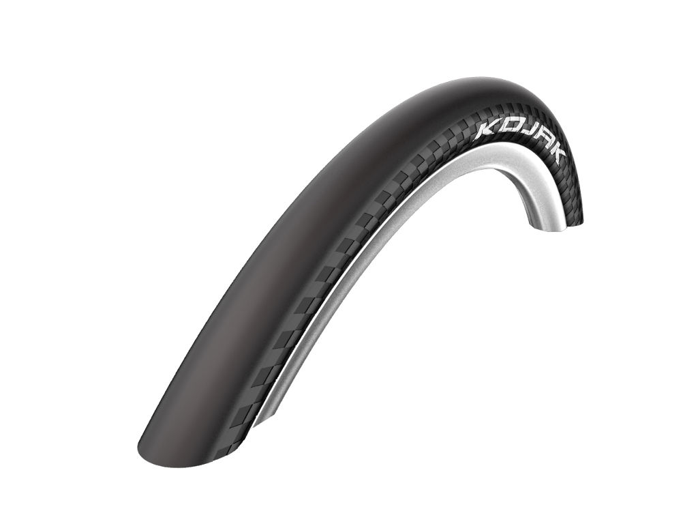
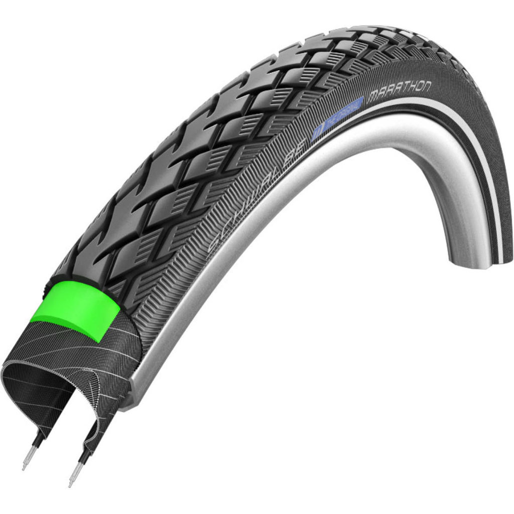
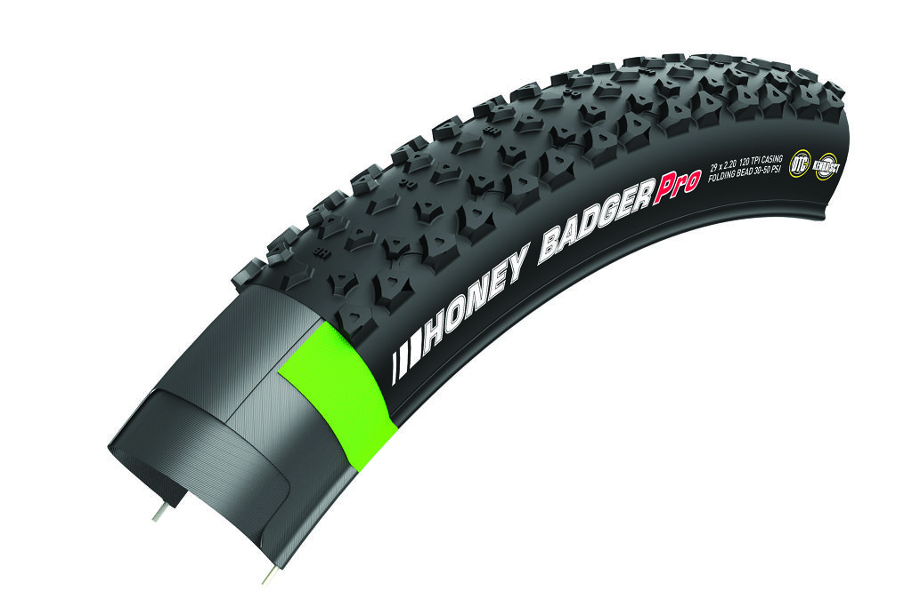

Opony, jeden z większych problemów przy wyjeździe. Tz. same opony nie są problemem ale proces ich wyboru. Ludzie się zastanawiają jaki typ wybrać jaką grubość itp.

## Typy opon rowerowych

#### Slick

Popularne opony drogowe przeznaczone wyłącznie do tych celów. Cechują się małymi oporami toczenia, zwykle wąskim przekrojem i wysokim ciśnieniem do którego się je pompuje. Opony typu slick posiadają charakterystyczną gładką fakturę która dobrze sprawuje się na suchych drogach asfaltowych. Jeżeli jednak spadnie deszcz lub będziemy jechać po piasku tracą one bardzo szybko przyczepność co może okazać się zgubne dla rowerzysty, szczególnie gdy ma się przy sobie dodatkowe 40kg bagażu. 

####Semi-Slick

Najpopularniejsze opony wykorzystywane przez rowerzystów. Opony te nadal posiadają w miarę małe opory toczenia, zazwyczaj są troszkę szersze przez co łatwiej amortyzować uderzenia no i posiadają już rowki do odprowadzania wody oraz innych rzeczy które znajdujemy na drodze. Nadal nie nadają się na bardziej ekstremalne warunki lecz bardzo dobrze nadają się na długie trasy szczególnie po zachodniej europie.

####Off-road

Najbardziej uniwersalne opony na których można jechać praktycznie wszędzie. Najszersze ze wszystkich typów oraz posiadające kostkę która umożliwia odprowadzanie błota i innych zanieczyszczeń. Świetnie nadają się na jazdę w gorszym terenie lecz niestety posiadają duży opór toczenia i przy większych prędkościach zazwyczaj zaczynają "buczeć" (dźwięk podobny do jazdy w lecie na zimówkach).

No teraz gdy już wiemy jakie mamy typy opon (tak wiem opony można dzielić na dużo więcej typów, szczególnie off-road, ale pozostańmy przy takim podziale) trzeba wyjaśnić od czego zależy opór jaki stawiają nam opony.

####Opory toczenia

Opór jest to dokładnie tarcie pomiędzy oponą a podłożem. Tarcie to występuje ponieważ podczas styku z podłożem opona zmienia swój kształt i przyłożona jest siła przeciwna do kierunku jazdy. Dlaczego opona zmienia swój kształt wytłumaczyłem w artykule o ciśnieniu. Aby szybko przypomnieć im mniejsze ciśnienie tym opona podczas kontaktu z podłożem bardziej się "spłaszcza" i dzięki temu ma większą przyczepność. Zaraz po tym jak miejsce stylu przesunie się o kilka centymetrów opona wraca do swojego kształtu. No to może brzmi bardzo technicznie ale zakładam że ten blog czytają osoby inteligentne i są w stanie to zrozumieć :)

Teraz co można zrobić aby zmniejszyć opór w takich oponach?
Dopompować opony. Im większe ciśnienie tym opona ma mniejsze predyspozycje do odkształcania się i mniejsze pole styku.
Kupić cieńsze opony wykonanie z bardziej elastycznego materiału. A to dla tego iż łatwiej i szybciej zmieniają one swój kształt przez co można je zmusić za pomocą punktu 1 do posiadania mniejszej powierzchni styku.

####Złe dobranie ciśnienia w oponach. Co może nam grozić?

Ogólnie są trzy stany w jakich może się znajdować opona: zbyt niskie ciśnienie, zbyt wysokie ciśnienie, odpowiednie ciśnieni. Zalecam jazdę z odpowiednim ciśnieniem zalecanym przez producenta lecz warto jednak wiedzieć jakie są plusy i minusy jazdy z innym niż zalecane (tak naprawdę są plusy).

#####Zbyt niskie ciśnienie plusy:

-Większa amortyzacja (do pewnego momentu)
-Większa przyczepność (także do pewnego momentu)

#####Zbyt niskie ciśnienie minusy:

-Łatwość przebicie opony
-Większy opór toczenia
-Tendencja to "znoszenia" rowerzysty lub nawet wyskoczenia opony z obręczy

#####Zbyt wysokie ciśnienie plusy:

-Mniejszy opór toczenia

#####Zbyt wysokie ciśnienie minusy:

-Brak amortyzacji
-Słaba przyczepność
-Zużywanie się tylko środkowej części opony

Nie wiem dokładnie co można określić za gorsze ale wiem że obie sytuacje mogą przynieść duże szkody (nie koniecznie w postaci wywrotki). W przypadku niskiego ciśnienie może się okazać że podczas przejechania przez dziurę będziemy dobijać obręczą do podłoża co może skończyć się nie tylko przebitą dętką lecz nawet zniszczeniem obręczy. W przypadku wysokiego ciśnienia także możemy zniszczyć obręcz ponieważ z powodu braku amortyzacji cała siła uderzenia będzie przechodzić na obręcz. Gdy ciśnienie jest za wysokie musimy mieć też pewność że opona nie wystrzeli ponieważ materiały z których została zrobiona tego nie wytrzymają.

####"No dobra podajesz dużo nie interesujących informacji a ja chcę wiedzieć jaką oponę wziąć na wyjazd?"

Już wyjaśniam. Pierwsze wypada ustalić z jakim rodzajem terenu będziesz miał do czynienia? Jeżeli będzie to asfalt i tylko asfalt a jedziesz do krajów w których nie leje 300 dni w roku polecam wziąć opony typu semi-slick. Szerokość jest tutaj sprawą drugorzędną ale gdybym miał już wybierać wziąłbym 1.75". W przypadku semi-slick moderowanie ciśnieniem może naprawdę zmienić właściwości jezdne opony co daje ci duże pole do popisu (no i wykorzystania właśnie przyswojonej wiedzy). Jeżeli jednak jedziesz do krajów gdzie przewidujesz jazdę w trochę trudniejszych warunkach, takimi są na przykład drogi gruntowe lub szutrowe polecam jednak wziąć opony typu off-road. Nie zapędzajmy się za bardzo jednak i nie wybierajmy opon do downhillu lecz pomyślmy bardziej o oponach do 2.2" ponieważ mimo wszystko będziesz musiał jechać po asfalcie i jazda na oponach 3" nie jest zbytnio przyjazna przy bardzo długich trasach.

####Kolejną sprawą jest to czy chcesz oponę zwijaną czy też drutowana. 

Sprawa jest dość prosta. Jeżeli cię stać kupuj zwijaną jeżeli nie drutowaną. Różnica jest głównie w cenie i wadze. Jeżeli nie chcesz wydawać dużo pieniędzy kup dwie drutowane i jedna zwijaną jako zapasową (łatwiej schować).

####No i jeszcze pozostaje pytanie czy opona bezdętkowa czy może jednak z tą dętką. 

Opony bezdętkowe mają bardzo dużo plusów. Głównym z nich jest to że są lekkie (brak dodatkowej wagi w postaci dętki) i zazwyczaj bardziej wytrzymałe. Problem jest jednak gdy taka opona zostanie jednak przebita. W przypadku opon posiadających dętkę możesz się spodziewać większej ilości "flaków" ale tez łatwiej takiego "flaka" naprawić. Wystarczy wymienić dętkę i po sprawie. W przypadku bezdętkowych opon można taką oponę próbować zakleić lub wymienić na nową (jeżeli masz zapas). Jeżeli oba typy zostaną przebite przez dużego gwoździa lecz nie spowoduje to rozerwania opony łatwiej się naprawia tą która ma dętkę :)

## Miało być o trikach wiec są triki:

#### Montowanie różnych opon

Część ludzi stosuje taką metodę. Polega ona na zamontowaniu dwóch różnych opon w jednym rowerze dzięki czemu możemy zmniejszyć masę i zachować tarcie. Bardzo popularnym przykładem jest montaż szerszej opony tylnej w związku z tym że jest to opona napędowa. Uważam że może to mieć sens jeżeli nie popadamy w skrajności i nie przesadzamy z różnicami. Montowanie opony tylnej 2.5" a przedniej 1.2" nie ma większego sensu ponieważ mimo przyczepności z tyłu przód może dalej nam uciekać na zakręcie.

####Odwracanie opon niezgodnie do kierunku jazdy

Tyczy się to tylko opon kierunkowych (czyli większości). Pewnego dnia ktoś wymyślił ciekawy mit że niby zamontowanie opony przeciwnie do kierunku jazdy oznaczonego na oponie poprawa przyczepność tej opony. Nie zaprzeczam że może zdażyć się jakiś taki przypadek ale w większości opon zadziała to wręcz odwrotnie ponieważ producenci projektują je w ten sposób aby oferowały możliwie jak największą przyczepność.

####Naprawianie opon trawą

Ten trik został mi opowiedziany przez kolegę i jeszcze go nie stosowałem ale ma od duży sens. Gdy przebije ci się dętka a nie masz na stanie zapasowej czy też zestawu naprawczego. Warto rozważyć pobawienie się w ogrodnika i napchanie trawy (lub innej w miarę miękkiej zieleniny) do środka opony. To powinno ci zapewnić zachowanie odpowiedniego kształtu opony i możliwość dalszej jazdy aż do punktu gdzie będzie można ja naprawić. Przy okazji też powinno zapewnić ci odpowiednią ilość czyszczenia później :)