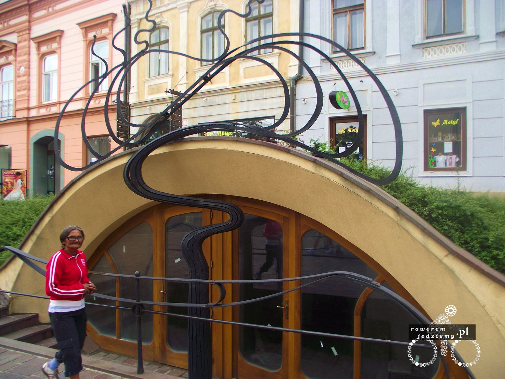
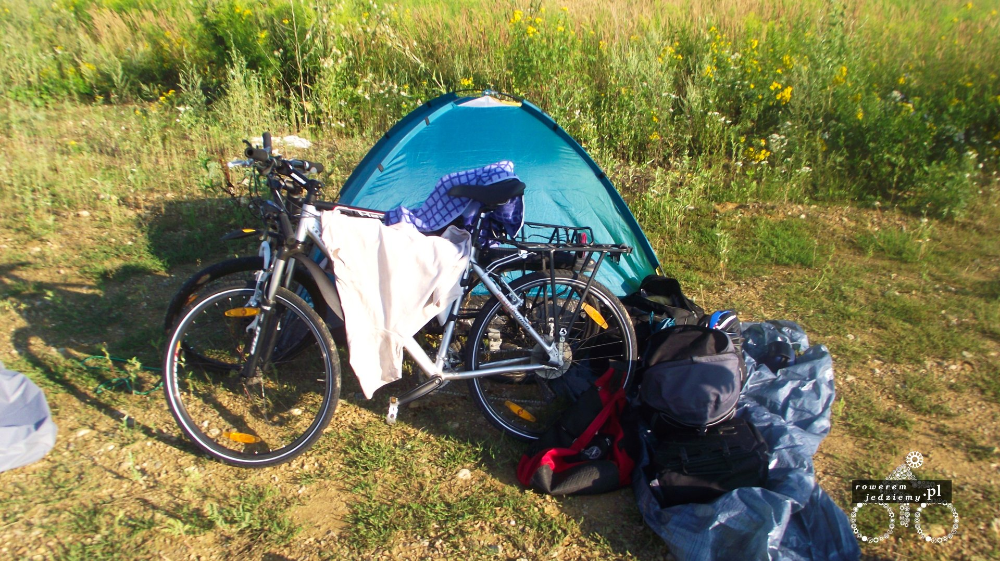

### Dzień 1
Już rano kilka godzin opóźnienia, problemy z rowerem i konieczność szukania dętki w niedzielę. Wyjazd z Krosna po godzinie 17.00. Pogoda dobra i mały ruch, no ale to niedziela. Pierwszy postój w Dukli z konieczności regulacji ciśnienia w oponach (za duża waga sakw). Podczas jazdy w stronę granicy pojawiły się chmury, które zostały z nami aż do Świdnika. Oczywiście z racji braku ruchu skorzystaliśmy z możliwości rozwijania prędkości przy zjeździe z Barwinka. 

Droga bardzo dobra, no i pierwszy raz zostaliśmy zatrzymani przez policję. Panowie byli bardzo mili sprawdzili, czy mamy światła itp. potem kazali jechać. Przed Świdnikiem zaczęło padać. Po rozłożeniu namioty i przykryciu rowerów schowaliśmy się w namiocie. Rafał uznał, że jutro nie jedzie, ale ja wiem, że trzeba dojechać do Koszyc.

### Dzień 2

Dzień rozpoczął się o 2:10 w nocy z powodu kałuży w namiocie, jak się okazało, nie jest on ani trochę wodoodporny jak oczekiwaliśmy. Druga pobudka o 4:40 trochę niewyspani i przemoknięci, ale już się spać nie dało. Rafał napomknął coś o Cierpieniach młodego Wertera. Obecny cel Tesco, później Presov i dalej się zobaczy, bo jesteśmy wykończeni. - (godzina 6:00)

32km za Świdnikiem jedzie się o dziwo bardzo dobrze. Chwała tutaj słowackim drogą, które są nienaturalnie równe i gładkie. Na postoju Rafał otworzył pasztet paprykowy z Tesco, okazało się, że to nie pasztet, tylko zmiksowane pomidorowe coś. Podczas zjazdu z góry Rafałowi spadła sakwa i chwilowo zatamował ruch na bardzo wąskich serpentynach. Pierwszy raz widzieliśmy znak dla tirowców o obowiązku zjazdu na drugim biegu. - (godzina 9:11)

Obecnie zjedliśmy nasze pierwsze i ostatnie gorące danie (nie mamy już denaturatu do kuchenki). Jesteśmy przy wyjeździe z Koszyc. Rafał poszedł spać, ja wolę poczekać aż śpiwór wyschnie. Udało nam się dostać dodatkowe dętki w Presovie, jak również plandekę w razie kolejnych burz. Z obserwacji wynika, że statystyczny Słowak jest bardziej zadbany od Polaka (to tylko obserwacje może reszta nie wychodzi  z domu). Jest tutaj też dużo Romów, którzy są czasami denerwujący. Im bliżej Węgier, tym ładniejsza pogoda.

### Dzień 3

Po śniadaniu wyruszamy w poszukiwaniu sklepu. Cel na dzisiaj to Aggtelek i zwiedzanie jaskiń. Zaczynają się górki i węgierskie drogi, więc będzie gorzej niż wczoraj, ale jest mniej km. Musimy jechać przez jakieś wioski, bo nie możemy drogą ekspresową. - (godzina 7:33)

Jesteśmy w Aggtelek i czekamy do 17, aż będziemy mogli wejść do jaskiń. Jazda była przyjemna pierwszy raz wiatr w plecy. Drogi oczywiście pokomunistyczne, ale widoki lepsze niż na Słowacji (no może prócz kobiet). Przypomnieliśmy sobie, że nie mamy forintów. Jak się okazało, w miejscowości turystycznej niedaleko granicy ze Słowacją nie można wymienić euro. Podobno jest gdzieś mityczny bankomat, ale nie udało nam się go znaleźć, bo nikt nie mówi po angielsku. - (godzina 16:09)

Jaskinie były fenomenalne. Rafał poznał Trzmiela Protectora, który uznał, że popilnuje nam za darmo rowerów. Wyjechaliśmy z parku narodowego, bo nie wypada tam rozkładać namiotu. Nadal nie mogę zrozumieć dlaczego ludzie robią zdjęcia obiektów w całkowitej ciemności z ręki z flashem? Pogoda się popsuła.

[Cz2 - Węgry i ich drogi](/post/cz-2-wegry-i-ich-drogi)