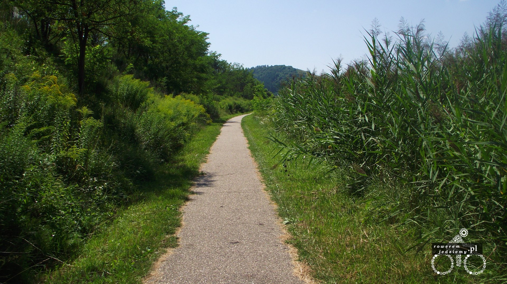
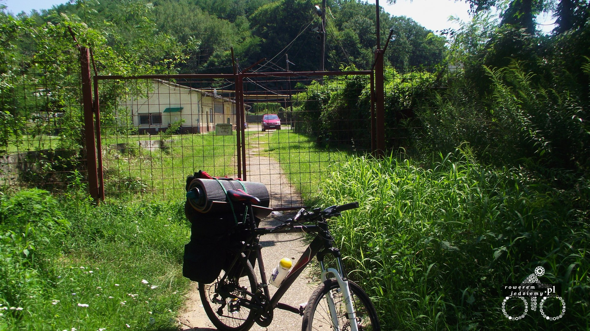
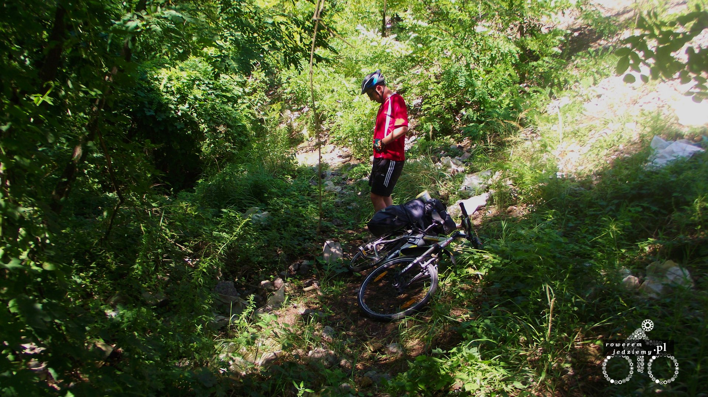
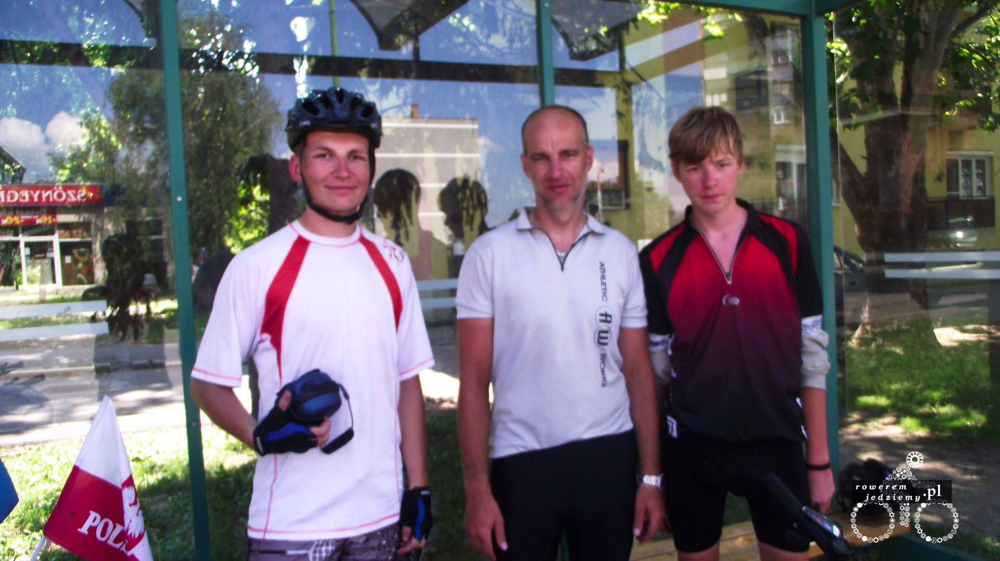
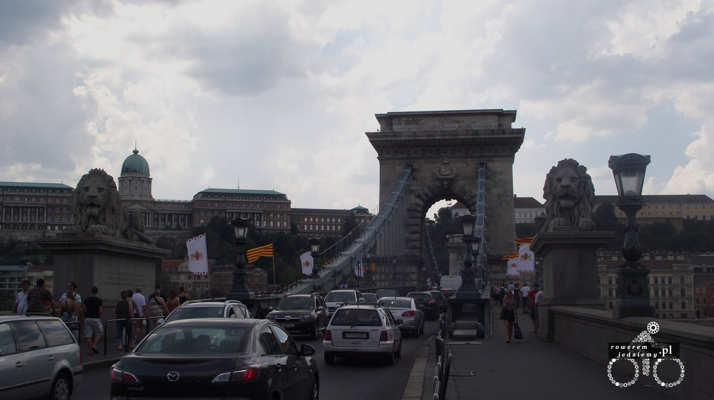
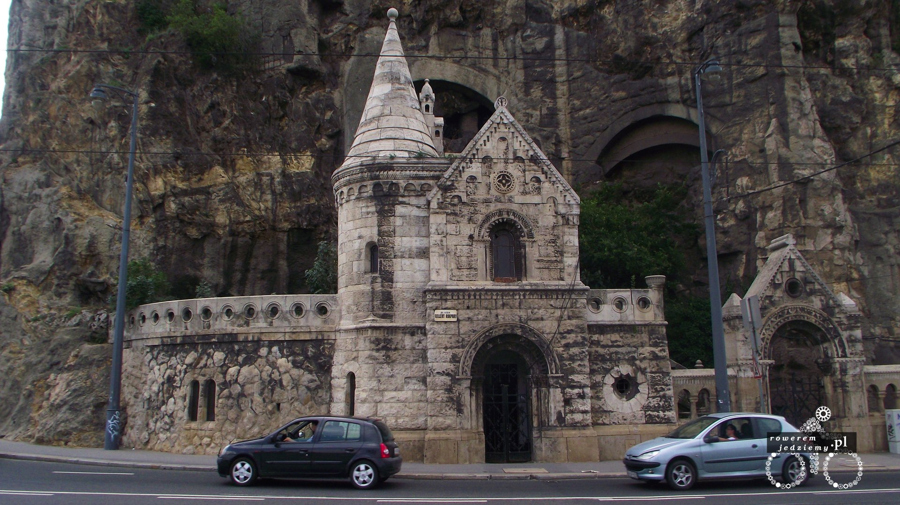

### Dzień 4
Przez noc pogoda się zmieniła i rano zastało nas słońce. Cel na dzisiaj Sirok no i oczywiście wymiana waluty. - (godzina 7:30)
W Ózdzie znaleźliśmy kantor, zrobiliśmy zakupy w jakimś supermarkecie gdzie puszczają w radiu American Country Music (ACM). Chleb smakuje jak mąka i już wiem że nie kupuję tutaj chleba. Oczywiście nikt nie mówi po angielsku (no może prócz jednego Niemca). - (godzina 10:50)
Oczywiście aby nie było za łatwo droga krajowa jest zabroniona dla rowerów. Pojechaliśmy jakąś dziurawą starszą niż my ścieżką rowerową i trafiliśmy na środku jakiegoś zadupia poza miastem na żelazną bramę (oczywiście zamkniętą na kłódkę). 

Nic nie dała próba obejścia 

(no może prócz coraz większej irytacji) więc zastosowałem starą znaną metodę otwierania wszystkiego czyli "z buta". O dziwo brama się otworzyła (chyba już trochę zardzewiała bo nie spodziewałem że tak szybko ustąpi). Nareszcie ktoś się pofatygował, ale gdy zdenerwowany pracownik usłyszał wyzwiska z nieznanym przez niego języku (angielsku) pokazał nam wyjście i nic więcej nie mówił. Po dojechaniu do Eger (o dziwo nie urywając kół) słyszeliśmy trochę polskiego języka. Na koniec dnia zaskoczyła nas wysokość gór podczas kierowania się na Sirok (na mapie wyglądają na łagodne).

### Dzień 5
Rano mieliśmy w planach odwiedzić jezioro w Markaz ale jak się okazało jest tam zakaz kąpieli. Skorzystaliśmy z tego że wszędzie rosną winogrona i poczęstowaliśmy się. Po dojechaniu do Gyongyos znowu przywitały nas znaki o zakazie poruszania się rowerów. Spotkaliśmy Polaków (pozdrawiam serdecznie jeżeli uda wam się to przeczytać), którzy odpoczywali na przystanku autobusowym (oczywiście mamy zdjęcie).

Wracali z Budapesztu i informowali nas abyśmy olali znaki zakazu bo one są i tak wszędzie. Przekonaliśmy się do tego gdy jechaliśmy krajową już 15km i ktoś w szczerym polu postawił taki znak. Nadal nie spotkaliśmy Węgra mówiącego po angielsku. W sumie to boją się trochę rozmawiać jak zaczyna się do nich mówić w obcym języku. Postój zrobiliśmy tam gdzie powiedzieli nam przyjaciele z polski czyli przy wyjeździe Godollo gdzie była dobrze wyposażona stacja benzynowa (nawet wi-fi miała). Jedna obserwacja z Węgier... mają tu dużo rond donikąd (5 zjazdów 2 gdzieś prowadzą).

### Dzień 6
Odwiedziliśmy Auchan w Budapeszcie (w sumie to przy wjeździe do Budapesztu). Odwiedziliśmy również słynny Hungaroring gdzie tydzień wcześniej odbywał się wyścig F1.  Budapeszt również zakazuje poruszania się rowerzystom ale mają przynajmniej zniszczone ścieżki rowerowe. Swoją drogą Węgry wyglądają tak jakby od upadku komuny przestały remontować infrastrukturę. Oczywiście nie wiemy gdzie jechać bo znaków do centrum nie ma na ścieżce rowerowej. Budapeszt składa się głównie z takich samych pokomunistycznych bloków więc łatwo się tam zgubić, szczególnie gdy przejeżdża się siódme skrzyżowanie i wygląda ono tak jak 6 poprzednich. Po dostaniu się do centrum miasta widoki są dużo ładniejsze (tynk nie odpada itp.) no i jest trochę ładnych zabytków. 

Teraz się zorientowaliśmy że przez cały pobyt na Węgrzech nie spotkaliśmy żadnej policji. Pierwszy raz spotkaliśmy osobę która mówi po angielsku i potrafiła nam wyjaśnić jak wyjechać na odpowiednią drogę. Jak wiadomo wszystkie drogi prowadzą do Budapesztu ponieważ nikt w tym kraju nie wpadł na pomysł że oprócz stolicy też można budować mosty. Następna droga krajowa i następne zakazy. Dojechaliśmy ostateczne do jeziora przed Balatonem i miejscowości Velence (ładne miejsce swoją drogą). 

[Cz 3 - Balaton, Chorwacja i w końcu Słowenia](/post/cz-3-balaton-chorwacja-i-w-koncu-slowenia)