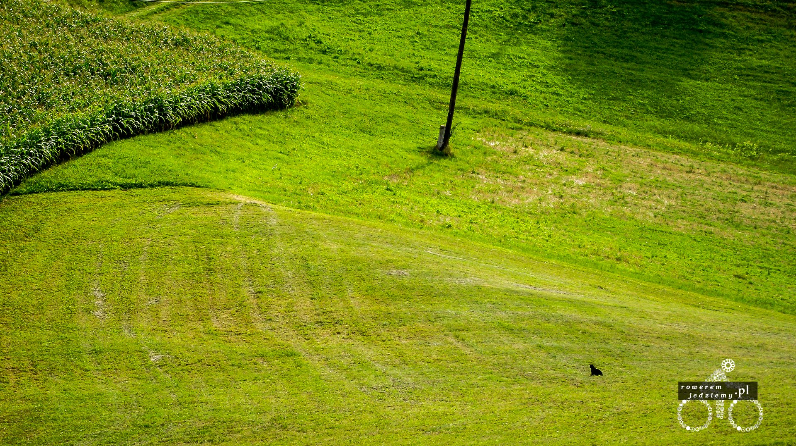

### Dzień 7
Rano poznaliśmy miłego Węgra rybaka który powiedział nam że nie wypada rozbijać namiotu obok jeziora bo policja może być niezadowolona (przynajmniej tak zrozumieliśmy to co próbował nam przekazać po węgiersku). Im bliżej Słowenii tym lepsze drogi. Droga strasznie nudna bo nie ma gór ale nie narzekamy. Dojechaliśmy nad Balaton. To jezioro jest przereklamowane po pierwsze nie jest zbyt czyste po drugie "ludzów jak mrówków". 

Nie zatrzymaliśmy się na długo (kilka godzin) i pojechaliśmy dalej bo nic tu nie było. Jutro do przekroczenia 2 granice (Węgiersko-Chorwacka i Chorwacko-Słoweńska).

### Dzień 8
Droga niezła oczywiście aż do granicy cały czas na zakazie. Na granicy nikt się nami nie przejmuje równie dobrze moglibyśmy przejść bez kontroli. Ustawiliśmy się jak samochody bo nikt do nas nie przyszedł. Przy przekraczaniu chorwackiej kontroli dostaliśmy informatory i dość dobrą mapę Chorwacji. Część gdzie jest Słowenia jest dokładniejsza od naszej zakupionej jeszcze w Polsce. No ale oczywiście musieliśmy źle skręcić i nadrobić 60km ponieważ dwa przejścia graniczne ze Słowenią są w miejscowościach o takich samych nazwach i wybraliśmy to złe. Od razu zauważalna poprawa jakości dróg. 

### Dzień 9
Pierwszy cały dzień na Słowenii i same plusy. Wszystkie napotkane osoby mówią dobrze po angielsku. Na jakimś odludziu w małej wiosce (nie było na naszej mapie) spotkaliśmy matkę z małym dzieckiem, która płynie piękną angielszczyzną wytłumaczyła jak najlepiej jechać aby dojechać. Później (w Ljutomerze) spotkaliśmy Pana Policjanta który zaprowadził nas do TIC oczywiście mówiąc ładnie po angielsku i pytając się o cele podróży. W samym TIC, miła Pani dała nam bardzo dokładną mapę Słowenii (oczywiście nasza poszła do kosza) i kilka broszurek co jeszcze można zwiedzić. 

Mając dobrą mapę i nie musząc używać NokiaMaps pojechaliśmy do Ptuja. Wiatr nie chciał chyba abyśmy się poruszali zbyt szybko więc wiał z zadziwiającą prędkością prosto w twarz. Pomagały mu dość strome podjazdy. W Ptuju odpoczeliśmy w ładnym parku. W poszukiwaniu noclegu przejechaliśmy 30km ponieważ na Słowenii wszędzie jest cywilizacja nawet gdy jest jakaś duża góra jest tam dom lub dwa. Ale jakość dróg powala na kolana no i w każdej nawet małej wiosce są ścieżki rowerowe. 
### Dzień 10
Pogorszyła się trochę pogoda i mamy chmury (teraz nas to cieszy po upałach przez ostatnie kilka dni). 

Pierwsze kilka km jedziemy z prędkością 10km/h (średnią) ponieważ zjechaliśmy na drogę no-name ponieważ uznaliśmy że będzie krócej. Na takich drogach nie ma znaków oznaczających jak stromy jest podjazd ale sądząc po doświadczeniu do 25% było tam przekroczone w kilku miejscach. Droga asfaltowa przeszła w drogę leśną ale spotkaliśmy tam mieszkańców którzy powiedzieli nam że tędy bez problemu dojedziemy (oni tam autem przejechali). 

Po dojechaniu do Celje pojechaliśmy dalej bo nie było co zwiedzać. Odwiedziliśmy za to miasto Laśko gdzie jest chyba największy na Słowenii browar o takiej samej nazwie. Woda w rzekach bardzo czysta widać wszystko nawet na większych głębokościach, ale nie ma co się dziwić jak tam spływa tylko woda ze źródeł górskich (Słowenia dba o środowisko i to BARDZO). 

Okazało się że jedziemy bardzo dobrym tempem i dojechaliśmy do stolicy. Przemili ludzie pomagali nam szukać pralni (jak się okazało w Słowenii jest bardzo mało pralni samoobsługowych). Pierwsze małżeństwo którego się zapytali tak chcieli nam pomóc że dzwonili do córki aby w internecie szukała pralni bo nie wiedzieli gdzie. Ostatecznie niestety tam gdzie znalazła tej pralni nie było ale brawa za chęci. Ostatecznie pomogła nam dwójka studentów (studentkę i studenta) którzy zaprowadzili nas do małego baru gdzie na mapach googla pokazali nam gdzie jest pralnia (dworzec kolejowy). Do wstukaniu koordynat i przegnaniu się z bracią studencką trafiliśmy na dworzec główny. Swoją drogą bardzo brzydki dworzec jak na takie ładne miasto.

[Cz 4 - Cel podróży, Włochy i Adriatyk](/post/cz-4-cel-podrozy-wlochy-i-adriatyk)