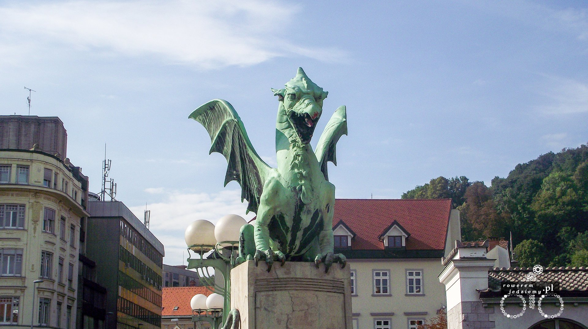
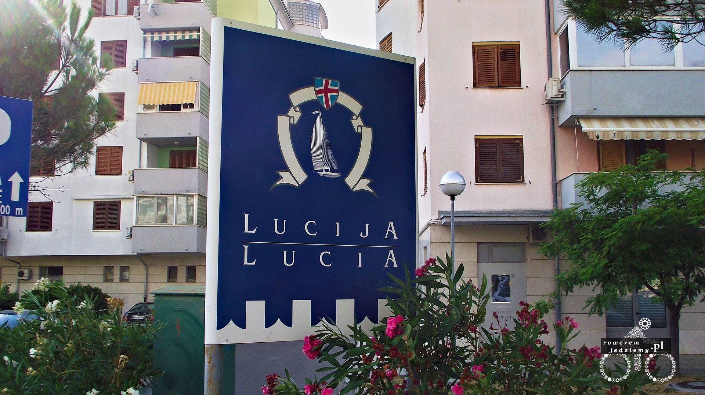

### Dzień 11
Na zwiedzanie stolicy poświęciliśmy 4h. Udało nam się dostać nową mapę tym razem z dodatkowo zaznaczonymi ścieżkami rowerowymi. Ljubljana jest bardzo ładnym miejscem i co najważniejsze zadbanym. 

No ale musieliśmy się zbierać, ponieważ chcieliśmy dojechać nad morze. Wyruszyliśmy w kierunku Postojnej. Trasa nie obfitowała w szczególne wydarzenia. W samej Postojnej mieliśmy postój i spotkaliśmy Portugalczyków którzy przyjechali na rowerach z Portugalii. Zepsuł się im GPS, więc daliśmy im jedną z naszych map. Po dojechaniu do granicy, zobaczyliśmy że na stacjach benzynowych takie kolejki jak na przy granicy ukraińsko-polskiej, no ale Włosi strasznie zbiednieli przez kilka ostatnich lat, a Słowenia ma tańczą benzynę (1,5E/l). 

Pierwsze wrażenia po zjeździe do Triest "Jak oni tu się rozmijają". 

Wszystkich i tak przebił kierowca autobusu, który wyjechał BARDZO stromą drogą o szerokości może autobus+20cm. Już nas nic nie mogło tam zdziwić. W Muggie cały czas było słychać muzykę jak nie z samochodu to ze skutera (włochy wieczna impreza). Zaskoczeniem było gdy to wszystko ucichło po przejechaniu granicy i ponownym znalezieniu się na Słowenii.

### Dzień 12
Rano znaleźliśmy się w Koper i zobaczyliśmy palmy. 

Ten widok skończył się wielkim uśmiechem. W końcu dojechaliśmy do Piran. Jadąc pięknym wybrzeżem morza Adriatyckiego (oczywiście specjalna ścieżka rowerowa) i zwiedzając nadmorskie miejscowości. 

Pierwsze wrażenia "EPIC!!!". Morze bardzo czyste (nie tak jak po włoskiej stronie). Widać małe pływające ryby (nawet chodzącego kraba udało się na dnie zobaczyć). Oczywiście brak piaszczystej plaży, ale to Adriatyk. Z Piranu przy dobrej pogodzie widać Wenecję. Sam Piran jest małym miasteczkiem, gdzie nawet chodniki czyści się myjką ciśnieniową. 

Wąskie miejskie uliczki do przemieszczania się wyłącznie rowerem lub skuterem mają swój urok. 

Na sam koniec dojechaliśmy do Luciji (Strasznie nazwa miasta kojarzyła mi się z naszą wspólną znajomą). 

Miasto troszeczkę większe gdzie można zrobić zakupu. Teraz zacznie się odpoczynek.

Statystyki:

| Dzień | km  | czas (min) | Vmax(km/h) | Vśr(km/h) |
|-------|-----|------------|------------|-----------|
| 1     | 87  | 253        | 67         | 20,6      |
| 2     | 110 | 307        | 62         | 21,5      |
| 3     | 93  | 253        | 58         | 22,1      |
| 4     | 111 | 322        | 52         | 20,7      |
| 5     | 118 | 328        | 53         | 21,6      |
| 6     | 97  | 255        | 50         | 22,8      |
| 7     | 131 | 340        | 49         | 23,1      |
| 8     | 142 | 371        | 51         | 23,0      |
| 9     | 106 | 351        | 72         | 18,1      |
| 10    | 142 | 418        | 67         | 20,4      |
| 11    | 146 | 460        | 70         | 19,0      |

Vśr = 21km/h 

km/dzień = 116,6km

Vmax = 72km/h

cała trasa 1283km + jazda wybrzeżem i czas pobytu ale tego nie liczyłem bo to już nie była jazda z prędkością z trasy.
cały czas 60h 58min

<iframe name="plotaroute_map_68629" src="https://www.plotaroute.com/embedmap/68629?units=km&hills=show" style="position:absolute;top:0;left:0;bottom:0;right:0;width:100%; height:100%;" frameborder="0" scrolling="no" allowfullscreen webkitallowfullscreen mozallowfullscreen oallowfullscreen msallowfullscreen></iframe>

Route map for <a href="https://www.plotaroute.com/route/68629?units=km" target="_blank" title="View this route map on plotaroute.com">2012 - Poland - Slovenia </a> by <a href="https://www.plotaroute.com/userprofile/30172" target="_blank" title="View this person's profile on plotaroute.com">kemal piro</a> on <a href="https://www.plotaroute.com" target="_blank" title="plotaroute.com - free route planner for walking, running, cycling and more">plotaroute.com</a>

### Powrót:

Nie prowadziłem szczegółowego dziennika z powrotu lecz wypada zaznaczyć kilka rzeczy...
- Dzień 1 - Pożar w okolicach Crni Kal i konieczność wracania przez Włochy (nadrobienie kilkudziesięciu km.
- Dzień 3 - Jadąca płonąca ciężarówka i obok niej coś na wzór straży miejskiej (chorwacja) z gaśnicami. Może chcieli wywieść ją z miasta...
- Dzień 6 - Złamana szprycha i lekko scentrowane koło.
- Dzień 7 - Przebita dętka (musiałem trochę spuścić powietrze, ponieważ koło zbyt mocno biło więc to moja wina). 