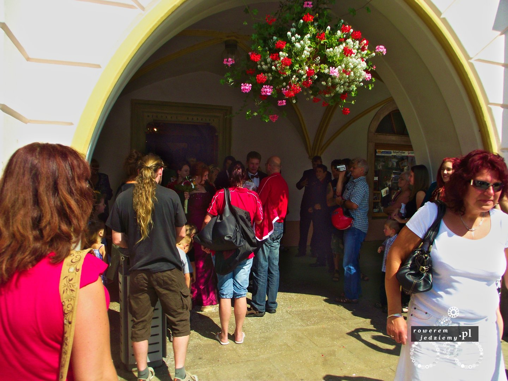
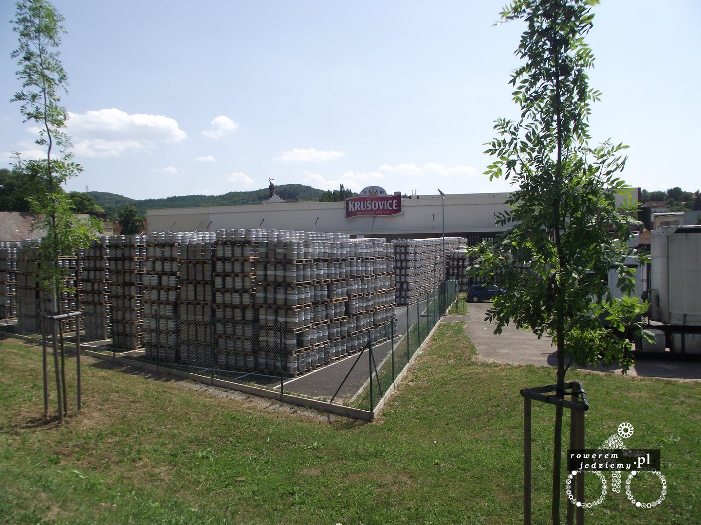
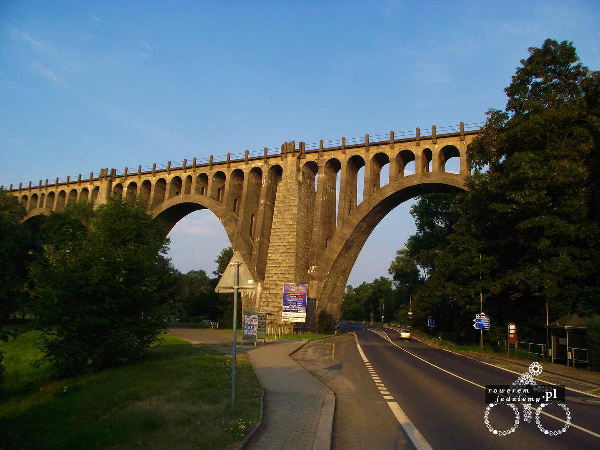
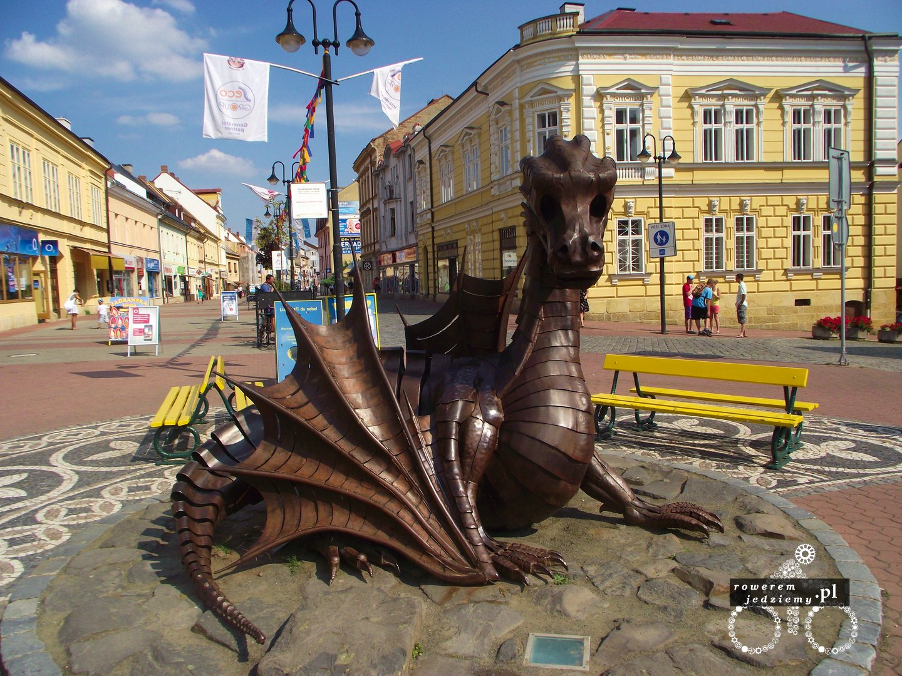

Już drugiego dnia wyjazdu zaczęło się coś dziać. Przez coś mam na myśli zapoznanie się z grupką weselną w Trutnovie. 

Zawsze sądziłem, ze wesele się organizuje popołudniami, ale jak widać, można i w południe. Zostałem zaproszony przez kumpli pana młodego (tak mi się przynajmniej zdaje). Gdy usłyszeli, ze własnie jadę do Szwajcarii, poczęstowali mnie piwem (ciekawe co w Czechach robić z rowerzystami po piwie? Niestety się już nie dowiem, bo nie został zatrzymany). Po wejściu do restauracji pierwsze zaskoczenie (to chyba tradycja), panna młoda wzięła sobie talerz ze stołu i z gracją walnęła nim o podłogę. Zaraz po tym jej i panu młodemu wręczono miotły i ładnie za sobą posprzątali. Tak to jest, kobieta zrobiła bałagan, ale facet i tak musi pomagać sprzątać :P, w odwrotnej sytuacji nie obyło, by się oskarżeń o wykorzystywanie kobiet. No ale nie kłóćmy się z czeską tradycją i wracajmy na imprezę. Nic nadzwyczajnego się już nie stało, chociaż ciekawą rzeczą było to, że nikt nie dawał kopert, jak to u nas jest w zwyczaju, lecz bardziej wymyślne prezenty (ciekawym był np. miecz). No oczywiście nawiązała się dyskusja, co mi odwaliło, że jadę do Szwajcarii na rowerze i czy na pewno wiem jak to jest daleko? Zastanawiałem się przez chwilę czy nie udawać idioty? "Ej naprawdę to tak daleko? A to sorry zawracam, nie chce mi się.". No ale postanowiłem nie zgrywać się z nowych przyjaciół, tylko dalej próbować rozmawiać z nimi po polsku, gdy oni do mnie po czesku. Nie, ale już trzeba się zbierać, bo przecież muszę zrobić trochę km jeszcze. Chcieli mi jeszcze podarować odchodne wódeczkę, ale z przykrością musiałem odmówić. Zakładam, że tłumaczenie czeskiej policji, że w Polsce jeżdżenie po flaszce jest całkowicie normalne, na niewiele by się zdało. No ale po życzeniu szczęścia w życiu i czego się tam życzy nowożeńcom, udałem się w stronę Jiczyna. Dzień nie byłby dniem, gdyby nie kolejne rozproszenia:

 A żeby nie było, że interesujące są wyłącznie rzeczy związane z alkoholem i zabawą.

No i na interesującą rzecz nie było trzeba czekać długo, a właściwie to tylko do wieczora. Rozłożyłem namiot pod Tesco i to był pierwszy z wielu błędów tej podróży. Jak wielkie było moje zdziwienie, gdy w środku nocy zawalił się na mnie namiot... Trochę zdezorientowany wziąłem do ręki pierwszą rzecz, jaka przyszła mi do głowy i nie było to nóż, który miałem w torbie :) Udało mi się znaleźć latarkę i jakoś wygramolić się z namiotu. Nad namiotem stał sobie pan z dwoma dużymi reklamówkami i chyba jeszcze bardziej zdezorientowany niż ja. Trochę się przestraszył (nie żebym ja był jakoś szczególnie spokojny w tej sytuacji). Okazało się, że to jest bezdomny i myślał, że to jakieś śmieci wyrzucone obok Tesco. Gdy już dotarło do niego, że nie jestem śmieciami, zrezygnował z dalszego składania mojego namiotu. Trochę słabo się już spało tej nocy.

Ale zaraz, gdzie te smoki? Miały być SMOKI!!! A proszę bardzo...

