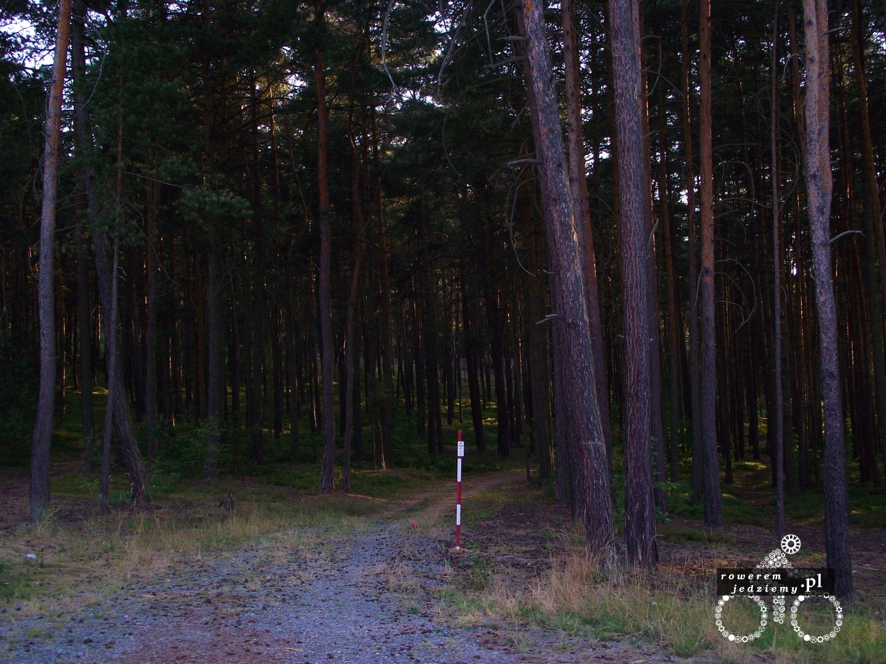
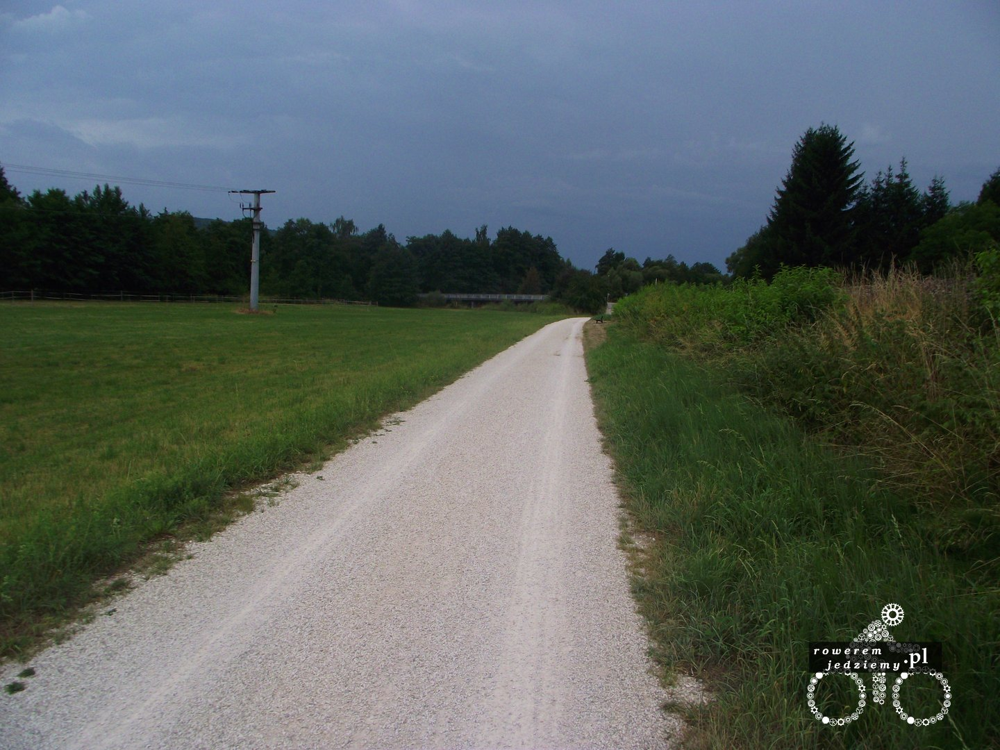

Dobra, ale od początku. Po szczęśliwym przejechaniu przez słoneczne Czechy rozpoczęły się Niemcy. Oczywiście, pamiętając że w Niemczech w niedzielę wszystko jest zamknięte, zrobiłem sobie zakupy w kraju knedlików (nie nie kupiłem knedlików). Niemcy o dziwo rozpoczęły się bardzo pozytywnie, od samego początku wjazd na przepiękną ścieżkę rowerową oddzieloną od jezdni. Nawet pogoda jak na ten kraj była bardzo fajna, no ale nie wszystko może być takie piękne. Pogoda jak zwykle tutaj się zepsuła no i z powodu braku słońca pojechałem w kierunku Leipzig zamiast Ulm. 

No ale prócz burzy nie było to najgorsze. Plusem był powrót do Norymbergi i zatrzymanie się przy salonie samochodowym. Zostałem zaproszony do domu starszego niemieckiego małżeństwa, które jadąc na rowerach, schroniło się przy tym samym salonie samochodowym. Miło z ich strony biorąc pod uwagę, że spędziłem tam już 2 godziny czytając książkę.

No ale kolejny dzień burzy i postanowiłem jednak jechać dalej. W pewnym momencie przestało mi robić różnice, z jaką siłą leje. Nie powinno, ale o dziwo pomimo bycia przemokniętym jechało się wygodnie i z wiatrem. No i właśnie w tej chwili obudziłem się obok drogi. Przez chwilę zastanawiałem się co się dzieje, ale ta tajemnica wyjaśniła się dość szybko. Samochód, który jechał za mną, zatrzymał się prawie natychmiast i wybiegły z niego dwie osoby. Zakładam, że była to para, ale nie miałem okazji zapytać. Kobieta chyba bardziej wiedziała co robić, jak się później okazało, pracuje w jakiejś tam klinice. Zastanawiałem się, dlaczego tak nalegają abym leżał, szczególnie że rów nie jest zbytnio ciekawym miejscem do leżenia, tym bardziej gdy jest w nim już sporo wody. Ona pobiegła do samochodu i wróciła z apteczką, po czym zaczęła coś robić na mojej twarzy. Zadziwiające jak to człowieka nic nie boli, gdy jest w stresie. Ulgą było, że znali angielski i dowiedziałem się, że właśnie dostałem gałęzią, w sumie to logiczne, ponieważ daszek od kasku i nisko schylona głowa z powodu deszczu, skutecznie uniemożliwiała mi zobaczenie czegoś co jest ponad linią kierownicy. Szczęśliwie doszliśmy do porozumienia, że do szpitala nie trzeba jechać i szyć tego. Przez "tego" mam na myśli rozcięcia pod lewym okiem długiego na około 3cm, lecz dość wąskiego i płytkiego. Zamiast tego dostałem krem "nivea" (to nie jest product placement) i po spędzeniu jeszcze chwili z nowo-poznanymi postanowiłem jechać dalej. Jadąc, zastanawiałem się, jak to musiało wyglądać z tyłu... Jedzie sobie rowerzysta w burzę i w pewnym momencie leci sobie gałąź. Niczego nieświadomy rowerzysta jedzie dzielnie dalej, aż w pewnym momencie napotyka gałąź na swojej drodze. Gałąź wygrywa jednak bitwę i rowerzysta kończy tak jak kończy. Posiadał jednak kask (+5 do obrony) więc obrażenia nie były poważne.

Gdy już dojechałem do pierwszej stacji benzynowej po drodze, uznałem że zobaczę jakie są szkody. Ciężko wyrazić zdziwienie pracowników, gdy zapytałem się o klucz do toalety, szybko wytłumaczyłem, co się stało bo jednak sam byłem ciekawy, jak to wygląda i chciałem ten klucz. Pierwsza myśl, która mi przyszła do głowy po zobaczeniu mojej twarzy "Oby nie została blizna" (Jak się później okazało, nie została dzięki pewnym specyfikom). No ale nie było tak źle. Gorzej było np. z moim telefonem, który domówił działania i mapą, która nie nadawała się już do niczego. Na szczęście pamiętałem, że mam się kierować na Ulm więc zapytałem się o drogę i pojechałem w tamtym kierunku.

Wybaczcie brak zdjęć, lecz nie miałem wtedy duszy fotografa, szczególnie samego siebie więc nie mam pamiątki (teraz w sumie żałuję). Wnioski jakie można czerpać z tego wydarzenia? Jeździj w kasku? Nie, koniecznie, ponieważ gdybym nie miał kasku, pewnie widziałbym trochę więcej i mogłoby się nic nie wydarzyć. Jak już oberwiesz w głowię miej kask? Zdecydowanie tak.