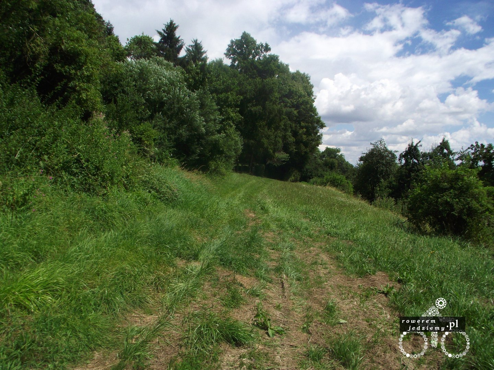

Po wydarzeniach związanych z burzą już nic gorszego stać się nie mogło, więc po zwiedzeniu sobie Ulm ruszyłem w stronę granicy szwajcarskiej. Tak mi się przynajmniej zdawało, ponieważ nie miałem mapy (no może prócz takiej poglądowej z informacji turystycznej Ulm). Oczywiście do celu miała prowadzić ścieżka rowerowa, która jak to często ścieżki mają w zwyczaju, skończyła się w szczerym polu.

Po tym postanowiłem nie zważać na trąbiących Niemców, którzy nalegali abym jechał jednak ścieżką ciągnącą się wzdłuż ulic, lecz ja wiedziałem swoje (a bo zaraz ta ścieżka sobie zakręci i tyle po moim kierunku jazdy). Trzymając się drogi, przynajmniej wiem gdzie jadę. Tego wieczoru nie mając się gdzie rozbić z namiotem, postanowiłem poczekać do całkowitego zmroku i rozbić się przy drodze. Oczywiście nastawiając sobie budzik na 5 rano, aby jeszcze pod osłoną nocy zebrać się ze wszystkim. O dziwo się to udało i od rana byłem już na najlepszej drodze do Szwajcarii. Byłem to w sumie dobrze powiedziane, ponieważ moja droga na mapie nie pokrywała się zbytnio z droga, którą jechałem. Na szczęście odwiedziłem parking dla tirów i spotkałem przemiłego kierowcę z Rosji. Nie, nie zostałem poczęstowany wódką i tak był trzeźwy, jak ze mną rozmawiał. Posiadał natomiast bardzo dokładną mapę całej europy, chociaż bardziej nazwałbym to księgą. Bardzo zdziwiony, że jestem z Polski i przyjechałem tu na rowerze, nawet zaoferował mi, że da mi tą księgę, bo ma dwie, ale ja czując jej masę, uznałem że nie jest tego warta.

No ale w pewnym momencie zaczęła się Szwajcaria. Zdziwiony brakiem jakiejkolwiek kontroli granicznej lub nawet stanowiska do kontroli, jechałem sobie za dwoma starszymi kolarzami aż do pierwszego miasta. Schaffhausen się zwało (tak też nie jest mi łatwo to wymówić). 

Wiedząc, że w Szwajcarii obowiązuje OC na rower, postanowiłem dowiedzieć się więcej od panów policjantów. Nie było tak ciężko ich znaleźć i wytłumaczyli mi, że to jest stary przepis i od początku tego roku już nie ma OC. No ale trzeba coś powiedzieć o samej Szwajcarii. Gdy ktoś wam kiedyś powiedział, że Holandia jest miejscem dla rowerzystów, to chyba nie był w tym górskim kraju. Posiadają oni więcej kilometrów dróg rowerowych niż my autostrad i ekspresówek razem wziętych. Jakość tych dróg jest świetna i co jakiś czas jest mapa całej okolicy w kilku skalach (największa ma promień 50km). Nie sposób jest się zgubić. Oczywiście drogi lecą w większości przypadków niezależnie od dróg przeznaczonych dla samochodów (a przynajmniej są oddzielone pasem zieleni). 

Bardzo szybko udało się dojechać do Zurychu i zobaczyć to drogie, ale jak że ładne miasto. 

Dlaczego drogie? Może kilka przykładów cen wam coś powie (ceny przeliczone po kursie w momencie pisania artykułu):
Pierś z kurczaka - 100zł/kg
Jabłka 1kg - 14zł
Bochenek chleba - 10-11zł

To chyba wystarczy :) . No ale nie samym Zurychem człowiek żyję i tak ruszyłem sobie wzdłuż Zurichsee (chyba powinienem to tłumaczyć jako morze zuryskie?). Swoją drogą dziwne zboczenie mają kraje, które nie mają dostępu do morza. Biorą jakieś duże jezioro i wmawiają sobie, że to morze. No ale to ich sprawa i nie nam ich osądzać.

Czy można w Szwajcarii spać na dziko? Pewnie nie ale nie robiło mi to jakiejś dużej różnicy. Jadąc wieczorem po odludziach, nie było problemu, aby rozłożyć sobie gdzieś namiot i po prostu pójść spać.

