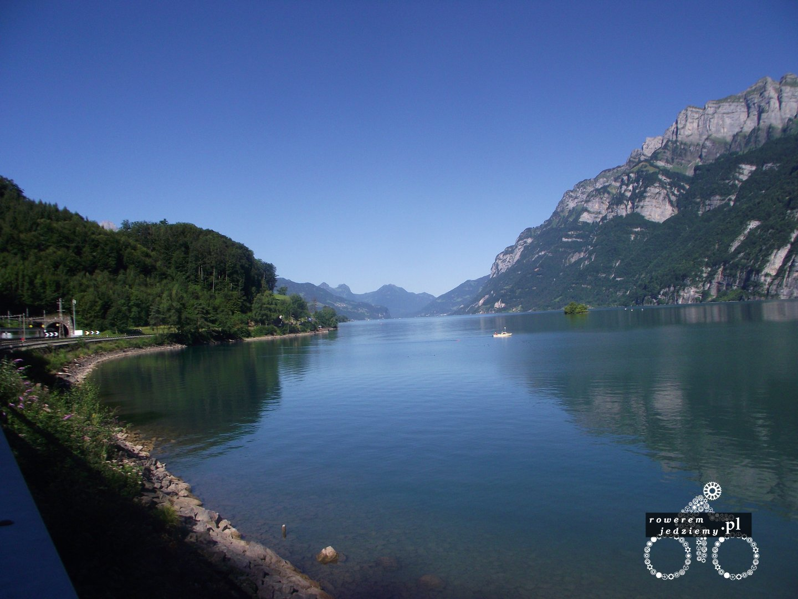
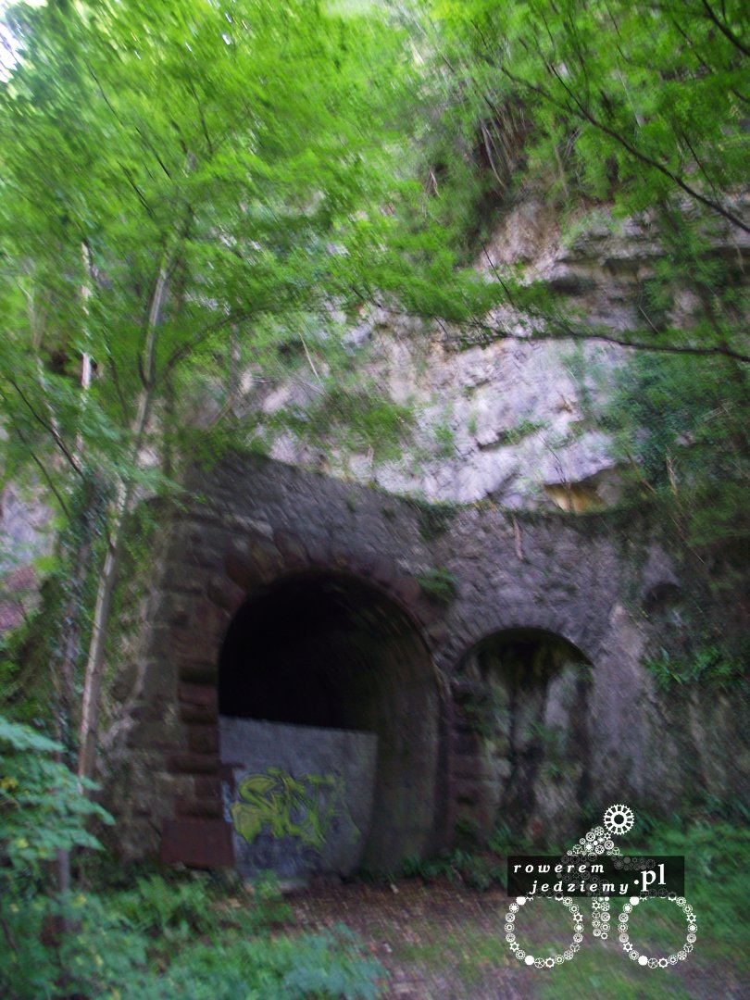
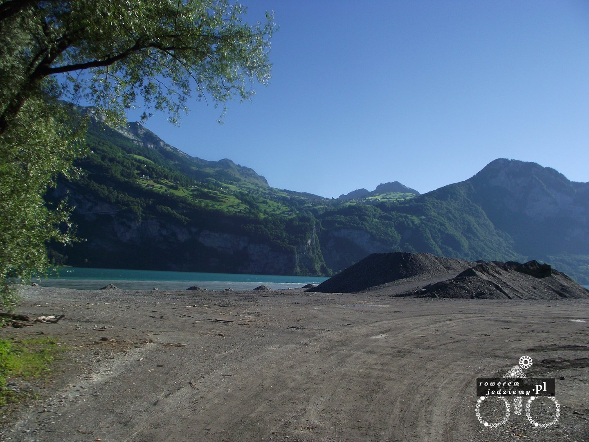
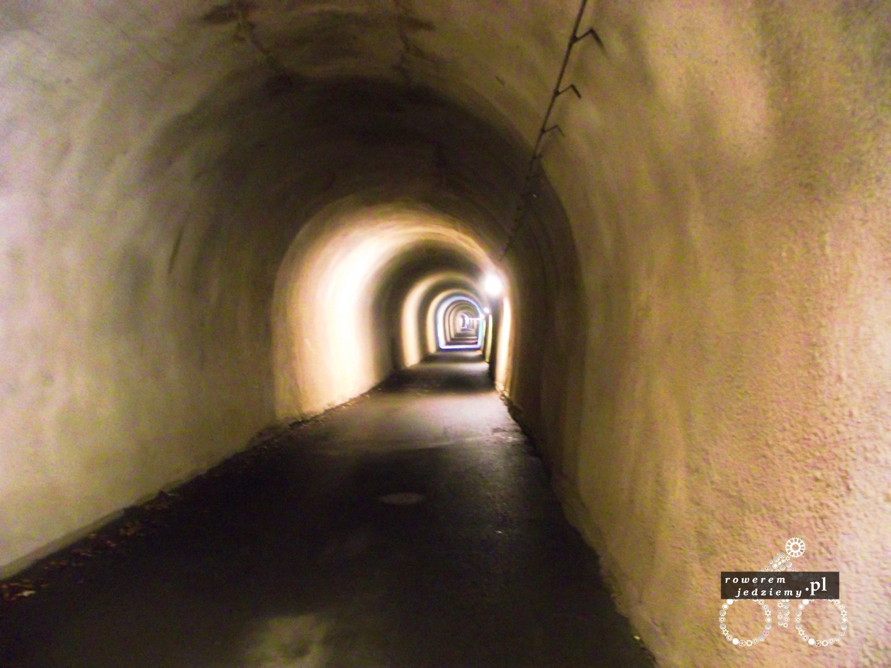
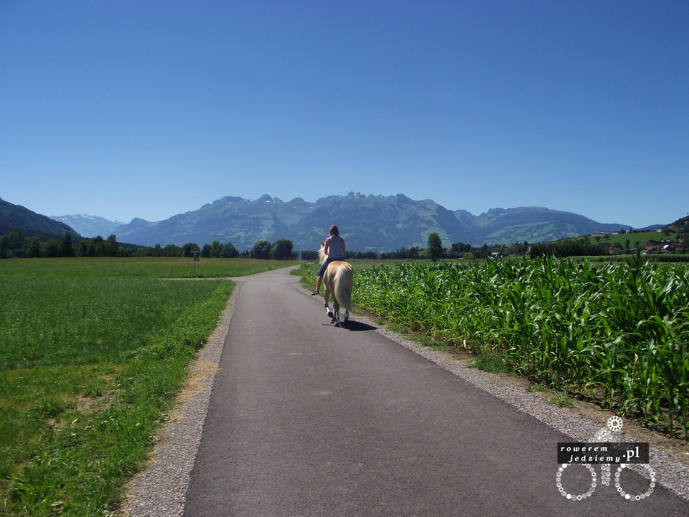
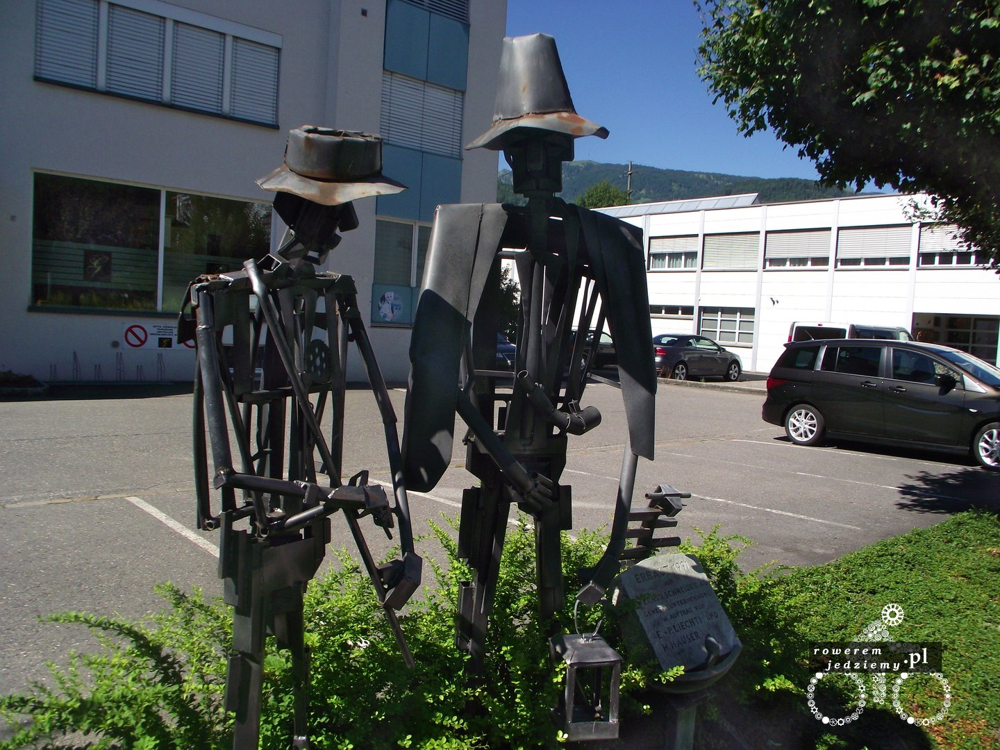
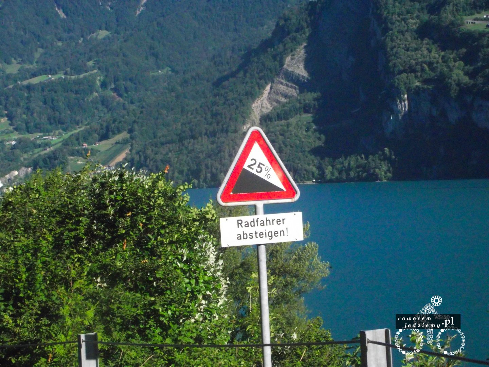

Jeszcze nigdy mi się tak dobrze nie przemierzało kilometrów jak tutaj. Dobra droga wszędzie mapy no i towarzystwo uśmiechniętych rowerzystów. Żyć nie umierać, szczególnie gdy po spojrzeniu nad kierownicę ma się takie widoki.

Szwajcaria ma świetne trasy krajoznawcze, chociaż biorąc pod uwagę moje w miarę cienkie opony, trochę się zapędziłem i wybrałem za bardzo "terenową" trasę. 

Mimo to dało radę się przejechać. Gdy będziecie w tym kraju, koniecznie spróbujcie jakiś górskich tras, gdzie trasa biegnie przez jakąś górę. Aby ułatwić życie rowerzystom, postanowiono wykopać specjalne tunele.

Jazda takim tunelem to naprawdę fajna sprawa, szczególnie gdy uświadamiasz sobie, że to zostało wybudowane specjalnie dla ciebie. No może jeszcze dla kilku tysięcy innych rowerzystów, ale nie traćmy chwili. Czasami jadąc drogą, niektóre rzeczy naprawdę cię zadziwiają.

Czasami jednak przydaje się znajomość języka (kolega dopiero po przyjeździe powiedział mi, co tam jest napisane, gdybym wiedział, może bym posłuchał). 

No ale jazda do samego Vaduz była przyjemnością. Właśnie w Vaduz troszkę się zgubiłem i postanowiłem zapytać o drogę. Szczęście mi dopisało, bo trafiłem na naprawdę przemiłą dziewczynę na rowerze, która pokazała mi miasto, wyprowadziła mnie z niego i na dodatek opowiedziała trochę o Szwajcarii (tak była to Szwajcarka mimo przebywania obecnie w Liechtensteinie). Biorąc pod uwagę całą podróż, te dni spędzone w Szwajcarii były najmilszymi w całej podróży. No i przy okazji najdroższymi :) 