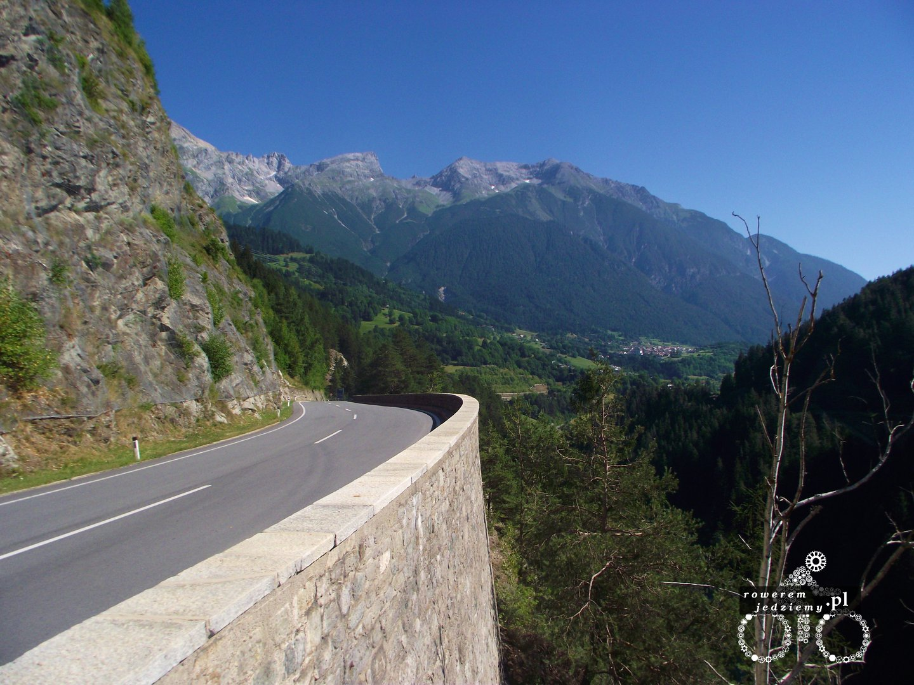

Pierwszy dzień w Austrii i zaczynamy podjazd pod Austriacką część alp. Na początku nie wydaje się to aż tak straszne, chociaż z każdą chwilą górka robi się bardziej stroma. Trzeba jechać trasą widokową, ponieważ droga ekspresowa/autostrada jest niedostępna dla rowerzystów. Moja trasa była bardziej dzika. 

Przez dzika rozumiem biegła sobie przez lasy i ogólnie mało asfaltowe drogi aż do momentu, gdy zaczęły się góry. Po drodze udało mi się zobaczyć bardzo dużą partię szachów. 

Trochę kusiło mnie, aby zrobić pierwszy ruch, ale uznałem, że Austriacy mogą nie mieć takiego poczucia humoru (jest to w sumie naród bardzo związany z Niemcami). Biorąc pod uwagę, że to są pierwsze w życiu tak wysokie góry na które wjeżdżam, nie wiedziałem czego się spodziewać. Na pewno nie spodziewałem się tuneli po drodze. Nie były to jednak takie fajne tunele, jakie miałem okazje przejeżdżać w Szwajcarii, lecz tunele bez pobocza, w których prócz mnie jechały także samochody. Niektóre miały więcej niż kilometr, a nie było można się w nich zatrzymywać, jadąc cały czas pod dość sporą górkę. No ale czego się nie robi dla fajnych widoków. 

Temperatura zaczęła powoli spadać. Rozbijając namiot, było już dość chłodno, ale nie robiłem sobie z tego problemu ponieważ zaraz schowam się do ciepłego śpiwora. Jak się w nocy okazało, to była jedna z najcięższych nocy, jakie miałem. Temperatura wg licznika spadła do 3 stopni, a mój śpiwór był przystosowany do min 6. Dzięki temu obudziłem się około 2 i zobaczyłem drogę mleczną. W wysokich górach gdzie zanieczyszczenie powietrza jest znikome, a dzisiaj pogoda była wyjątkowo bezchmurna, widoki były naprawdę zapierające dech. Z tym dechem to może temperatura miała coś wspólnego.

Zjazd z tych gór był ogromnym wyzwaniem dla moich hamulców. Tarcze świeciły się na czerwono, więc co jakiś czas musiałem zrobić przerwę, aby się trochę ostudziły. Nie zrobiłem już takiego błędu, jaki kiedyś i nie polałem ich zimną wodą. Tak sobie jadąc, kierowałem się na Innsbruck, w sumie to nie ma tam zbytnio innej drogi do wyboru. 

W mieście gdzie rozgrywają się zawody pucharu czterech skoczni, dokonałem pierwszego od początku tego wyjazdu komunikacji z przyjaciółmi z Wrocławia. Chyba byli ucieszeni, że żyję, przez chwilę wydawało mi się, że nawet zdziwieni. Oczywiście nie było czasu, żeby opowiedzieć wszystko, ale warto dać znać, że jest ok. Szczególnie że dopiero teraz komórka zaczęła działać po kąpieli w Niemczech. Cały czas jadąc bez mapy (skoro już pokonałem taką trasę to po co mi mapa) udało mi się dojechać do granicy niemieckiej i dostać się ostatecznie na "alpenstrasse" mijając po drodze dużo miejscowości, w których niemieckie rodziny spędzały wakacje. Widząc tych wszystkich ludzi, którzy wylegiwali się na leżakach i hamakach, myślałem sobie "nie wiecie co czynicie, są dużo lepsze sposoby na spędzanie wakacji".

W kolejnych dniach udało mi się dojechać do Salzburga, wg mnie przepięknego miasta znajdującego się w dolinie. Szczególnie na uwagę zasługuje zamek, który znajduje się w centrum i świetnie zaprojektowane miasto. Na przykład ogrody, które są oddalone dobry kawałek od zamku, bezpośrednio na niego wskazują. W tym mieście zobaczyłem także rajdową taksówkę i ulicznych grajków. Ale nie byli to zwykli grajkowie. Na placu centralnym (nazwijmy go rynkiem) nie można widocznie grać innej muzyki niż klasyczna, więc wszyscy tam zebrani grali sobie Mozarta, Chopina i im podobnych. Tak macie rację, nie było tam romów z ich akordeonami :)

No ale na cyganów nie było trzeba długo czekać, bo można ich spotkać zaraz po przekroczeniu czeskiej granicy. Mijałem po drodze miasto opisywane jako miasto kultury romskiej. Żadnej kultury tam nie widziałem. Bardziej same podniszczone budynki, ale może mam inne pojęcie o kulturze. Droga do Polski nie była ciężka lub tez nieprzyjemna. Z Czechami zawsze można się dogadać, mimo że nie spotkałem już żadnego wesela po drodze. Cała podróż zajęła mi 10 dni więc nawet niezłe tempo. Przyjechałem wychudzony i z rozcięciem pod okiem, które już zaczęło się goić. Aby nie pisać kolejnego artykułu, na temat wyjazdu do Szwajcarii ten zrobił się trochę dłuższy niż miał.

No i na koniec trasa całego wyjazdu:

<iframe name="plotaroute_map_77577" src="https://www.plotaroute.com/embedmap/77577?units=km&hills=show" style="position:absolute;top:0;left:0;bottom:0;right:0;width:100%; height:100%;" frameborder="0" scrolling="no" allowfullscreen webkitallowfullscreen mozallowfullscreen oallowfullscreen msallowfullscreen></iframe>

Route map for <a href="https://www.plotaroute.com/route/77577?units=km" target="_blank" title="View this route map on plotaroute.com">2013 - Poland -Switzerland</a> by <a href="https://www.plotaroute.com/userprofile/30172" target="_blank" title="View this person's profile on plotaroute.com">kemal piro</a> on <a href="https://www.plotaroute.com" target="_blank" title="plotaroute.com - free route planner for walking, running, cycling and more">plotaroute.com</a>

