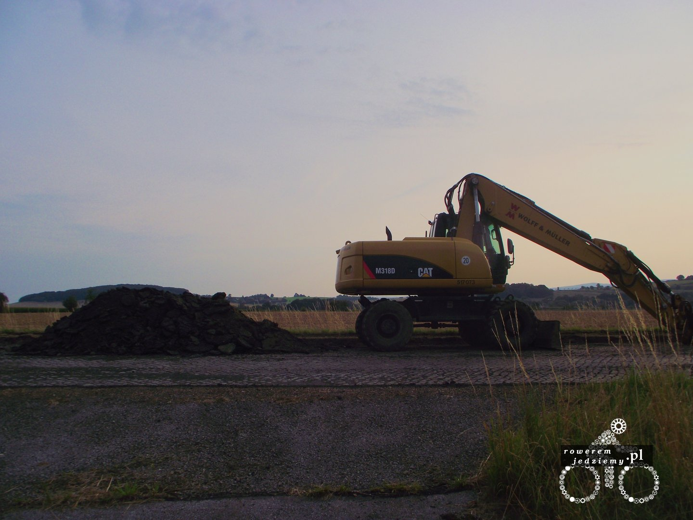
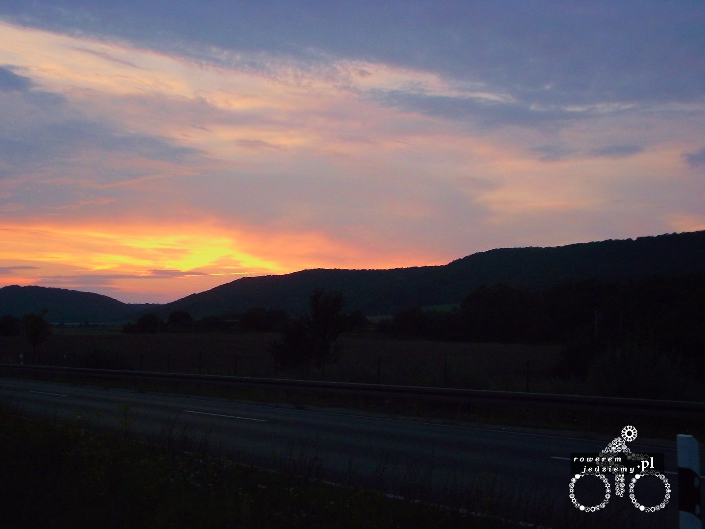
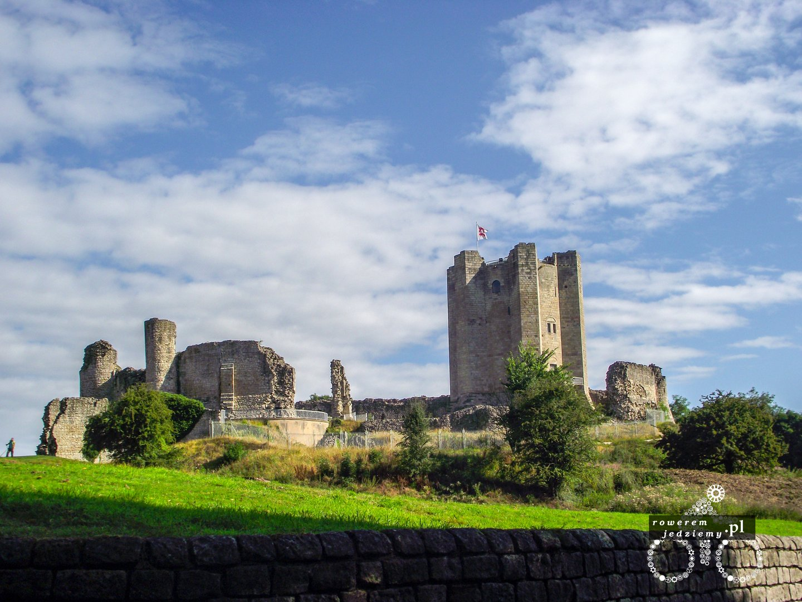

###Dzień 1 (211km)

6:00 pobudka już spóźniony a tu jeszcze trzeba się pakować, tak więc o 9:30 udało się zebrać i wyjechać z akademika. Sam wyjazd przebiegał bardzo łagodnie, ponieważ udało się ominąć poranne wrocławskie korki i nawet zakupy zrobić. Gdy tak sobie jadę po drodze krajowej 95 i niech nikt mi się nie waży teraz narzekać na polskie drogi, bo zostanie potraktowany tak jak Rosja przez UE po ataku na Ukrainę, "wyrażę stanowcze oburzenie". Przed Bolesławcem spotkałem Maczka, który jechał w tym samym kierunku i wyszedł, aby zrobić mi zdjęcie (którego do tej pory nie dostałem). Przy wjeździe do Zgorzelca zrobiłem zakupy na niedzielę, ponieważ ludzie z kraju piwa i kiełbasy nie mają zwyczaju pracować ten dzień. Drogi boczne są bardziej górzyste, niż się spodziewałem, no i oczywiście jak na lato przystało, wypadałoby zrobić remont. Z moich drobnych spostrzeżeń w Niemczech robi się zdecydowanie więcej remontów niż w Polsce. Oczywiście remonty wiążą się z objazdami, które trochę psują wyznaczoną trasę, ale na szczęście zrezygnowałem z papierowej mapy na rzecz mapy offline w telefonie. Zawsze się zastanawiałem, dlaczego przy niektórych ścieżkach rowerowych jest napis 'frei'? Ostatecznie ciekawość zwyciężyła i zapytałem się przedstawiciela władz. Informacja jaką dostałem, jest następując: gdy mamy napisane 'frei' to możemy jechać tam rowerem, ale nie musimy (do nas należy decyzja), natomiast gdy tego nie ma to mamy taki obowiązek. W sumie to można było się tego domyśleć, bazując na jednym napisie, który Niemcy zostawili nam po drugiej wojnie światowej.

Pod koniec dnia jeszcze udało mi się załapać na objazd autostradą (tak dzielnie pojechałem bo już nie chciało mi się wracać). No i rozłożyłem namiot obok zamkniętej drogi.

###Dzień 2 (175km)
Rano pogoda nadal sprzyjała i po śniadaniu (oczywiście musli z mlekiem ) powróciłem walczyć z objazdami i nadrabiać kilometrów. Odezwał się też do mnie stary przyjaciel "Pan kolano". Zdecydował on, że tak szybko nie będziemy jechać jak wczoraj, więc w obliczu jego argumentów musiałem zwolnić trochę. Korzystając z pogody, udało się zrobić kilka dobrych zdjęć (na przykład zamków itp).

Oczywiście jak przystało na Niemcy (już drugi przejazd przez ten kraj) pogoda musiała się zepsuć, tak więc po południu rozpoczęła się burza z piorunami i nie było sensu dalej jechać. Zjechałem na stację benzynową "Agip" i czekałem... po 3 godzinach siedzenia wyjąłem śpiwór, bo zaczęło się robić zimno. Niestety to było koniec jazdy na dzisiaj, ponieważ prócz zimna przyszła noc i rozłożyłem namiot pod daszkiem stacji benzynowej. Nikt nie miał nic przeciwko i udało się jakoś przespać do rana.

[Cz2 - W krainie deszczu](/post/w-krainie-deszczu)