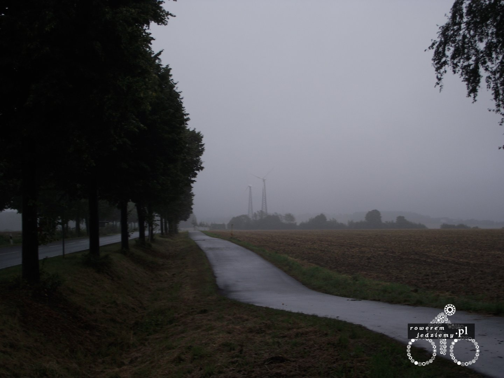
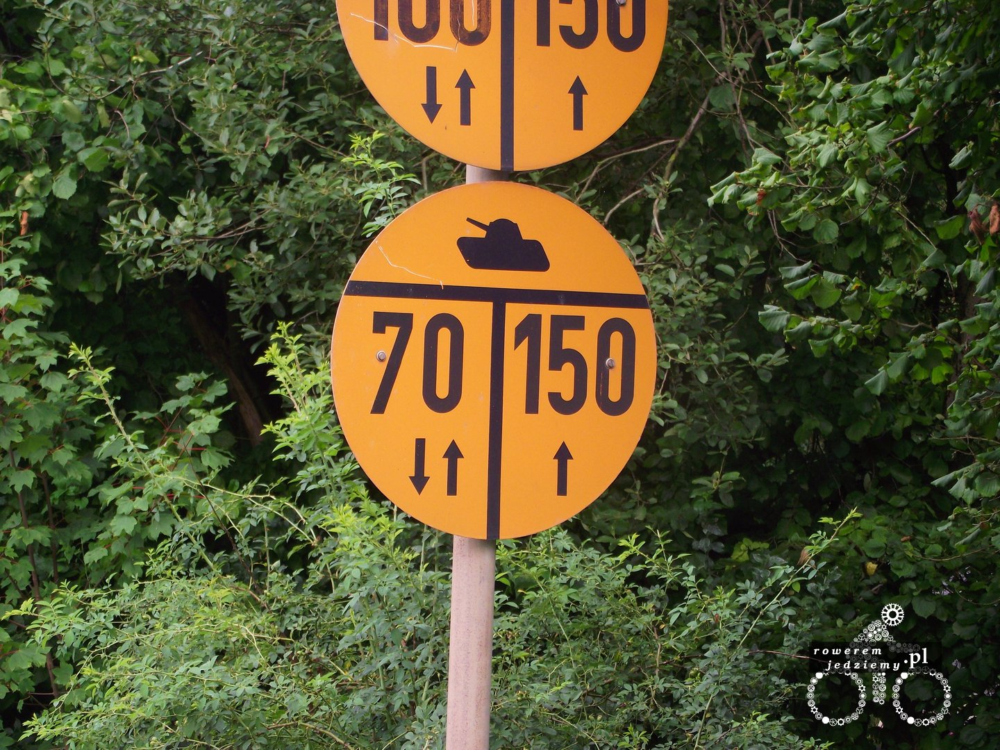
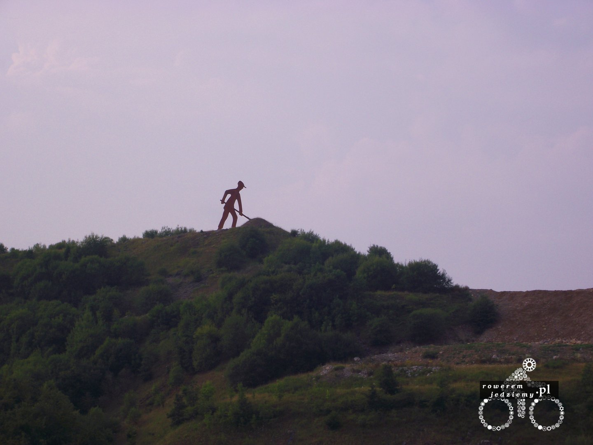

###Dzień 3 (204km)
Po nocy spędzonej na stacji benzynowej pogoda niestety się nie poprawiła. Zaczęły się natomiast górki, ale na szczęście nie przyprawiły większych problemów. Cały czas próbuję przemówić do rozsądku kolanu, ale nie chce słuchać. Dzień ogólnie bardzo nudny pewnie z tego powodu, iż nic nie zwiedzam. No ale głównym celem jest dojazd do Anglii, więc na tym wyjeździe będzie mało zwiedzania.

W taki sposób wygląda mniej więcej droga wraz z pogodą. Wielkim plusem Niemiec są ich drogi rowerowe, lecz w środkowych Niemczech jest ich zdecydowanie mniej niż na południu. Trzeba pogratulować człowiekowi, który wymyślił softshell, ponieważ mimo ciągłego deszczu nie przemaka i jest w nim znośnie ciepło. Czasami, jadąc sobie przy drodze, można zobaczyć ciekawe "rzeźby".

Nie wiem jaki mają one przekaz (może "pracuj Niemcu pracuj"), ale są dużych rozmiarów i mieszczą się na górkach niedaleko drogi.

###Dzień 4 (177km)
Znalazłem sposób na ból kolana, ale o tym później. Warunki pogodowe nic się nie zmieniły tak samo, jak ilość remontów napotykanych po drodze. Trochę ponarzekałem, teraz mogę wrócić do właściwej treści. Wczoraj w godzinach popołudniowych było małe urwanie chmury, więc musiałem przestać jechać, ponieważ już prawie nic nie widziałem. Założyłem na siebie pokrowiec rowerowy (dodatkowo na rower także), aby osłonić się trochę od deszczu. Działało to bardzo dobrze, jedynym problemem było to, że zaczynało się robić coraz ciemniej, a ja byłem w środku lasu (tak niemcy prowadzą czasami ścieżki rowerowe). W związku z tym postanowiłem prowadzić rower w tej ulewie przez las. W pewnym momencie problem kolana się rozwiązał, ponieważ miałem spotkanie z rysiem/psem/wilkiem (niepotrzebne skreślić). Nie jestem w stanie do końca określić, ponieważ nie chciałem, aby to było spotkanie trzeciego stopnia, więc wsiadłem na rower i jechałem ile się tylko dało, mając nadzieję że za mną nie pobiegnie. Chyba nie okazałem się wart wysiłku, za co jestem wdzięczny, ponieważ udało mi się jakoś wyjechać z lasu. Pewnie wybaczycie, że nie zrobiłem zdjęcia, ponieważ niestety trochę bardziej ceniłem sobie wyjazd z tego lasu niż zrobienie zdjęcia zwierzęciu, które na mnie warczało w nocy. Dojechałem do jakiejś wioski, gdzie pytałem się ludzi czy mogę sobie rozłożyć namiot na ich posesji (3 razy "nein"), aż ostatecznie dostałem pozwolenie od przysłowiowej Helgi i tym oto sposobem rozłożyłem się w szopie (dokładnie była to szopa na siano). W nocy robi się coraz zimniej (tej udało się odnotować temperaturę 13.7 stopnia).

[Cz 3 - Zagłębie ruhry - czyli miejsce nie dla rowerzystów](/post/zaglebie-ruhry-czyli-miejsce-nie-dla-rowerzystow)