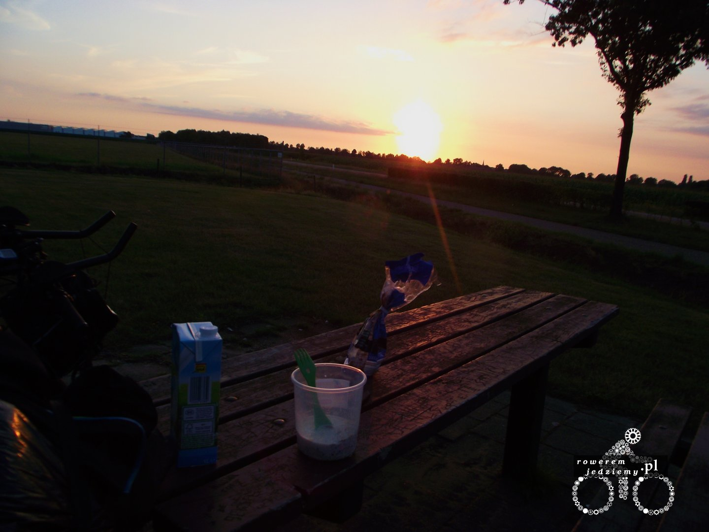

### Dzień 5 (242km)
Pogoda nie ustępuje, lecz jadąc dalej, dojechałem do zagłębia ruhry i tutaj rozpoczęły się schody. Dokładnie skończyła się ładna ścieżka rowerowa i zaczęły się zakazy jazdy rowerem. Dla osób, które nigdy nie były w tej części Niemiec informacja, że zagłębie to jest czymś w GOP (górnośląski okręg przemysłowy). Mimo tego, że jest tam bardzo dużo miast w małej odległości, nie ma pomiędzy nimi ścieżek rowerowych, jak to było wcześniej, lecz autostrady. Jak wszyscy wiedzą, Niemcy przestrzegają przepisów, więc raczej nie odważyłem się jechać chamsko po autostradzie rowerem. Wyborem padły drogi boczne, dzięki czemu trochę pobłądziłem i nadrobiłem ogromną ilość kilometrów. Przez przypadek dojechałem nawet na lotnisko w Dortmundzie. No ale po wyjeździe z Duisburga zaczyna się z powrotem normalna droga aż do samej Holandii. Jazda w moim przypadku jest dość nudna, ponieważ skończyły się górki i inne atrakcje. Na szczęście Holandia to już inna sprawa. Przy wjeździe od razu widać różnicę z Niemcami (po pierwsze przestało lać). Gdy u nas na granicy sprzedaje się głównie alkohol itp., to na granicy holenderskiej sprzedaje się kwiaty.

Jadąc sobie przez kraj, w którym rowerzysta jest traktowany niczym indyjska święta krowa, nie sposób dostrzec zwiększonej liczby rowerzystów i dwupasmowych ścieżek rowerowych. Nie ma problemu także z dogadaniem się, ponieważ każdy zna angielski. Nigdy wcześniej nie jechałem przez Holandię rowerem, więc byłem bardzo zdziwiony, widząc że rowerzyści mają tutaj osobny pas na rondzie (który oczywiście zawsze ma pierwszeństwo). Szkoda jedynie, że droga przez Holandię taka krótka. Warto jeszcze napisać kilka rzeczy o tym kraju. Bardzo fajną rzeczą są kosze na śmieci przy ścieżkach międzymiastowych.

Nie trzeba zsiadać z roweru, aby wyrzucić butelkę w trakcie jazdy. Granicy holendersko-belgijskiej można nie zauważyć, ponieważ nie ma tam żadnego posterunku, po prostu normalna droga tylko asfalt się zmienia na inny. Jakość dróg nie spadła po wjeździe do Belgii, lecz ilość dróg rowerowych tak. Ponieważ zaczęło robić się ciemno, rozbiłem się obok jakiegoś pola.

### Dzień 6 (96km)
Rano obudziłem się przywitany przez stadko krów, które na szczęście były odgrodzone drutem od mojego namioty (nie wiedziałem, że rozbija się obok pastwiska). Zjadłem śniadanie, złożyłem namiot i pojechałem dalej. Gdy tylko dojechałem do kanału Alberta, jechałem cały czas wzdłóż przylegającej do niego ścieżki rowerowej.

Duży tam ruch (nie tylko rowerzyści, ale także rolkarze biegacze itp). Pewnie zastanawiacie się, dlaczego tylko 96km skoro dzień wcześniej było aż 242? A to dlatego, iż zatrzymałem się w Antwerpii u Sawiego. Zostałem przywitany wspaniałą jajeczniczką (by było bardzo dobrą odskocznią od musli). Zostałem zabrany także na wycieczkę do Brukseli, aby zobaczyć park rozrywki i Atomium (pamiątka po expo).

Dobrze jest wziąć ciepły prysznic zamiast mycia się po stacjach benzynowych (nie licząc ciągłego prysznica w postaci deszczu). W Belgii można zauważyć naprawdę ogromną ilość imigrantów. Szczególnie w miastach typu Antwerpia czy Bruksela. W mniejszych miejscowościach mimo wszystko dominują Belgowie. Ciekawi mnie jak Żydzi wytrzymują w swoich szatach w takim upale (Żydzi są szczególnie widoczni w Antwerpii). No nic, jutro będzie trzeba dostać się na prom i przepłynąć do Wielkiej Brytanii.

[Cz 4 - Prom i bitwa o Anglię](/post/prom-i-bitwa-o-anglie)