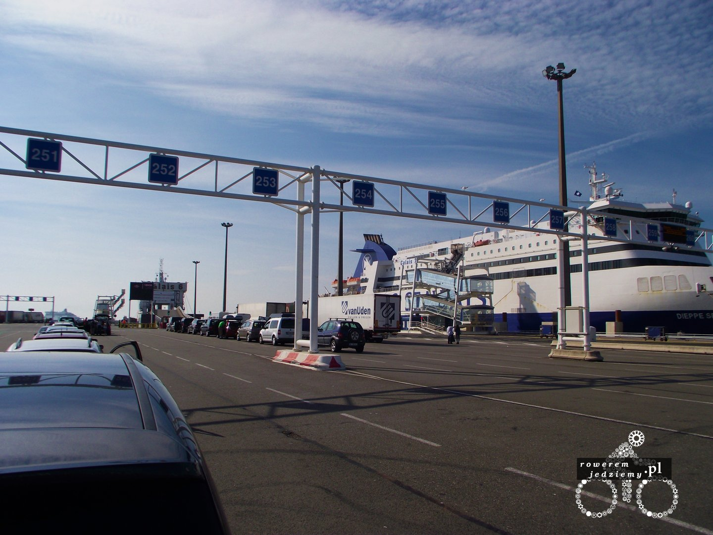
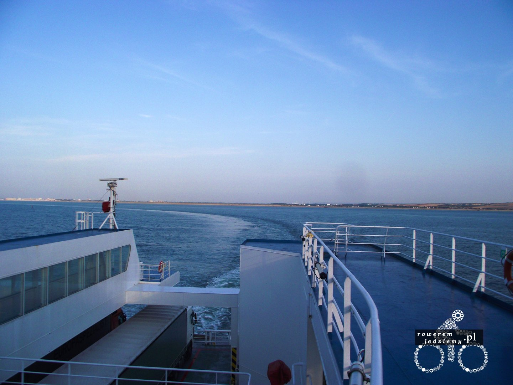
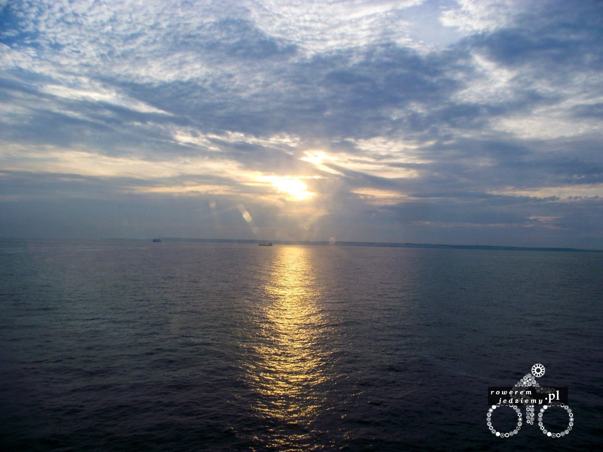
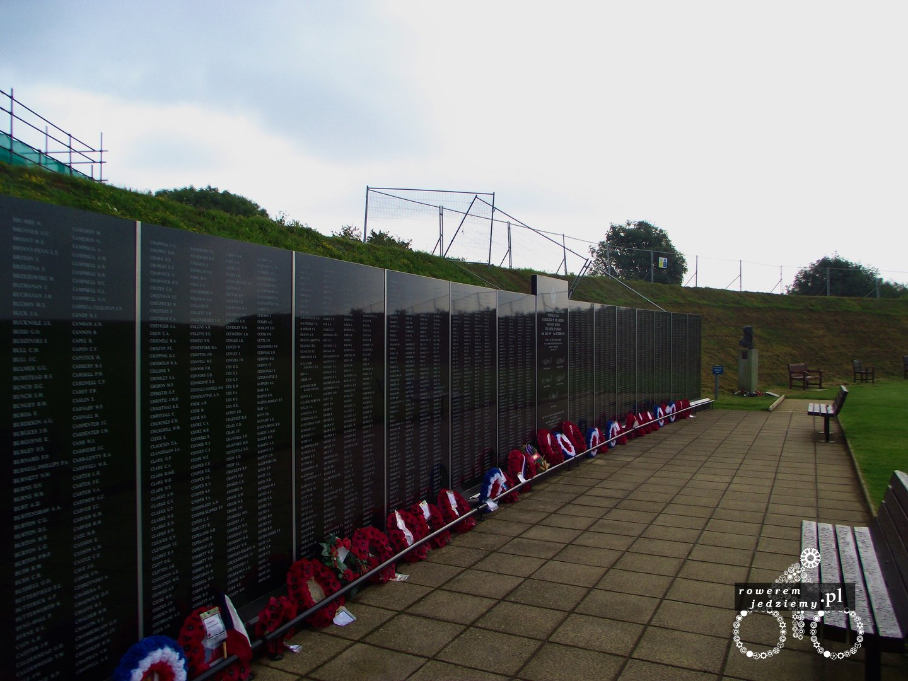
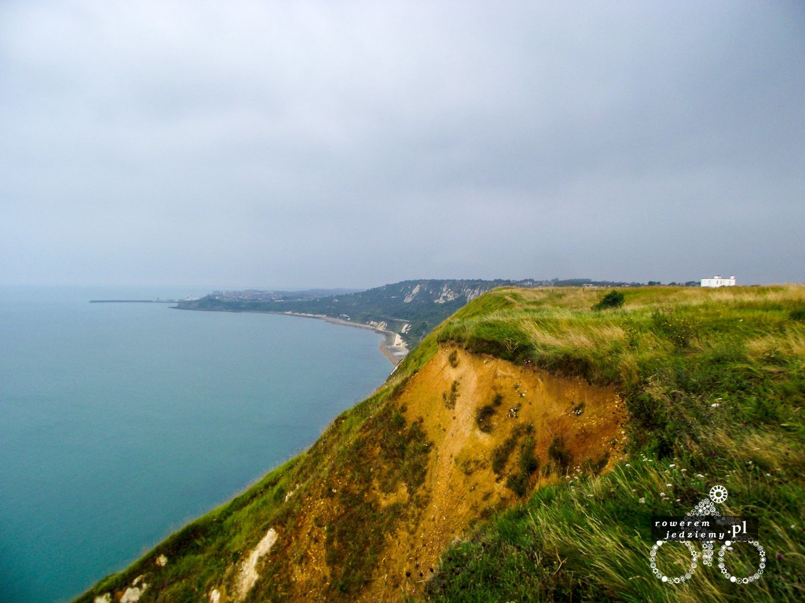
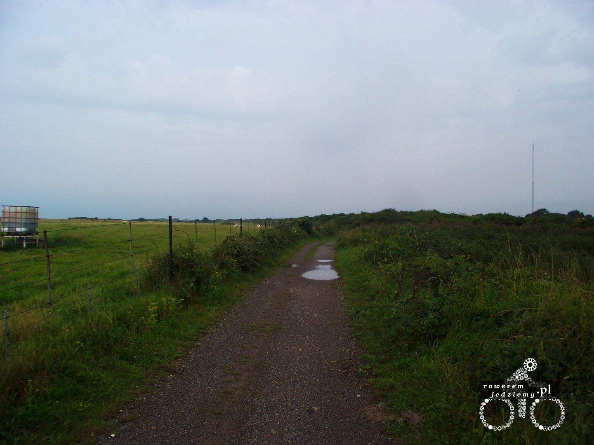
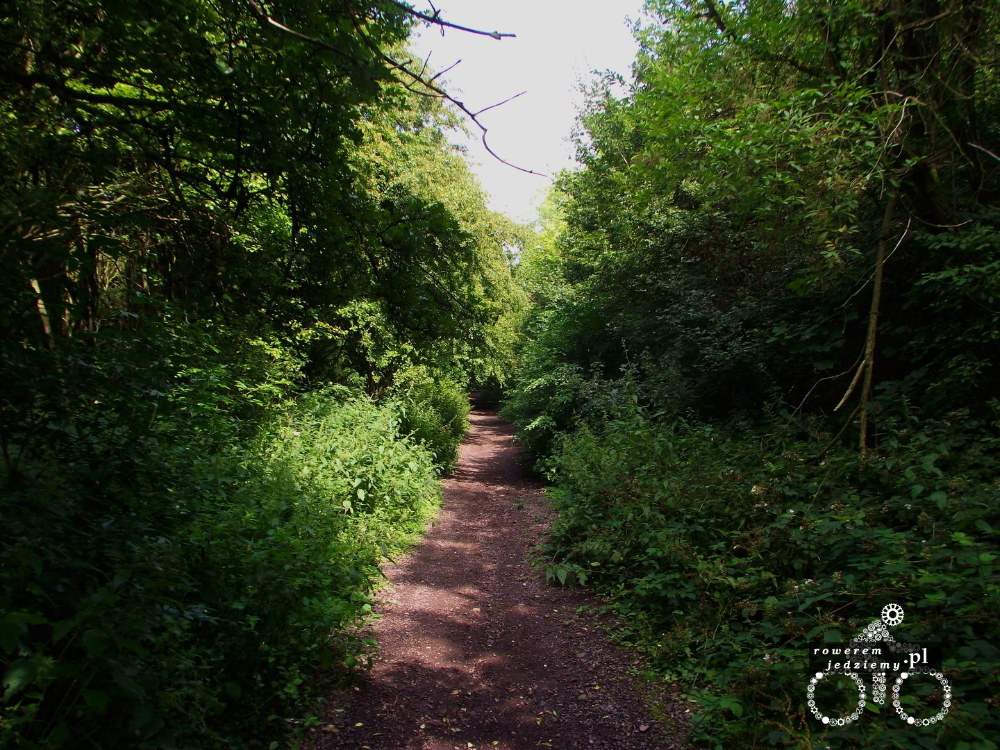
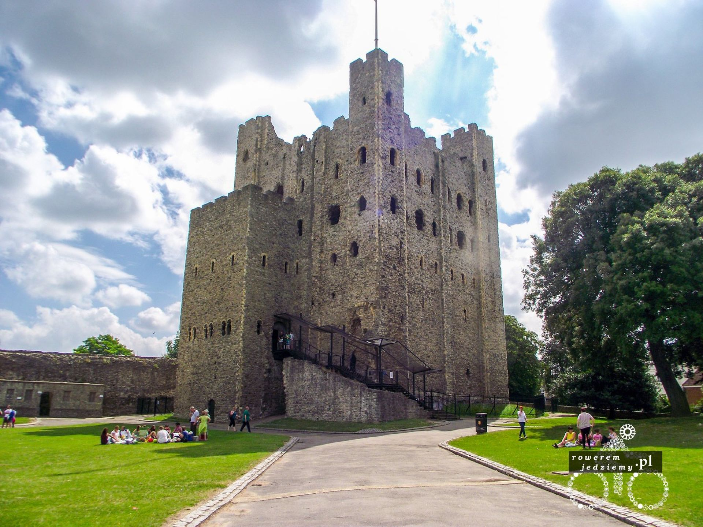

### Dzień 7 (za mało km aby wspominać)
Rano zostałem podrzucony do Calais (miasto portowe na północy Francji). Mimo tego nie udało się zdążyć na prom, więc kupiłem drugi bilet (jak się później okazało, mogłem płynąć na tym samym, ponieważ jest ważny 4 godziny). Aby dostać się na prom z rowerem, podjechałem tak jak podjeżdżają samochody i inne pojazdy. Byłem jedynym rowerzystą w kolejce. Jestem pod wrażeniem kobiety, która pracowała na recepcji, ponieważ jak się dowiedziałem, zna płynnie Polski, Francuski, Niemiecki i Angielski (tak musiałem się zapytać, gdy zaczęła do mnie mówić po polsku, gdy okazałem paszport). Kolejka nie jest aż tak duża, jak się spodziewałem.

Jest tu dużo polskich autobusów i w oddali cały parking tirów. Gdy obsługa zobaczyła, że stoję w kolejce razem z autami, powiedzieli mi, abym wszystkich wyprzedził i stanął sobie z przodu. Sam miałem taki pomysł, ale myślałem że to będzie trochę buractwo z mojej strony. Im dłużej stoi się w takiej kolejce, tym bardziej widzi się kto jest typowym imigrantem w UK. Obok mnie stoi sobie rodzina 6 osobowa w 5 osobowym samochodzie wydaje się, że z Turcji (arabska "uroda"). Inne samochody zawierają polaków, słowaków itp. Oczywiście pełno "słoików" (tak Warszawo nie jesteś osamotniona). To się UK doczekało "turystów".
Jakieś 30 min przed wyznaczonym czasem przypłynął prom, na który wpuścili mnie jakąś minutę przed samochodami, aby mnie chyba nie rozjechali po drodze. Przymocowałem rower do jakiejś rurki na parkingu (tak prom ma normalny parking) i udałem się na pokład.
Na pokładzie poznałem Holendra, który powiedział mi, że jedzie na jakąś imprezę w UK i kilka rad, ponieważ pierwszy raz podróżowałem statkiem. Jedną z nich było "Jeżeli jest ci nie dobrze, przejdź na tył statku, tam dużo mniej trzęsie". Na szczęście ta rada się nie przydała, ale dobrze wiedzieć na przyszłość. Sama podróż przebiegała bardzo łagodnie (dobra pogoda itp).

Po dopłynięciu na miejsce pogoda się trochę zepsuła i na noc zapowiadał się deszcz. Udało mi się wyjechać na jeden z klifów (są wzdłuż całego wybrzeża) i rozbić namiot. Od razu mogę nie polecić ścieżek rowerowych, ponieważ są w bardzo złym stanie.

Ciekawie zrobiło się w nocy. Rozłożyłem namiot przy ścieżce rowerowe, ponieważ wszędzie było ogrodzenia, które dzielnie zabezpieczało mnie przed odejściem od niej. Całe szczęście, że znalazło się coś w rodzaju miejsca postojowego (kawałek kwadratowego pola wylanego betonem). No i w nocy zaczęło lać. Byłem bardzo zdziwiony, gdy obudziwszy się około 2 w nocy, poczułem się jak na łóżku wodnym. Jak się okazało, mój namiot stoi w około 10 centymetrowym jeziorku, ale dzięki nieprzemakalnej podłodze i tropikowi w środku było sucho (podłoga ma około 20cm wysokości). Uznałem że nie ma co się bawić na nowym rodzaju łóżka i zacząłem wynosić rzeczy, które dociążały namiot (czyt. sakwy). Gdy namiot zaczął pływać na wodzie, przetransportowałem go w bardziej suche, a co za tym idzie wyższe miejsce i poszedłem spać.
### Dzień 8 (184km)
Od samego rana pogoda jak to tutaj mówią "pada psami i kotami". Plusem jest to, że właśnie padać przestało i dojechałem do memoriału "Bitwy o Anglię"

Bardzo fajnie wyglądają klify, które ciągną się wzdłuż drogi rowerowej.

Kierując się na północ w stronę Gravesend, zrobiło się słonecznie i znacznie przyjemniej. Znowu było można porozumiewać się z tubylcami w cywilizowanym języku i gdy ktoś do ciebie mówił, nie brzmiało to jak rozkaz rozstrzelania. Przynajmniej łatwo było tłumaczyć skąd się jedzie itp. Jak już wcześniej mówiłem, o drodze tak teraz wypada ponarzekać na drogi główne. Oczywiście panuje taka opinia, że w Polsce stan dróg jest bardzo zły. Te wszystkie osoby, które tak sądzą, zapraszam do Wielkiej Brytanii, aby spróbowały dróg brytyjskich i zrewidowały swoje poglądy. Ścieżek poza miastami praktycznie nie ma, a jeżeli są, nie radzę nimi jechać. Popełniłem ten błąd zbyt wiele razy i raz skończyłem daleko ok jakiejkolwiek drogi jadąc sobie przez las.

Po dotarciu do Gravesend udało się zrobić kilka zdjęć zamków (w uk jest tego więcej niż u nas) i przeprawić przez rzekę drugim promem. Ten był mały i przeznaczony do przewodu wyłącznie ludzi (no i ewentualnie rowerów).

Ponieważ znowu zaczęło robić się ciemno, rozłożyłem namiot przy drodze na Cambridge i poszedłem spać.

[Cz 5 - Cambridge i centralna Anglia](/post/cambridge-i-centralna-anglia)