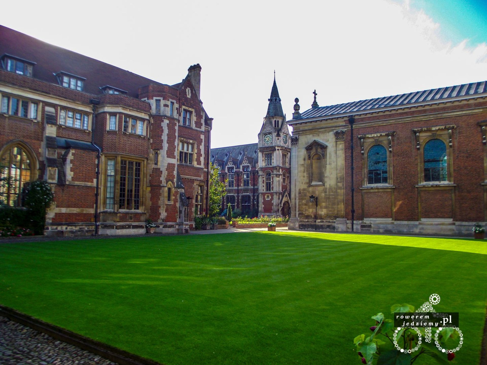
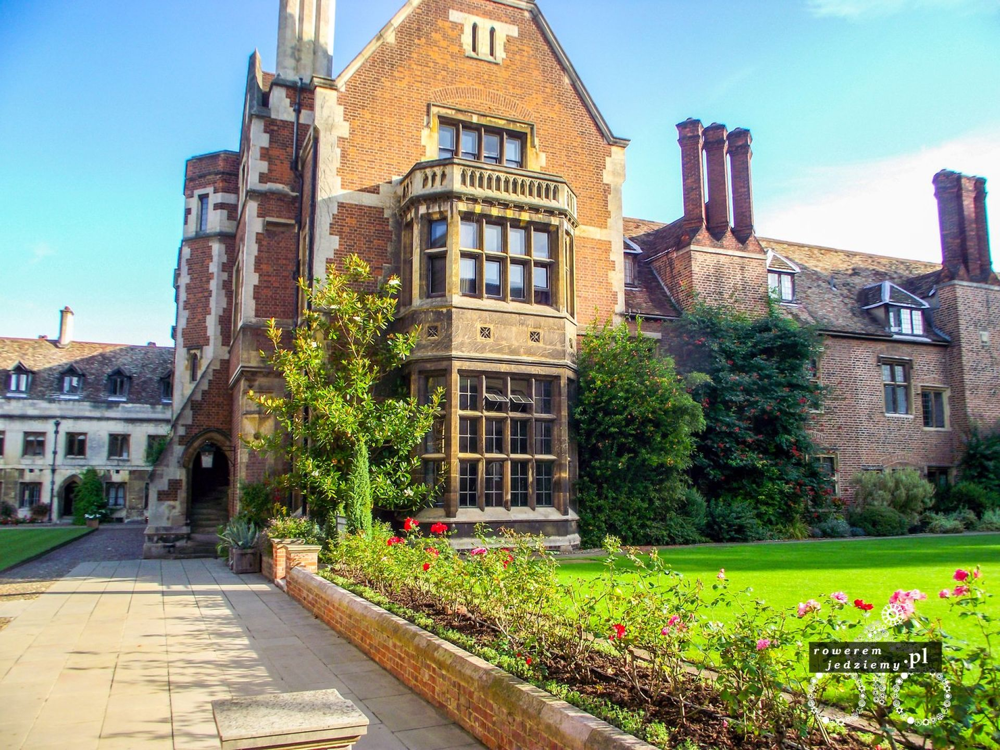
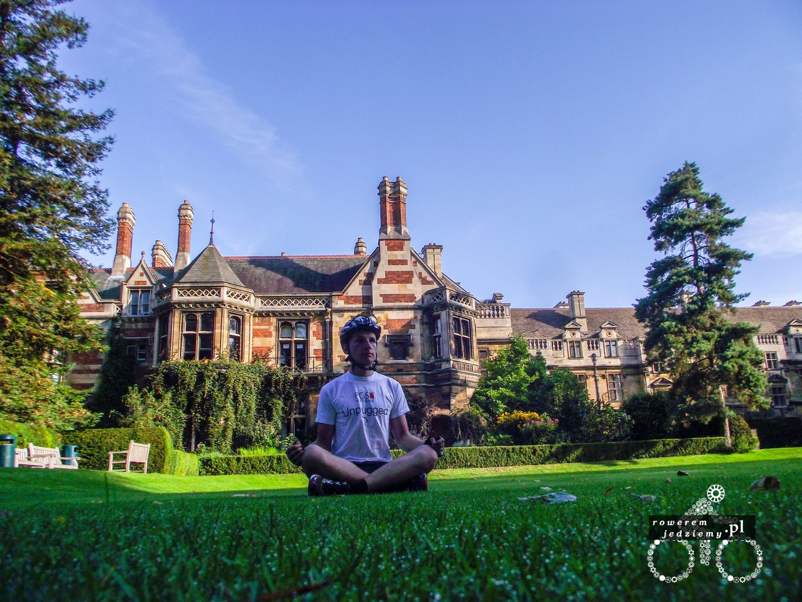
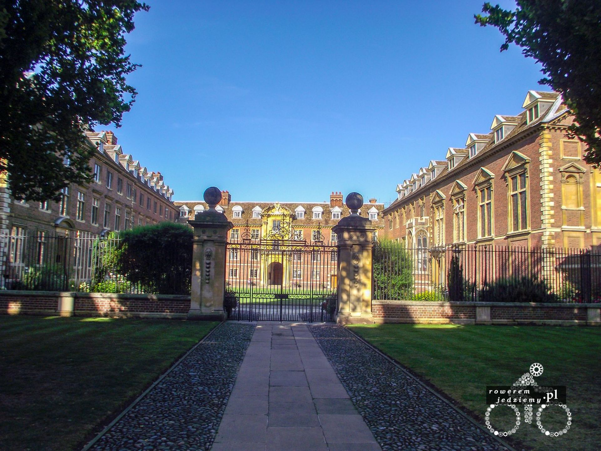
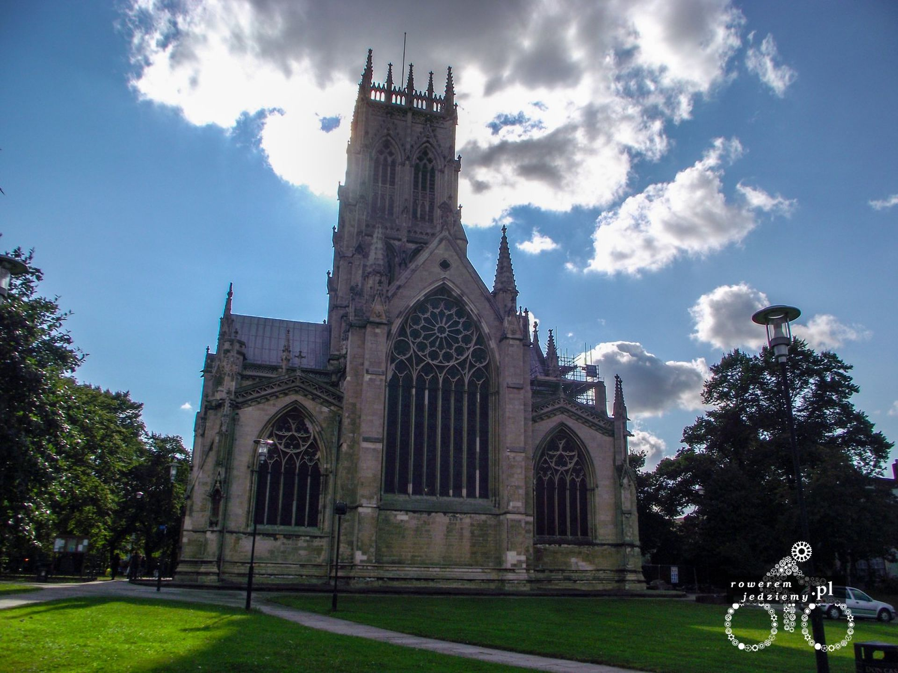
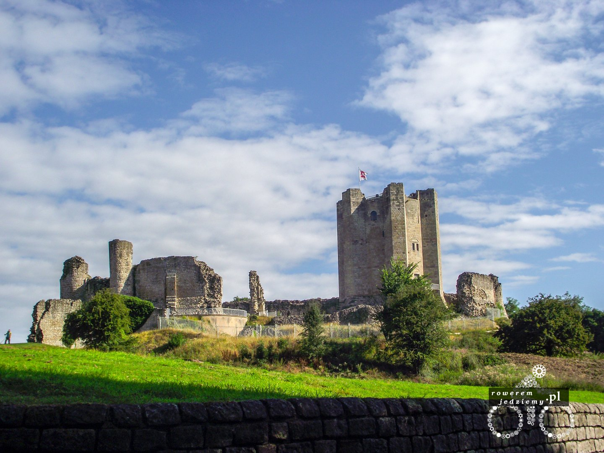
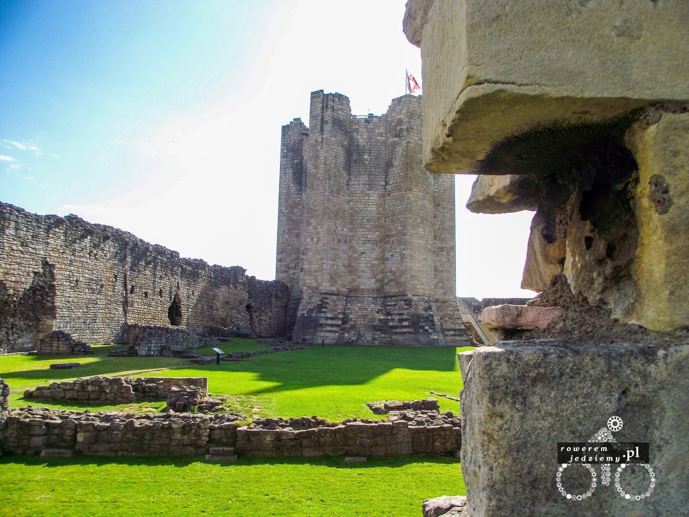
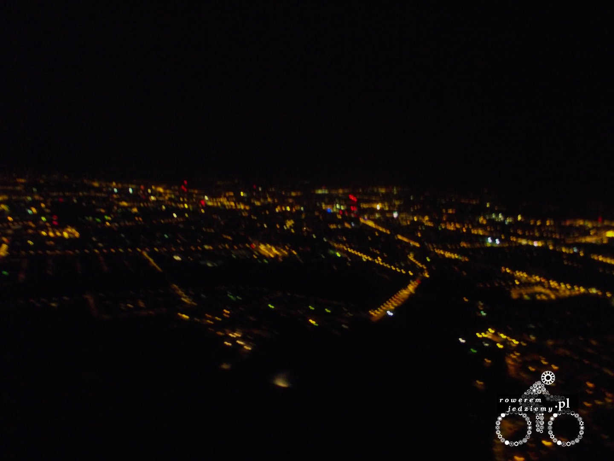

### Dzień 9 (304km)
Godzina piąta rano i pobudka, aby wcześniej dojechać do Cambridge. Udało się to przed godziną 7. No i można powiedzieć, że jestem pod wrażeniem. Średniowieczne miasto wygląda naprawdę ładnie. Szczególnie centrum i uniwersytet. 

Ciekawą opcją było wejście na teren dla studentów. Ponieważ przyjechałem tak bardzo rano, udało mi się przejść obok posterunku portierni (na teren kampusu niektórych College'ów jest zakaz wstępu lub wstęp tylko do określonych obszarów). Po wejściu nikt już nie zwracał na mnie uwagi, ponieważ uznawali, że jestem studentem (w sumie to byłem, ale nie tej uczelni). W pewnym momencie jedna kobieta (było to po godzinie 8), powiedziała mi że jak się nie pośpieszę, to się spóźnię na jakieś spotkanie. Ja dzielnie podziękowałem jej za informacje i jak na obcego przystało, zwiałem z kampusu. Na wyjściu przywitałem portiera, który już siedział na stanowisku i pojechałem zwiedzać dalej.

Po wyjechaniu z miasta udałem się na drogę "A1" która jest to drogą główną i gdzie panuje bardzo duży ruch. Na szczęście było pobocze. Niestety balans w naturze musi być zachowany i pobocze było zasłane wszelkiego rodzaju odpadkami, począwszy od kawałków opon, przez śrubki i gwoździe aż na martwych zwierzętach skończywszy. Zastanawiam się, czy ktoś to w ogóle czyści, ponieważ niektóre z nich (tych zwierząt oczywiście) były już w stanie porządnego rozkładu. Jak przez całą trasę nie udało mi się przebić opony, tak tutaj udało się przebić ją dwa razy (raz kawałkiem drewna, drugi raz gwoździem). W pewnym momencie pojawił się znak zakazu jazdy rowerem, więc zjechałem z drogi i szybko znalazłem objazd przez Ollerton. W tym miejscu przejechałem przez słynny las Sherwood, lecz wtedy o tym nie miałem pojęcia. Las mimo swojej legendy nie jest oznaczony. Jeżeli nie wiesz, że to ten jedyny to nawet się nie zorientujesz (to chyba tak samo, jak w związkach ale tutaj kobiety powinny się wypowiedzieć). Tego dnia przejechałem najdłuższy odcinek tej podróży, a to dlatego iż nie chciało mi się zostawiać 50km, więc jechałem do celu.
W kolejnych dniach pojeździłem sobie trochę po Doncaster i okolicy. Ciekawe rzeczy, które można tam zobaczyć to kościół w Doncaster

No i oczywiście Conisbrough Castle

Ale nie wszystko jest takie piękne, jak by to było można sobie wyobrazić. Ponieważ w tamtym okręgu jest bardzo dużo imigrantów, nie jest to już typowo brytyjskie miasto. Dla kontrastu przytoczę jedną sytuację, której świadkiem byłem w Lidlu. Przyszła sobie polka (lat około 19) do sklepu i przy kasie wydarła się na kasjerkę (brytyjkę), że ta nie umie polskiego. Trochę mi było głupio, że pochodzę z tego samego kraju i wcale się nie dziwię, że taka a nie inna opinia panuje o nas na wyspach. Oczywiście wiem, że pewnie znaczna większość jest inna, ale to właśnie kontrast się zapamiętuje. Okazało się, że bardzo duża część obcokrajowców, mimo że mieszka tutaj już kilka lat wcale nie zna języka w stopniu pozwalającym się płynnie porozumiewać. Spowodowane jest to odizolowaniem się od brytyjskiego społeczeństwa i życie we własnych "gettach".

Na koniec dorzucam przejechaną trasę:

<iframe name="plotaroute_map_77569" src="https://www.plotaroute.com/embedmap/77569?units=km&hills=show" style="position:absolute;top:0;left:0;bottom:0;right:0;width:100%; height:100%;" frameborder="0" scrolling="no" allowfullscreen webkitallowfullscreen mozallowfullscreen oallowfullscreen msallowfullscreen></iframe>

Route map for <a href="https://www.plotaroute.com/route/77569?units=km" target="_blank" title="View this route map on plotaroute.com">Wroclaw -&gt; Doncaster 2014</a> by <a href="https://www.plotaroute.com/userprofile/30172" target="_blank" title="View this person's profile on plotaroute.com">kemal piro</a> on <a href="https://www.plotaroute.com" target="_blank" title="plotaroute.com - free route planner for walking, running, cycling and more">plotaroute.com</a>

